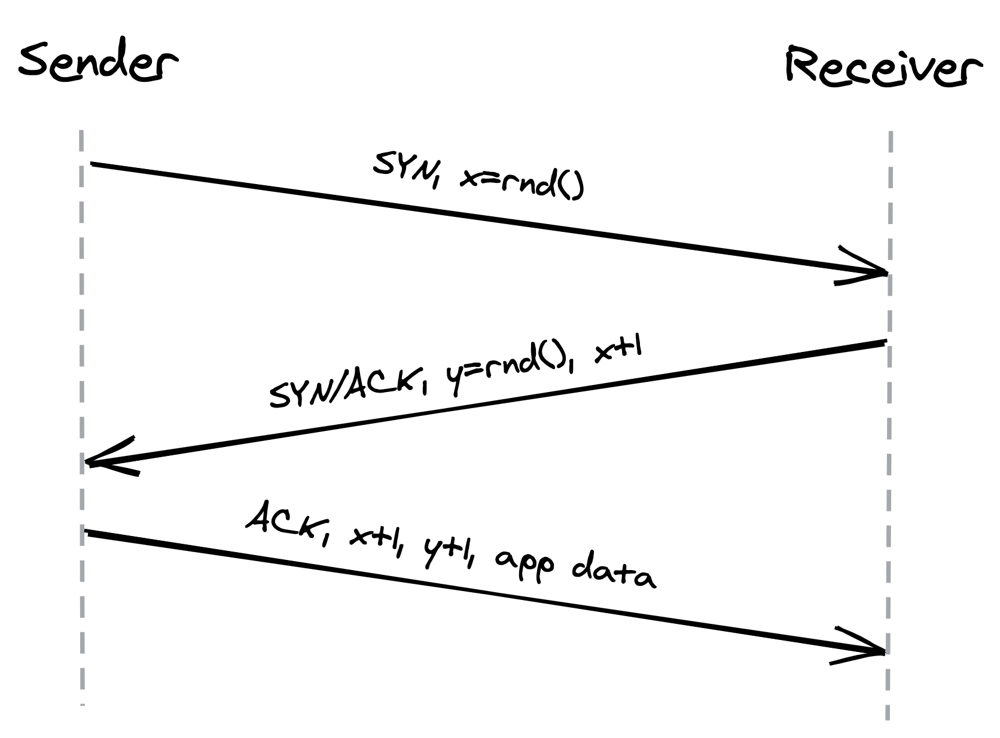
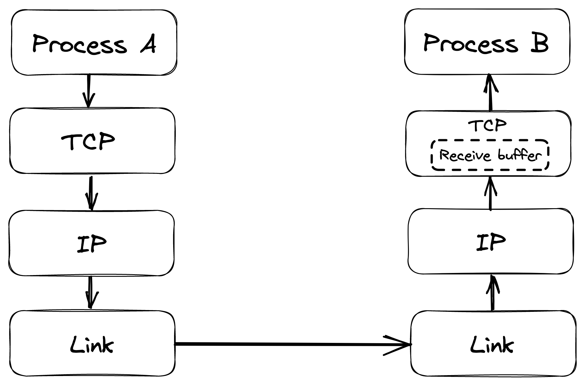
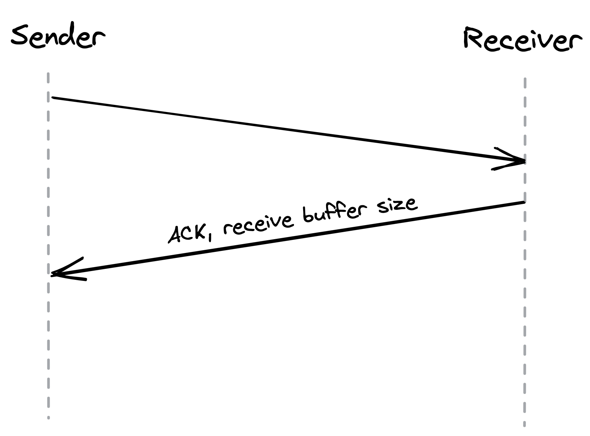
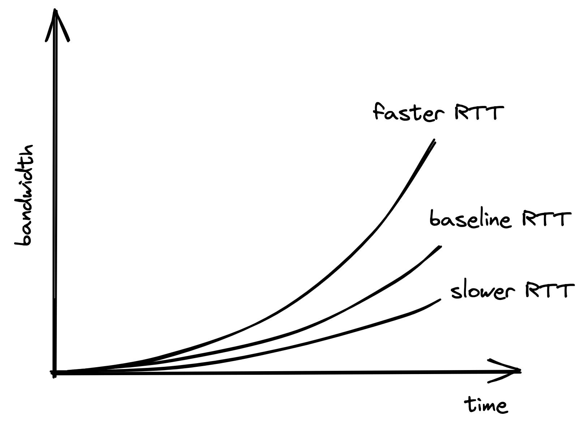

# Chapter 2: Reliable Links

This chapter explores how a reliable communication channel is built on top of an unreliable network layer.

### Internet and Transport Layers (IP & TCP)

- **Internet Layer (IP)**: Communication at the internet layer happens by routing packets between nodes. This requires:
  - An **addressing** system for nodes, handled by the **IP protocol** (e.g., IPv6 provides 128-bit addresses).
  - A **routing** mechanism for packets, where routers use local routing tables to decide where to send a packet next. These tables are managed by the **Border Gateway Protocol (BGP)**.
- **Unreliability of IP**: The IP protocol does not guarantee that data will arrive at its destination. For instance, an overloaded router might drop packets.
- **Transport Layer (TCP)**: The **Transmission Control Protocol (TCP)** is a transport-layer protocol that creates a reliable communication channel on top of IP.
  - **Guarantees**: TCP ensures that a stream of bytes arrives _in order, without gaps, duplication, or corruption_.
  - **Stability**: TCP also implements stability patterns to prevent overwhelming the network and the receiver.

## 2.1 Reliability Mechanisms in TCP

To create the illusion of a reliable channel, TCP employs several mechanisms:

- **Segmentation**: It divides a byte stream into discrete packets called **segments**.
- **Sequence Numbers**: Segments are sequentially numbered, which allows the receiver to detect missing segments (holes) and duplicates.
- **Acknowledgments (ACKs)**: Every segment sent must be acknowledged by the receiver.
- **Retransmission**: If an acknowledgment is not received within a certain time, a timer on the sender's side fires, and the segment is retransmitted.
- **Checksums**: The receiver uses a checksum to verify the integrity of a delivered segment and ensure the data has not been corrupted during transit.

## 2.2 Connection Lifecycle

Before data can be sent, a TCP connection must be established. The connection lifecycle is managed by the operating system on both ends through a **socket**.

- **Connection States**: At a high level, a connection can be in one of three states:
  1.  **Opening**: The connection is being created.
  2.  **Established**: The connection is open, and data is being transferred.
  3.  **Closing**: The connection is being terminated.

### Three-Way Handshake

TCP uses a **three-way handshake** to establish a new connection:

1.  The sender sends a `SYN` segment with a random sequence number `x`.
2.  The receiver sends back a `SYN/ACK` segment, acknowledging `x` and providing its own random sequence number `y`.
3.  The sender replies with an `ACK` segment, and can now send the first bytes of application data.

::: {.centerfigure}
{width=60%}
:::

- **Cold-Start Penalty**: This handshake introduces a full round-trip delay where no application data is sent. The lower the round-trip time (RTT), the faster a connection can be established. Placing servers geographically closer to clients helps reduce this penalty.

### Connection Termination

- Closing a connection also involves multiple round-trips. If another transmission is likely to occur soon, it is more efficient to keep the connection open.
- **TIME_WAIT State**: When a socket is closed, it doesn't disappear immediately. It transitions to a `TIME_WAIT` state for several minutes to prevent delayed segments from a closed connection from being accepted by a new one.
- **Connection Pools**: If many connections open and close rapidly, the number of sockets in the `TIME_WAIT` state can build up and exhaust the system's limit, causing new connection attempts to fail. This is why applications often use **connection pools** to reuse existing connections.

## 2.3 Flow Control

Flow control is a mechanism that prevents a sender from overwhelming a receiver with too much data.

- The receiver stores incoming data in a **receive buffer** before it is processed by the application.
- The receiver communicates the available size of this buffer to the sender in its acknowledgment segments.
- The sender then ensures it does not send more data than can fit in the receiver's buffer. This is similar to rate-limiting, but it operates at the connection level.

::: {.centerfigure}
{width=70%}
:::

::: {.centerfigure}
{width=60%}
:::

## 2.4 Congestion Control

Congestion control is a mechanism that prevents a sender from overwhelming the underlying network.

- The sender maintains a **congestion window**, which is the total number of segments that can be sent without receiving an acknowledgment.
- **Slow Start**: When a new connection is established, the congestion window is small. For every acknowledged segment, the window size increases exponentially until it reaches a limit. This means the network's full capacity cannot be used immediately.
- **Congestion Avoidance**: If a segment is lost (detected via a timeout), the congestion window size is reduced. The window size then grows more slowly over time.
- **Bandwidth and Latency**: The maximum theoretical bandwidth is a function of the congestion window size and the round-trip time:
  $$
  \text{Bandwidth} = \frac{\text{WinSize}}{\text{RTT}}
  $$
  This equation shows that bandwidth is directly impacted by latency. A shorter RTT allows the sender to utilize the network's bandwidth more quickly and effectively. This further emphasizes the benefit of placing servers close to clients.

::: {.centerfigure}
{width=60%}
:::

## 2.5 Custom Protocols (UDP)

The reliability and stability of TCP come at the cost of higher latency and lower bandwidth.

- **User Datagram Protocol (UDP)** is a connectionless transport layer alternative to TCP that sacrifices these guarantees.
- **Characteristics of UDP**:
  - It does not provide the abstraction of a byte stream; clients send discrete packets called **datagrams**.
  - It offers no reliability guarantees (no sequence numbers, no acknowledgments).
  - It does not implement flow or congestion control.
- **Use Cases**: UDP is a lean protocol often used to bootstrap custom protocols that need some, but not all, of TCP's guarantees. For example, in multiplayer online games, a lost data packet (like a snapshot of the game state) is often better dropped than retransmitted, because by the time the retransmitted packet arrives, it would be obsolete. UDP is ideal for such real-time applications where TCP's retransmission attempts would degrade the user experience.
