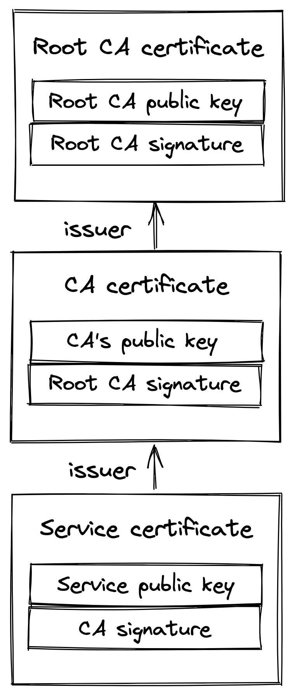

# Chapter 3: Secure Links

While TCP provides a reliable way to send bytes over a network, the data is sent in the clear, making it vulnerable to interception by a middleman. To secure this communication, the **Transport Layer Security (TLS)** protocol is used. TLS runs on top of TCP, providing a secure channel that application layer protocols like HTTP can use.

In essence, TLS provides three core security guarantees:

- **Encryption**: Protects data from being read by unauthorized parties.
- **Authentication**: Verifies the identity of the communicating parties.
- **Integrity**: Ensures data has not been tampered with or corrupted.

## 3.1 Encryption

Encryption guarantees that data transmitted between a client and a server is obfuscated and can only be understood by them.

The process involves two types of cryptography:

1.  **Asymmetric Encryption**:
    - This method is used when the TLS connection is first established to negotiate a shared encryption secret.
    - Each party generates a key pair (a private and a public key) and exchanges their public keys. The shared secret can be derived from this exchange without ever being sent over the wire.
    - Asymmetric encryption is slow and computationally expensive, so it's only used for this initial key exchange.
2.  **Symmetric Encryption**:
    - After the shared secret is established, all subsequent communication is encrypted using symmetric encryption, which is fast and cheap.
    - The shared key is periodically renegotiated to minimize the risk if a key were to be broken.

> **Note**: Encrypting data has a CPU penalty, but this is negligible on modern processors with dedicated cryptographic instructions. Therefore, **TLS should be used for all communications**, including those not on the public internet.

## 3.2 Authentication

Authentication is the process of verifying that the server is who it claims to be. The server may also want to authenticate the client. TLS implements this using **digital signatures** based on asymmetric cryptography.

### Certificates

The main challenge in authentication is for the client to trust that the public key shared by the server is authentic. This problem is solved using **certificates**.

- **Certificate**: A digital document that proves ownership of a public key. It includes:
  - Information about the owning entity.
  - An expiration date.
  - The public key itself.
  - A digital signature from the third-party entity that issued it.
- **Certificate Authority (CA)**: The entity that issues a certificate.
- **Certificate Chain**: Certificates are linked together in a chain. A service's certificate is signed by a CA, whose certificate might be signed by another CA, and so on. This chain ends with a **root CA**, which issues a self-signed certificate.

::: {.centerfigure}
{width=40%}
:::

### Trust Verification

- A client's device (e.g., operating system) maintains a **trusted store** containing certificates of trusted root CAs like _Let's Encrypt_.
- When a TLS connection is opened, the server sends its full certificate chain to the client.
- The client scans the chain until it finds a certificate issued by a CA that is in its trusted store.
- It then verifies each certificate in reverse order, checking the digital signature and expiration date until it reaches the server's own certificate. If all checks pass, the server is authenticated.

> **Important**: A common and critical operational failure is letting a certificate expire. This will cause clients to fail connection attempts, potentially bringing down an entire application. It is crucial to have automation in place to monitor and auto-renew certificates.

## 3.3 Integrity

Integrity ensures that the data has not been altered or corrupted in transit. Even if data is encrypted, a middleman could still tamper with it (e.g., by swapping random bits).

- To protect against this, TLS calculates a **message authentication code (HMAC)** for each message using a secure hash function.
- When a process receives a message, it recomputes the HMAC and compares it to the one included in the message.
- If the codes do not match, it means the message has been tampered with or corrupted, and the message is dropped.

> **Note on TCP Checksums**: While TCP uses a checksum for integrity, it is not 100% reliable and can fail to detect errors in rare cases (roughly 1 in 16 million to 10 billion packets). The TLS HMAC provides a much stronger guarantee against data corruption.

## 3.4 Handshake

When a new TLS connection is established, the client and server perform a **handshake**. During this process, they:

1.  **Agree on a Cipher Suite**: They negotiate the specific set of algorithms to use for:
    - Key exchange (for generating the shared secret).
    - Signatures (for signing certificates).
    - Symmetric encryption (for application data).
    - HMAC (for data integrity).
2.  **Create a Shared Secret**: They use the agreed-upon key exchange algorithm to create the shared secret that will be used for symmetric encryption.
3.  **Authenticate**: The client verifies the server's certificate. The server can optionally verify a client certificate as well.

This handshake process requires additional network round trips (typically 2 for TLS 1.2 and just 1 for TLS 1.3). This is another reason to place servers geographically close to clients and to reuse existing connections whenever possible to avoid this initial latency cost.
