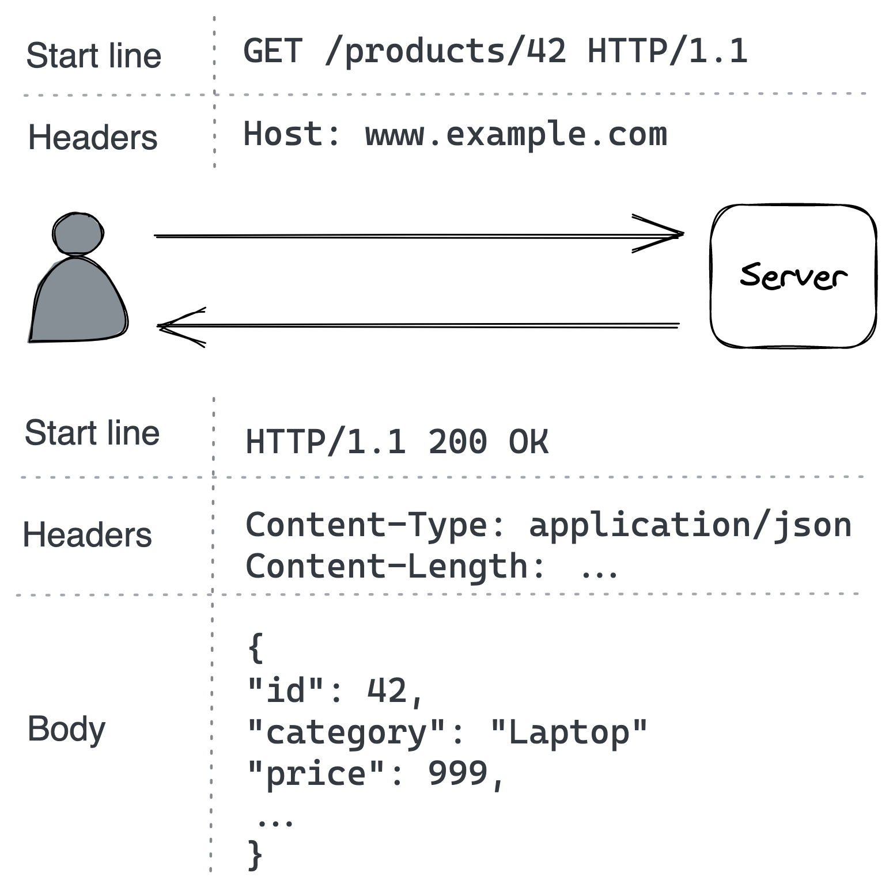

# Chapter 5: APIs

An **Application Programming Interface (API)** acts as an adapter for a server. It translates messages received from a communication link into calls to the server's internal business logic, allowing clients to invoke operations.

### Communication Styles

1.  **Direct Communication**:

    - The client communicates directly with the server.
    - It requires both the client and server to be up and running at the same time for the communication to succeed.
    - **Request-Response** is a common direct communication style where a client sends a request and the server replies with a response.

2.  **Indirect Communication**:
    - The client and server communicate through an intermediary, such as a message broker.
    - The sender and receiver do not need to be available simultaneously.
    - **Messaging** is a prime example, where messages are exchanged via a message channel.

This chapter focuses on the **request-response** style of direct communication.

### Request-Response Details

- **Serialization**: Request and response messages contain data serialized in a language-agnostic format.
  - **_Textual formats (e.g., JSON)_** are human-readable and self-describing but are more verbose and have higher parsing overhead.
  - **_Binary formats (e.g., Protocol Buffers)_** are leaner and more performant but are not human-readable.
- **Synchronous vs. Asynchronous**:
  - **_Synchronous_**: The client sends a request and blocks, waiting for the response. This is inefficient as it ties up threads.
  - **_Asynchronous_**: The client sends a request and provides a callback to be invoked when the response is received. Modern languages like JavaScript, C#, and Go simplify this with primitives like `async/await`.
- **Common Technologies**:
  - **Internal APIs** (server-to-server) often use high-performance RPC frameworks like **gRPC**.
  - **External APIs** (public-facing) tend to be based on **HTTP** because it's easily accessible from web browsers.

A popular set of design principles for HTTP APIs is **Representational State Transfer (REST)**. Key REST principles include stateless requests and cacheable responses.

## 5.1 HTTP

**HTTP (Hypertext Transfer Protocol)** is a request-response protocol used to encode and transport information. An HTTP message in version 1.1 is a textual block of data containing a start line, headers, and an optional body.

::: {.centerfigure}
{width=70%}
:::

HTTP is a **stateless** protocol, meaning every request must contain all the information the server needs to process it. It runs on TCP for reliability and is called **HTTPS** when secured with TLS.

### HTTP Versions and Performance

- **HTTP 1.1**: Suffers from **head-of-line (HOL) blocking**, as a new request cannot be issued on a connection until the response to the previous one has been received. The workaround is to create multiple connections, which consumes more resources.
- **HTTP 2**: Addresses HOL blocking by using a binary protocol that allows for multiplexing multiple concurrent request-response streams on the same connection.
- **HTTP 3**: The latest version, which is based on UDP. It implements its own transport protocol to solve TCP-level HOL blocking, where a single lost packet can block all streams on the connection. With HTTP 3, a lost packet only interrupts its own stream.

## 5.2 Modeling APIs with Resources

An HTTP server hosts **resources**, which can be any physical or abstract entity (e.g., a document, an image). A **URL** identifies a resource. For example, in `https://www.example.com/products?sort=price`:

- `https` is the protocol.
- `www.example.com` is the hostname.
- `/products` is the resource name (also called an endpoint).
- `?sort=price` is the query string with additional parameters.

URLs can model relationships, for example `/products/42/reviews`. However, deep nesting can make an API complex.

## 5.3 Request Methods

HTTP request methods are the verbs or actions to be performed on a resource. The most common methods are `POST`, `GET`, `PUT`, and `DELETE`.

| Method     | Safe | Idempotent |
| :--------- | :--: | :--------: |
| **POST**   |  No  |     No     |
| **GET**    | Yes  |    Yes     |
| **PUT**    |  No  |    Yes     |
| **DELETE** |  No  |    Yes     |

- **Safe**: The method should not have any visible side effects. Safe methods can be cached.
- **Idempotent**: Executing the method multiple times has the same end result as executing it once.

## 5.4 Response Status Codes

An HTTP response includes a **status code** to communicate the outcome of the request.

- **2xx (Success)**: e.g., `200 OK`.
- **3xx (Redirection)**: e.g., `301 Moved Permanently`.
- **4xx (Client Error)**: The error is with the client's request. These should not be retried.
  - `400 Bad Request`: Input validation failed.
  - `401 Unauthorized`: Client is not authenticated.
  - `403 Forbidden`: Client is authenticated but not allowed to access the resource.
  - `404 Not Found`: The requested resource could not be found.
- **5xx (Server Error)**: The server failed to fulfill a valid request. These can be retried.
  - `500 Internal Server Error`: An unexpected server error.
  - `502 Bad Gateway`: The server received an invalid response from a downstream server.
  - `503 Service Unavailable`: The server is temporarily overloaded or down for maintenance.

## 5.5 OpenAPI

An **Interface Definition Language (IDL)** is used to formally describe an API in a language-independent way. This definition can be used to generate boilerplate code for server adapters and client SDKs.

The **OpenAPI** specification (formerly Swagger) is one of the most popular IDLs for RESTful HTTP APIs. It allows for a formal description of endpoints, methods, status codes, and resource schemas in a YAML document.

## 5.6 API Evolution

APIs must evolve over time. It is crucial to avoid introducing **breaking changes** that require all clients to be modified at once.

- **Endpoint-level breaking changes**: Renaming an endpoint (e.g., `/products` to `/new-products`) or making an optional parameter mandatory.
- **Message-level breaking changes**: Changing the data type of a property in a schema.

To support breaking changes, APIs should be **versioned**, for example, by prefixing the URL (`/v1/products/`). However, evolving in a backward-compatible way is the preferred approach.

## 5.7 Idempotency

When a client request times out, it doesn't know if the server processed the request or not. Retrying is a common way to handle such transient failures. While some methods like `PUT` and `DELETE` are inherently idempotent, others like `POST` are not. Retrying a `POST` request could result in creating duplicate resources.

To solve this, a server can make non-idempotent operations idempotent using an **idempotency key**.

- The client sends a unique identifier (e.g., a UUID) in a request header (e.g., `Idempotency-Key`).
- The server stores this key upon successfully processing the request.
- If a request with the same key is received again, the server detects it as a duplicate.
- For the best client experience, the server should return the _same response_ that it sent for the original request, making the retry seamless.

This requires the server to atomically store the idempotency key and handle the request, which can be achieved with database transactions. An idempotent API makes it much easier to build robust clients that can safely retry failed requests.
