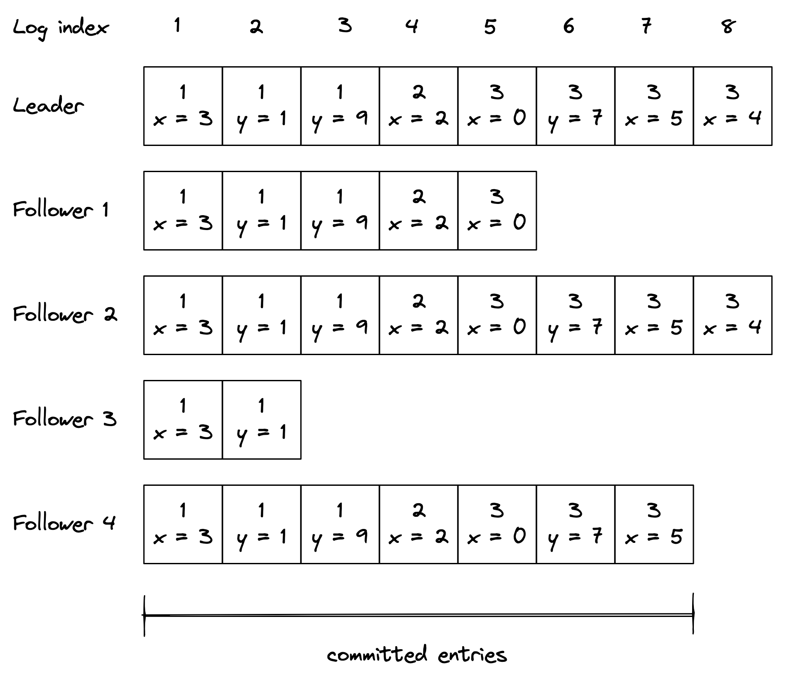
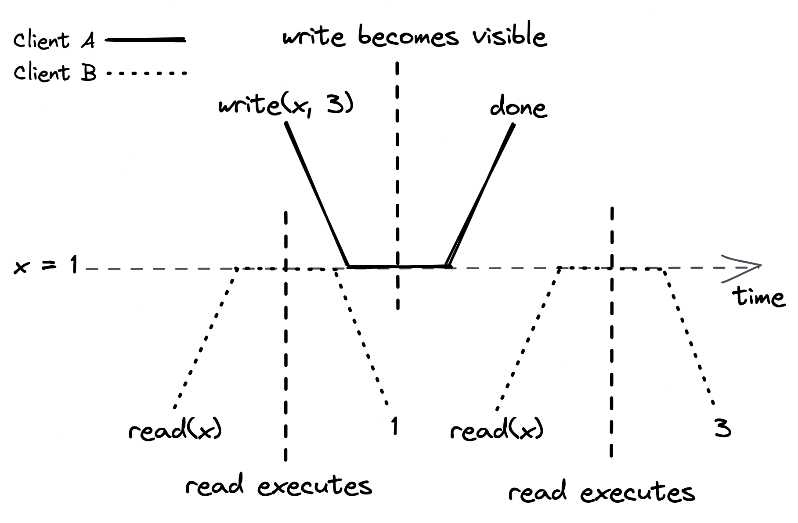
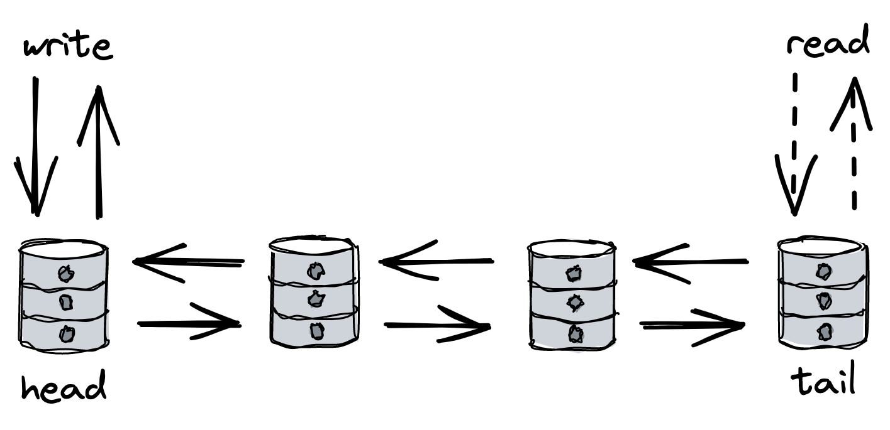

# Chapter 10: Replication

## Introduction to Replication

Data replication is a core concept in distributed systems, serving two primary purposes:

- **Increased Availability**: If data is stored on a single machine that fails, the data becomes inaccessible. By replicating the data across multiple machines, clients can seamlessly switch to a working copy if one fails.
- **Increased Scalability and Performance**: With more replicas, more clients can access the data concurrently, improving the system's overall throughput.

The main challenge of replication is maintaining **consistency** among all replicas, especially in the face of network failures or process crashes.

## State Machine Replication

State machine replication is a powerful mechanism for building fault-tolerant services. It is the foundation for consensus protocols like Raft.

- **Core Idea**: Each process in the system is modeled as a _state machine_. A state machine is an abstraction that transitions from one state to another based on a given input (an operation).
- **Consistency Guarantee**: If all state machines are **deterministic** (meaning the same operation always produces the same result) and they process the exact same sequence of operations in the same order, they are guaranteed to end up in the same final state.
- **Fault Tolerance**: This mechanism ensures that if one process (state machine) fails, a redundant and consistent copy is available on the other processes.

## Raft: A Leader-Based Protocol

Raft is a popular and understandable consensus protocol designed to manage a replicated log. It guarantees the strongest form of consistency.

- **Key Roles**:
  - **_Leader_**: A single, elected process that is solely responsible for managing and changing the replicated state.
  - **_Followers_**: The other processes that passively replicate the state from the leader.

### The Replicated Log

The leader ensures all followers have the same state by replicating its **log**.

- The log is an ordered list of entries.
- Each log entry contains:
  1.  The **operation** to be applied to the state (e.g., `x = 5`).
  2.  The **index** indicating the entry's position in the log.
  3.  The **election term** of the leader that created the entry.

::: {.centerfigure}
{width=80%}
:::

### The Commit Process

For an operation to be officially accepted and applied, Raft follows a specific two-phase process:

1.  **Logging**: The leader receives a command from a client, appends it as a new entry to its _own_ log, but does **not** execute it yet.
2.  **Replication**: The leader sends an `AppendEntries` request containing the new entry to all of its followers.
3.  **Majority Acknowledgement (Quorum)**: The leader waits to receive a successful response from a **_majority_** of the followers.
4.  **Commitment**: Once the leader hears back from a majority, it considers the entry **committed**. It then applies the operation to its local state machine.
5.  **Follower Application**: Followers are informed that the entry is committed in future `AppendEntries` messages. Only then do they apply the operation to their local state machines.

This majority-based approach allows the system to tolerate failures. For a system with `2f + 1` processes, it can tolerate up to `f` failures and still make progress.

### Failure Handling in Raft

- **Leader Failure**: If a leader fails, a follower initiates an election to become the new leader. A candidate can only win an election if its log is at least as up-to-date as any other process in the majority that voted for it. This ensures no committed data is lost.
- **Network/Follower Failure**: If a follower is down or the network drops messages, the leader will retry sending `AppendEntries` requests indefinitely. These requests are idempotent (re-applying them has no extra effect). When a follower comes back online, the leader will find the last point where their logs agree and force the follower's log to match its own.

## Consistency Models

Consistency models define the rules and guarantees of a replicated data store, specifying what clients can expect to see when reading and writing data.

### Strong Consistency (Linearizability)

This is the strongest and most intuitive consistency model.

- **How it works**: All client requests (both reads and writes) are handled exclusively by the leader.
- **Guarantee**: The system behaves as if there is only a single copy of the data. Every operation appears to execute atomically and instantly at a specific point in time. Once an operation completes, its effects are visible to _all_ subsequent observers.
- **Tradeoff**: This model provides the best guarantees but suffers from higher latency, especially for reads. To serve a read, the leader must first contact a majority of followers to confirm it is still the leader, adding a round-trip delay.

::: {.centerfigure}
{width=60%}
:::

### Sequential Consistency

A slightly relaxed model that improves read performance.

- **How it works**: Writes are sent to the leader, but reads can be served by any follower.
- **Guarantee**: All observers will see the operations happen in the _same order_. However, there is no real-time guarantee. Different clients might see the state at different times (e.g., one client reading from an up-to-date follower, another from a lagging one).
- **Analogy**: A producer-consumer queue. The consumer sees items in the same order the producer added them, but it is always lagging behind.

::: {.centerfigure}
{width=80%}
:::

### Eventual Consistency

The most relaxed consistency model, prioritizing availability.

- **How it works**: Clients can connect to any follower for reads.
- **Guarantee**: If no new writes are made to the system, all replicas will _eventually_ converge to the same state.
- **Tradeoff**: This model offers high availability and read scalability but is difficult for developers. A client could read a new value from one replica and then read an older value from another, leading to confusing behavior. It is suitable only for applications where slightly stale data is acceptable (e.g., counting "likes" or page visits).

## The CAP and PACELC Theorems

- **CAP Theorem**: States that a distributed system can only simultaneously provide two of the following three guarantees:

  1.  **C**onsistency (strong)
  2.  **A**vailability
  3.  **P**artition Tolerance
      Since network partitions are a fact of life, a system must choose between being **consistent** or being **available** during a partition.

- **PACELC Theorem**: An extension to CAP that more accurately reflects real-world tradeoffs. It states that:
  - In case of a **P**artition, one must choose between **A**vailability and **C**onsistency.
  - **E**lse (during normal operation), one must choose between **L**atency and **C**onsistency.
    This highlights the direct relationship between consistency and performance: stronger consistency guarantees require more coordination, which increases latency.

## Chain Replication: An Alternative Approach

Chain replication is a protocol that provides strong consistency with a different architecture, aiming for higher throughput.

- **Architecture**: Processes are arranged in a linear chain.
  - **_Head_**: The first node in the chain. All **write** requests are sent here.
  - **_Tail_**: The last node in the chain. All **read** requests are served from here.
- **Fault Tolerance**: Managed by a separate, fault-tolerant **control plane** (which itself might use Raft). The control plane's job is to monitor the chain and reconfigure it when a node fails.

::: {.centerfigure}
{width=70%}
:::

### Data Flow

- **Write Path**: A client sends a write to the `head`. The `head` applies the change and forwards it to the next node. The update propagates down the entire chain. A write is only considered **committed** when it reaches the `tail`.
- **Read Path**: All reads are sent to the `tail`, which can serve the data from its local state immediately.

### Comparison to Raft

- **Performance**:
  - Chain replication has **higher read throughput** and **lower read latency**, as the tail can respond without coordinating with other nodes.
  - It has **higher write latency** because a write must traverse the entire chain to be committed. A single slow node slows down all writes.
- **Design**: It cleanly splits the **data plane** (the chain) from the **control plane** (failure management). This allows the data path to be highly optimized for throughput, as it is not concerned with failure detection.
- **Read Optimization**: To further scale reads, all replicas can be allowed to serve them. To maintain strong consistency, if a replica has a "dirty" (uncommitted) version of an object, it must first contact the tail to get the latest committed version before responding.

::: {.centerfigure}
{width=70%}
:::
