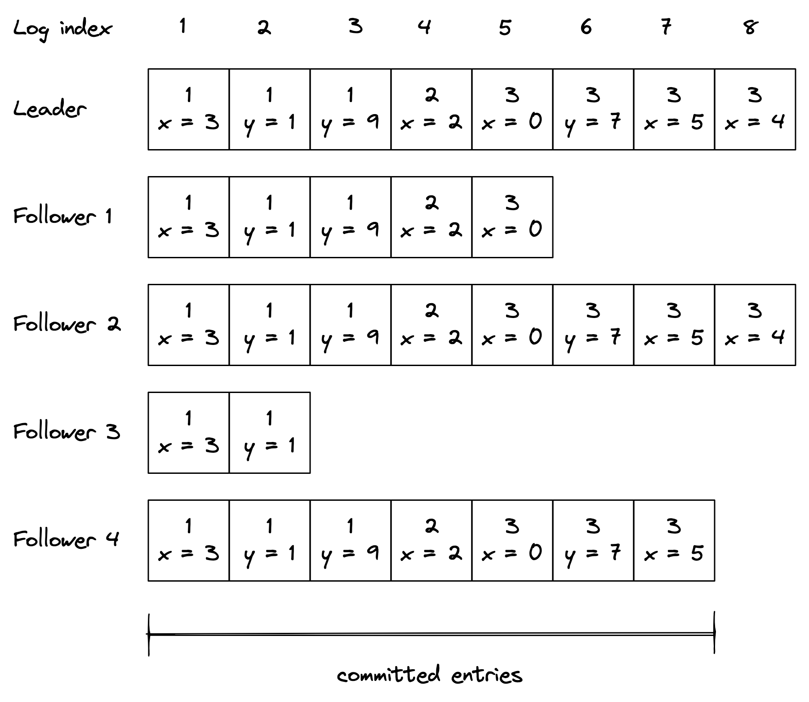
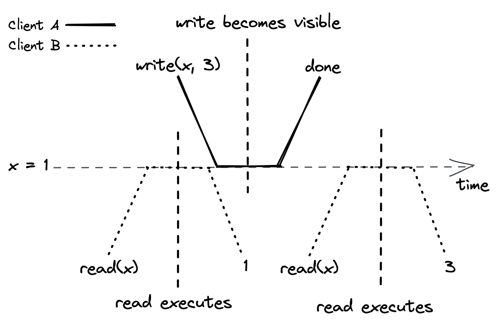
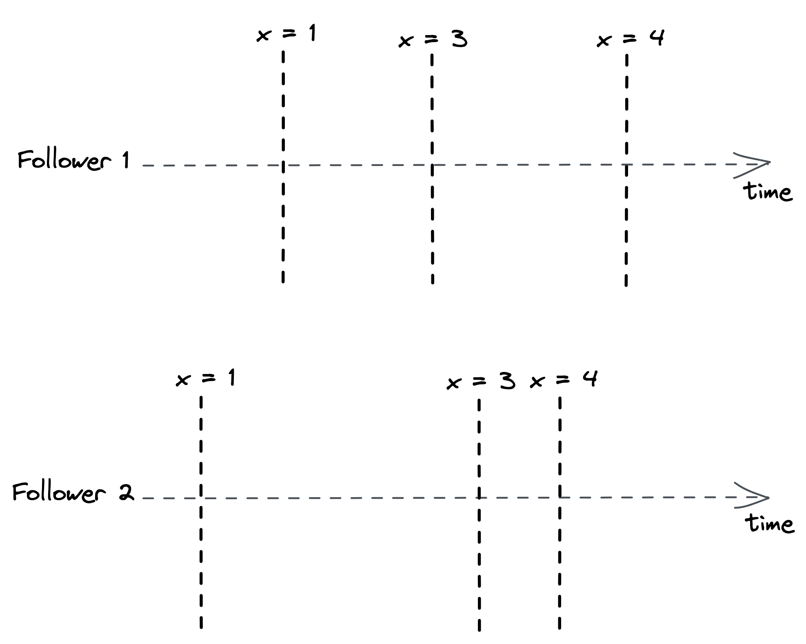
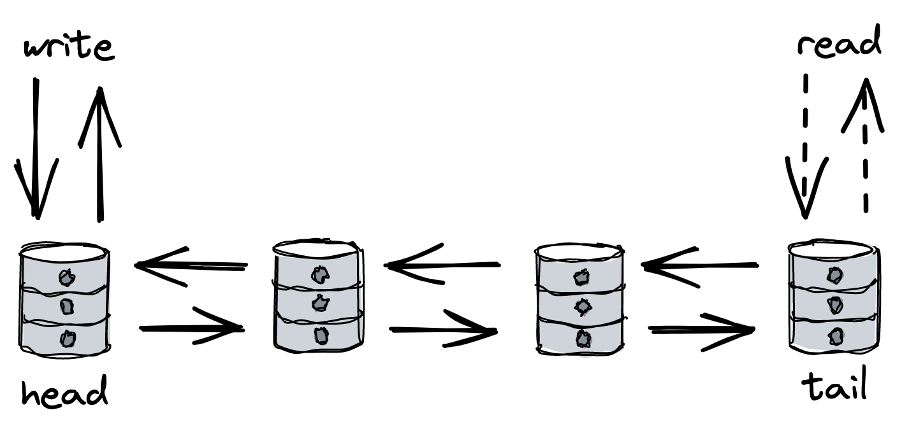

# Chapter 10: Replication

Data replication is a fundamental technique in distributed systems used for two primary reasons:

- **To increase availability**: If data is stored on a single process that fails, the data becomes inaccessible. With replication, clients can switch to a working copy.
- **To increase scalability and performance**: The more replicas there are, the more clients can access the data concurrently.

The main challenge of replication is keeping all replicas consistent with one another, especially in the face of failures. This chapter explores replication primarily through the lens of **state machine replication**, using the Raft algorithm as an example.

The core idea of **state machine replication** is that if multiple processes start in the same initial state and execute the exact same sequence of operations, they will all end up in the same final state. In this model, a leader process broadcasts operations to follower processes (replicas).

## 10.1 Raft State Machine Replication

In the Raft protocol, a leader is first elected. This leader is the only process allowed to change the system's state. It does so by maintaining a log of operations, which it then replicates to its followers.

- A **log** is an ordered list of entries. Each entry contains:
  - The operation to be applied (which must be deterministic).
  - The index of the entry in the log.
  - The leader's election term.

::: {.centerfigure}
{width=80%}
:::

### The Write Process in Raft

1.  A client sends a write request to the leader. The leader appends a new entry for the operation to its local log. The operation is **not yet applied** to the state.
2.  The leader sends an `AppendEntries` request to each follower containing the new entry. This request also serves as a periodic heartbeat.
3.  Upon receiving the request, each follower appends the entry to its own log and sends an acknowledgment back to the leader.
4.  When the leader receives successful acknowledgments from a **majority** of followers (a quorum), it considers the entry **committed** and applies the operation to its local state machine.
5.  The leader informs followers of the latest committed index in future `AppendEntries` requests. Followers then apply the committed entries to their local state.

### Fault Tolerance in Raft

- **Quorum-Based Progress**: Because the leader only needs to wait for a majority of followers, the system can tolerate failures. A system with `2f + 1` followers can tolerate up to `f` failures.
- **Leader Failure**: If the leader fails, a new leader is elected. To prevent an out-of-date follower from becoming leader, a candidate cannot win an election unless its log contains all previously committed entries.
- **Follower Failure**: If a follower is down or a message is lost, the leader will retry sending the `AppendEntries` request indefinitely until a majority have appended it. When the follower comes back online, the leader will find the point where their logs agree and send all necessary entries to bring the follower's log up-to-date.

## 10.2 Consensus

State machine replication is a practical application of **consensus**, a fundamental problem in distributed systems where a group of processes must agree on a single value. The agreement must satisfy three properties:

1.  Every non-faulty process eventually agrees on a value.
2.  The final decision is the same for every non-faulty process.
3.  The agreed-upon value was proposed by one of the processes.

You will likely never need to implement consensus from scratch, as off-the-shelf solutions like **etcd** and **ZooKeeper** are widely used for coordination tasks like leader election.

## 10.3 Consistency Models

A **consistency model** formally defines the possible views that clients (observers) can have of a replicated system's state. There is a fundamental trade-off between consistency, performance, and availability.

### Strong Consistency (Linearizability)

- This is the strongest consistency guarantee a system can provide for single-object requests. It makes the replicated system appear as if there is only a single copy of the data.
- Every operation appears to take place atomically at a specific point in time between its invocation and its completion. Its side-effects are visible to all observers once it completes.
- This can be achieved if all clients send their reads and writes exclusively to the leader. However, for a leader to serve a read, it must first contact a majority of followers to confirm it is still the leader, which adds significant latency.

::: {.centerfigure}
{width=70%}
:::

### Sequential Consistency

- This model guarantees that operations occur in the same order for all observers, but it provides **no real-time guarantee** about when an operation's side-effects become visible.
- This can be achieved by allowing followers to serve reads. Different clients reading from different followers might see the state at different times, but they will all see the state evolve in the same sequence.

::: {.centerfigure}
{width=70%}
:::

### Eventual Consistency

- This is the weakest consistency model. It only guarantees that if no new writes occur, all replicas will **eventually** converge to the same state.
- This occurs when clients can read from any follower. A client might read from one follower, then another that is lagging behind, and see the state appear to go backward in time.

### The CAP and PACELC Theorems

- **The CAP Theorem**: States that a distributed system can only provide two of the following three guarantees: Strong **C**onsistency, **A**vailability, and **P**artition tolerance. Since network partitions are a given, the real choice is between strong consistency and availability.
- **The PACELEÇC Theorem**: Extends CAP by stating that in case of a network **P**artition, a system must choose between **A**vailability and **C**onsistency; **E**lse (during normal operation), it must choose between **L**atency and **C**onsistency.

## 10.4 Chain Replication

Chain replication is a replication protocol that arranges processes in a linear chain, with a **head** and a **tail**.

- **Write Path**: Writes are sent exclusively to the **head**. The update is then passed down the chain from one process to the next until it reaches the **tail**.
- **Read Path**: Reads are served exclusively by the **tail**.
- **Fault Tolerance**: Handled by a dedicated **control plane** (which itself must be fault-tolerant, e.g., using Raft) that monitors the chain and reconfigures it if a node fails. This separates the data path from the control plane.

::: {.centerfigure}
{width=70%}
:::

### Performance and Trade-offs

- **Pros**:
  - **High Read Throughput**: Reads are served immediately from the tail without any coordination, leading to lower latency.
- **Cons**:
  - **High Write Latency**: A write must travel through the entire chain before it is committed, so a single slow replica can slow down all writes.
  - **Lower Write Availability**: If any process in the chain is unavailable, writes cannot be committed until the control plane detects the failure and reconfigures the chain. Raft, in contrast, can commit writes as long as a majority of processes are available.
