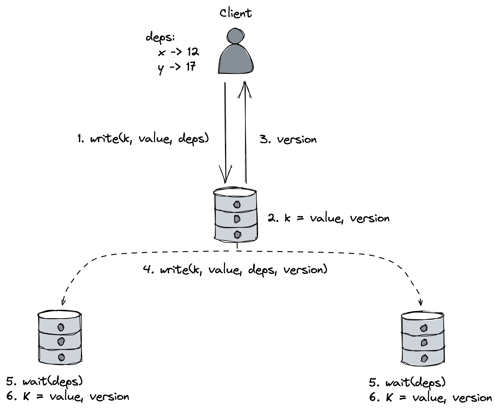

# Chapter 11: Coordination Avoidance

## The Problem with Coordination

Traditional state machine replication requires a **fault-tolerant total order broadcast**, which ensures that every replica receives the same updates in the same order. This is difficult to implement because it requires **consensus**.

This need for a total order creates two major issues:

- **Scalability Bottleneck**: Updates must be processed sequentially by a single process (e.g., the leader in Raft), which limits throughput.
- **Lack of Availability**: Total order broadcast is not available during network partitions, as dictated by the CAP theorem.

This chapter explores replication strategies that avoid coordination by not requiring a total order.

## Broadcast Protocols

Broadcast protocols are used to deliver a message to a group of processes. They are built on top of unicast (point-to-point) protocols like TCP.

- **Best-Effort Broadcast**: The sender sends the message to all processes one by one. If the sender crashes midway, some processes will never receive the message.
- **Reliable Broadcast**: Guarantees that the message is delivered to all non-faulty processes, even if the sender crashes.
  - **_Eager Reliable Broadcast_**: Upon receiving a message for the first time, each process re-broadcasts it to the entire group. This is very expensive, requiring $N^2$ messages for a group of N processes.
  - **_Gossip Broadcast_**: A probabilistic protocol where processes retransmit messages to a random subset of their peers, similar to how rumors spread. While not a 100% guarantee, it's highly effective for broadcasting to large groups where deterministic protocols wouldn't scale.

::: {.centerfigure}
{width=80%}
:::

- **Total Order Broadcast**: The strongest form of broadcast. It is a reliable broadcast that also guarantees messages are delivered in the **same order** to all processes. This requires consensus.

## Conflict-free Replicated Data Types (CRDTs)

If we use a broadcast protocol that _doesn't_ guarantee total order, any replica can accept writes. This improves performance and availability but means replicas will receive updates in different orders and their states will diverge. To be useful, this divergence must be temporary, and replicas must eventually converge to the same state. This is the core idea of **eventual consistency**.

A stronger variation is **Strong Eventual Consistency**, which uses a deterministic method to resolve conflicts _without_ needing consensus. This allows for systems that are simultaneously available, partition-tolerant, and (strongly eventually) consistent.

This is achieved using data types that have specific mathematical properties:

- The set of possible states for an object forms a **semilattice**.
- There is a **merge** operation that is _associative_, _commutative_, and _idempotent_.

Data types with these properties are called **Conflict-free Replicated Data Types (CRDTs)**. They are designed to converge automatically.

### Common CRDT Implementations

- **Last-Writer-Wins (LWW) Register**: Each update is associated with a timestamp. When merging two versions of an object, the one with the greater timestamp "wins," and the other is discarded. This is simple but can arbitrarily discard a concurrent update.

::: {.centerfigure}
{width=50%}
:::

- **Multi-Value (MV) Register**: Instead of discarding concurrent updates, the MV register keeps all of them. It uses vector clocks to detect which updates are concurrent. The application or client is then responsible for resolving the conflict by choosing a value or merging them.

::: {.centerfigure}
{width=50%}
:::

CRDTs are composable, meaning you can build complex structures like a key-value store using a dictionary of CRDT registers.

## Dynamo-style Data Stores

Dynamo is a famous design for a highly available, eventually consistent key-value store. Systems like Cassandra and Riak KV are inspired by it.

### Quorum Replication

- **Operation**: Any replica in the system can accept read and write requests.
- **Write Quorum (W)**: When a client writes, it sends the request to N replicas but only waits for acknowledgements from a subset **W**.
- **Read Quorum (R)**: When a client reads, it sends the request to N replicas but waits for responses from a subset **R** and uses the most recent value.
- **Consistency**: If **`W + R > N`**, the read and write quorums are guaranteed to overlap. This ensures that a read will see at least one replica with the latest committed write.

::: {.centerfigure}
{width=40%}
:::

### Anti-Entropy Mechanisms

To ensure that all replicas eventually receive all updates (even those missed during the initial write), Dynamo-style systems use anti-entropy (or healing) mechanisms:

- **Read Repair**: When a client reads from R replicas, it might detect some have stale data. The client then issues a write request to update those out-of-sync replicas with the newer value.
- **Replica Synchronization**: A continuous background process where replicas periodically communicate (often using a gossip protocol) to compare their data (e.g., using Merkle trees) and repair any inconsistencies.

## The CALM Theorem

The CALM theorem provides a formal way to determine if an application can be implemented without coordination (like consensus).

- **Theorem**: A program has a consistent, coordination-free distributed implementation _if and only if_ it is **monotonic**.
- **Monotonicity**: A program is monotonic if new inputs only add to or refine the result, without ever invalidating or retracting a previous output.
  - _Monotonic Example_: Adding items to a shopping cart.
  - _Non-Monotonic Example_: A bank transfer, which involves both a decrement (non-monotonic) and an increment. Standard variable assignment is also non-monotonic as it overwrites the previous value.
- CRDTs are, by design, monotonic.

## Causal Consistency

Causal consistency is a model that is stronger than eventual consistency but weaker than strong consistency.

- **Problem Solved**: It preserves the "happened-before" relationship between operations. In an eventually consistent system, you might see a comment on a photo before you see the photo itself. Causal consistency prevents this.
- **Guarantee**: If operation A _causes_ operation B, all processes are guaranteed to see A before B. Operations that are not causally related (i.e., are concurrent) can be observed in different orders by different processes.
- **Significance**: Causal consistency is the **strongest** consistency model that can be achieved while also guaranteeing availability and partition tolerance.

### Implementation (based on COPS)

Causal consistency can be implemented by tracking dependencies.

1.  When a client reads a key, it notes the version (e.g., a logical timestamp) of the data it received. This version becomes a **dependency**.
2.  When the client later writes a new value, it sends its list of dependencies along with the write request to its local replica.
3.  The local replica applies the write and broadcasts it asynchronously to other replicas.
4.  When a remote replica receives the broadcasted write, it **waits** until it has seen and applied all the write's dependencies before applying the write itself. This ensures the causal order is respected across the system.

::: {.centerfigure}
{width=70%}
:::
