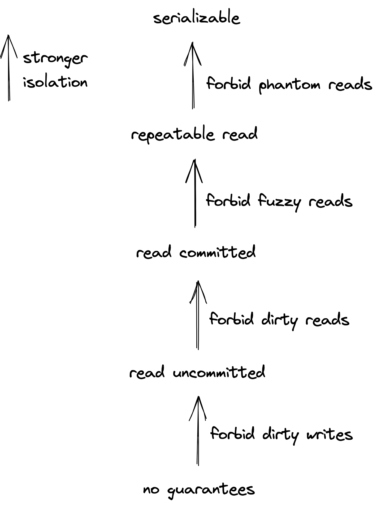
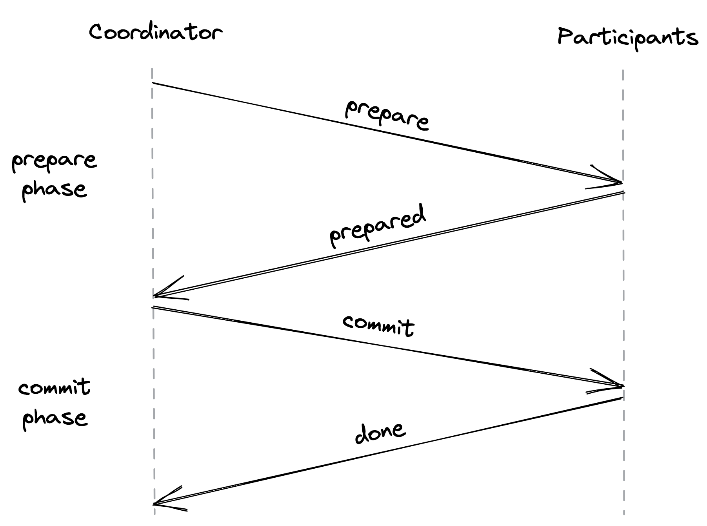
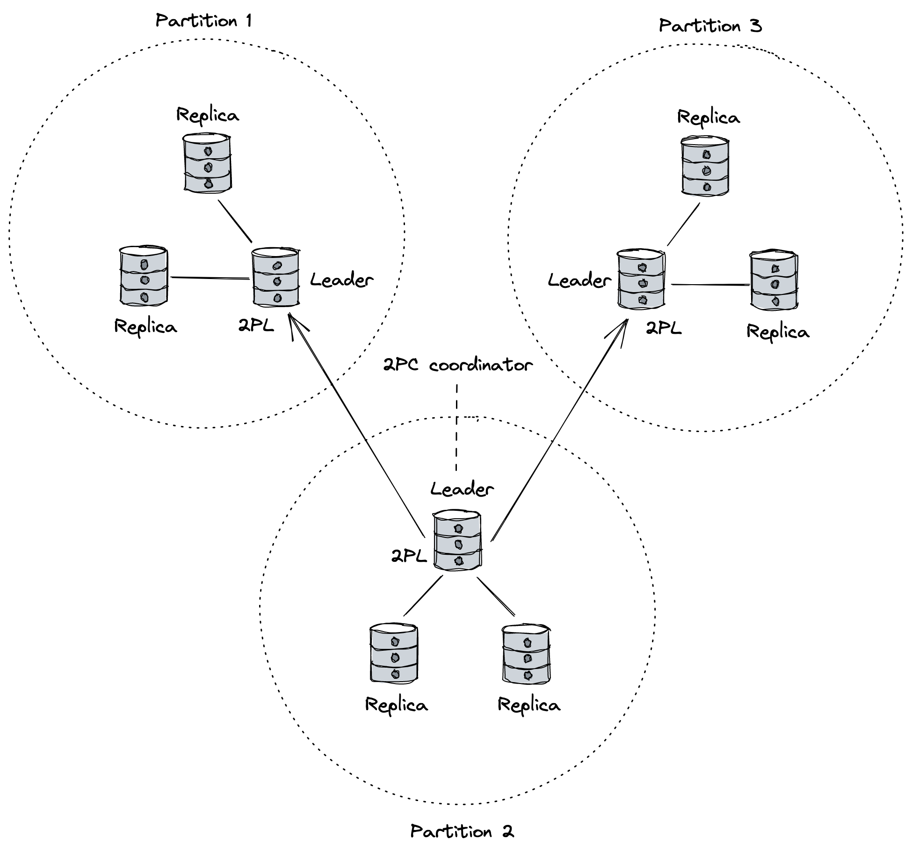

# Chapter 12: Transactions

A **transaction** is a group of operations that are treated as a single, indivisible unit. It gives the illusion that either all operations within the group complete successfully, or none of them do. While straightforward in a single database, this becomes challenging in distributed systems (e.g., microservice architectures) where a transaction must span multiple data stores.

## ACID Properties of Transactions

In traditional databases, transactions provide a set of guarantees known as **ACID**:

- **Atomicity**: Guarantees all-or-nothing execution. If a transaction starts but fails for any reason, all of its partial changes must be undone (rolled back). This ensures the system is never left in a partially updated state.
- **Consistency**: Ensures that a transaction can only bring the database from one valid state to another. This is an application-level guarantee; the developer who defines the transaction is responsible for maintaining invariants (e.g., ensuring money is not created or destroyed in a transfer).
- **Isolation**: Guarantees that concurrently executing transactions do not interfere with each other. From any single transaction's perspective, it appears to be running completely alone, which prevents race conditions.
- **Durability**: Ensures that once a transaction is successfully committed, its changes are permanent and will survive subsequent system crashes. In distributed systems, true durability requires **replication** to protect against storage device failures.

## Isolation Levels and Concurrency Control

Running transactions one by one (serially) would guarantee isolation, but it would be extremely inefficient. Therefore, databases run transactions concurrently, which can lead to several types of race conditions:

- **Dirty Write**: A transaction overwrites a value written by another transaction that has not yet committed.
- **Dirty Read**: A transaction reads a value from another uncommitted transaction.
- **Fuzzy Read**: A transaction reads the same object twice and gets a different value each time because another transaction modified it in between.
- **Phantom Read**: A transaction executes a query twice (e.g., `SUM(salaries)`) and gets a different result because another transaction added or removed rows that match the query's criteria.

### Isolation Levels

Databases offer different **isolation levels** to protect against these race conditions. A stronger level provides more protection at the cost of performance.

::: {.centerfigure}
{width=50%}
:::

- **Serializability**: The strongest isolation level. It guarantees that the result of running a group of transactions concurrently is the same as if they had been run serially (one after another) in _some_ order. It prevents all possible race conditions.
- **Strict Serializability**: This level combines serializability with the real-time guarantees of linearizability. It ensures that once a transaction completes, its effects are immediately visible to all future transactions. This is the safest, most intuitive model but often comes with a performance penalty.

### Concurrency Control Protocols

These are the mechanisms databases use to enforce isolation while maximizing concurrency.

- **Pessimistic Control (e.g., Two-Phase Locking - 2PL)**: This approach assumes conflicts are likely and uses locks to prevent transactions from interfering with each other.

  - It uses **read locks** (shared) and **write locks** (exclusive).
  - A transaction has two phases: an _expanding phase_ where it only acquires locks, and a _shrinking phase_ where it only releases them. In practice (_strict 2PL_), all locks are held until the transaction commits or aborts.
  - Its main drawback is the risk of **deadlock**, where two or more transactions get stuck waiting for each other's locks. Deadlocks must be detected and broken by aborting one of the transactions.

- **Optimistic Control (e.g., Optimistic Concurrency Control - OCC)**: This approach assumes conflicts are rare.

  - Transactions execute on a private workspace without taking locks.
  - When a transaction is ready to commit, the system performs a **validation step** to check if its work conflicts with any other concurrently running transaction.
  - If there is no conflict, the transaction's changes are applied. If a conflict is detected, the transaction is aborted and must be restarted.
  - This protocol is efficient for read-heavy workloads where conflicts are infrequent.

- **Multi-Version Concurrency Control (MVCC)**: The most widely used concurrency control scheme today.
  - It maintains older versions of data to avoid conflicts between readers and writers.
  - When a **read-only transaction** starts, it is given a consistent snapshot of the database. It can read from this snapshot without blocking or being blocked by write transactions.
  - **Write transactions** still use a pessimistic (2PL) or optimistic (OCC) protocol to handle conflicts with other write transactions.
  - Because most transactions are read-only, MVCC provides a significant performance improvement.

## Atomicity and Distributed Commit

To guarantee atomicity in a single database, changes are first written to a **Write-Ahead Log (WAL)** on disk before being applied. If the system crashes or a transaction aborts, the WAL contains all the information needed to undo partial changes.

However, this mechanism doesn't work for transactions that span multiple, separate data stores. For that, a distributed commit protocol is needed.

### Two-Phase Commit (2PC)

2PC is a protocol used to achieve atomic transaction commits across multiple distributed participants. It involves a **coordinator** and one or more **participants**.

- **Phase 1: Prepare Phase**

  1.  The coordinator sends a `prepare` message to all participants, asking if they are ready to commit the transaction.
  2.  Each participant performs any work needed to be in a committable state (e.g., writing to its own WAL), and then responds "yes" or "no".
  3.  A "yes" vote is a promise; the participant is now locked in and cannot unilaterally abort. It must wait for the coordinator's final decision.

- **Phase 2: Commit Phase**
  1.  If the coordinator receives "yes" from **all** participants, it sends a `commit` message to all of them.
  2.  If the coordinator receives even one "no" or a participant times out, it sends an `abort` message to all of them.

::: {.centerfigure}
{width=60%}
:::

**Drawbacks of 2PC**:

- It is **slow**, requiring multiple network round-trips.
- It is a **blocking protocol**. If the coordinator fails after participants have voted "yes," the participants are stuck and cannot release their locks until the coordinator recovers.

## NewSQL: Combining Scalability and Transactions

"NewSQL" refers to a new generation of distributed databases that aim to provide the scalability of NoSQL systems with the strong transactional guarantees (ACID) of traditional relational databases.

### Example: Google's Spanner

Spanner is a globally-distributed database that provides ACID transactions at scale.

- **Architecture**: Data is broken into **partitions**. Each partition is replicated across different data centers using a state machine replication protocol (like Paxos), with one node acting as the **leader**.
- **Single-Partition Transactions**: The leader for that partition handles the transaction and uses 2PL for isolation.
- **Multi-Partition Transactions**: Spanner uses **2PC** to coordinate transactions that span multiple partitions. One of the partition leaders acts as the coordinator, while the others act as participants.
- **Fault Tolerance**: The state of the coordinator and all participants is replicated. If a leader fails, another replica is elected to take its place and can resume the 2PC protocol from the replicated log.
- **Isolation**: Spanner uses MVCC combined with 2PL to provide **strict serializability**. This allows read-only transactions to be lock-free.
- **Timestamps**: To order transactions in a globally distributed system, Spanner uses **TrueTime**, a high-precision clock system that uses GPS and atomic clocks. It provides time as an _uncertainty interval_. A transaction must wait for this uncertainty period to pass before committing, ensuring its timestamp is correctly ordered relative to other transactions.

::: {.centerfigure}
{width=80%}
:::
