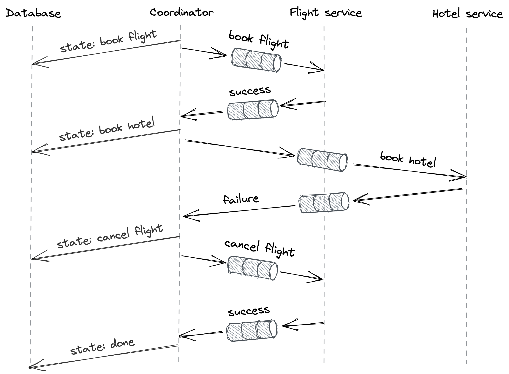

# Chapter 13: Asynchronous Transactions

## The Need for Asynchronous Transactions

The Two-Phase Commit (2PC) protocol is a synchronous and blocking protocol. This means a transaction can't proceed if the coordinator or any participant is slow or unavailable, forcing participants to hold locks and block other transactions. This approach is not suitable for:

- **Long-running transactions** that may take hours or days to complete.
- **Inter-organizational transactions**, where different organizations are unwilling to let external systems block their own.

Asynchronous transactions provide an alternative. They are **atomic** (all-or-nothing) but sacrifice **isolation**. While an asynchronous transaction is in progress, the system is temporarily in an inconsistent state. The core concept behind them is the use of _persistent messages_ that are guaranteed to be processed exactly once.

## The Outbox Pattern

This pattern is a common solution for atomically updating a primary database and then communicating that change to another system, like a search index or cache.

**Use Case**: A product catalog service needs to update its relational database and its Elasticsearch search index whenever a product is changed. Doing this in two separate steps is not atomic; the service could crash after the first step, leaving the systems inconsistent.

**How it Works**:
1.  **Atomic Write**: When the service updates the product catalog, it does so within a single, local ACID transaction. In the _same transaction_, it inserts a message describing the change into a special `outbox` table in the same database.
2.  **Atomicity Guarantee**: Because this is a single ACID transaction, the product update and the message creation are atomic. The message is only saved to the outbox if and only if the product change is successfully committed.
3.  **Relay Process**: A separate, dedicated **relay process** continuously monitors the `outbox` table for new messages.
4.  **Message Delivery**: When the relay finds a message, it sends it to the destination system. In practice, this is often done via a durable message channel like Kafka or Azure Event Hubs. The relay only deletes the message from the outbox after the destination acknowledges its successful delivery.
5.  **Idempotency**: The relay process might crash after sending a message but before deleting it. This would cause it to send the same message again upon restarting. To prevent duplicate processing, each message is given a unique **idempotency key**, which allows the destination service to deduplicate messages and ensure it processes each one exactly once.

The outbox pattern is conceptually similar to state machine replication, where the `outbox` table serves as the replication log.

## The Saga Pattern

The saga pattern is used for managing distributed transactions that consist of multiple steps, where any step could fail and require previously completed steps to be undone.

**Use Case**: A travel booking service needs to book a flight and a hotel. If the flight booking succeeds but the hotel booking fails, the flight must be canceled to maintain atomicity.

**How it Works**:
A saga is a sequence of local transactions `T1, T2, ..., Tn`.

- For every forward transaction `Ti`, there is a corresponding **compensating transaction `Ci`** that can undo its changes.
- The saga guarantees that either all forward transactions (`T1...Tn`) complete successfully, or a combination of forward and compensating transactions are executed to ensure the entire operation is undone, guaranteeing atomicity.

### Orchestration-based Sagas

A common way to implement a saga is with a central **orchestrator** (or coordinator) that manages the entire workflow.

- The orchestrator calls participant services to execute the local transactions in sequence (e.g., first call flight service, then hotel service).
- If a local transaction `Ti` fails, the orchestrator is responsible for calling the compensating transactions `C(i-1)...C1` for all the steps that have already succeeded.
- The orchestrator must persist its own state (e.g., as a state machine) so that if it crashes, it can resume the saga from where it left off.
- Like the outbox pattern, communication between the orchestrator and participants should be asynchronous (via message channels) and use idempotency keys to handle retries and prevent duplicate processing.

::: {.centerfigure}
{width=80%}
:::

## Handling the Lack of Isolation

Asynchronous transactions, by their nature, sacrifice the isolation property of traditional ACID transactions. While a saga is in progress, the system is in an inconsistent state, and another process might read this intermediate data.

One way to work around this lack of isolation is to use **semantic locks**:

- Any data that a saga modifies is marked with a "dirty" flag.
- Another transaction that tries to access this "dirty" data can be programmed to either:
      _ Fail immediately and roll back its own changes.
      _ Wait until the first saga completes and the dirty flag is cleared.
