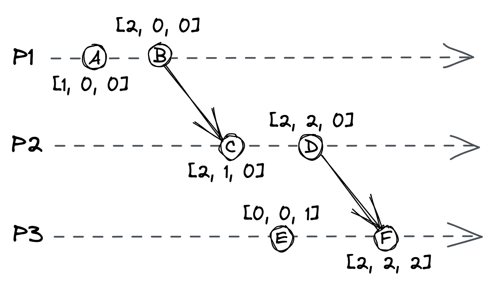

# Chapter 8: Time

Time is a fundamental concept in distributed systems, crucial for everything from DNS record TTLs to failure detection timeouts. However, its most important use is for **ordering events**. In a single-threaded application, operations execute sequentially, but in a distributed system, there is no shared global clock that all processes agree on. This makes it challenging to determine if one operation happened before another, which is critical for building correct applications.

This chapter explores different types of clocks that can be used to order operations across processes in a distributed system.

## 8.1 Physical Clocks

A process has access to a physical wall-time clock, but these clocks have limitations.

- **Quartz Clocks**: The most common type of clock. They are cheap but not very accurate.

  - **Clock Drift**: Due to manufacturing differences and temperature, quartz clocks can run at slightly different rates, causing them to drift apart over time.
  - **Clock Skew**: The difference between two clocks at a specific point in time.

- **Synchronization**: To combat drift, quartz clocks are periodically synced with higher-accuracy clocks, like **atomic clocks**, using a protocol.

  - The most common protocol is the **Network Time Protocol (NTP)**. A client estimates its clock skew by receiving a timestamp from an NTP server and correcting for the estimated network latency.
  - A major issue with this synchronization is that it can cause a machine's clock to jump forward or backward in time, which is problematic when comparing timestamps. An operation that runs after another could have an earlier timestamp.

- **Monotonic Clocks**: Most operating systems also offer a monotonic clock.
  - It measures the number of seconds elapsed since an arbitrary point in time (e.g., system boot time) and is guaranteed to only move forward.
  - It is useful for measuring elapsed time on a _single node_.
  - It is **of no use** for comparing timestamps between different nodes.

Because we cannot perfectly synchronize wall-time clocks across processes, we cannot depend on them for ordering operations across nodes. This leads to the concept of logical time, which is based on causality.

## 8.2 Logical Clocks

A logical clock measures the passing of time in terms of logical operations, not wall-clock seconds. It captures the **happened-before** relationship, where one operation can causally affect another.

### Lamport Clocks

A Lamport clock is a simple logical clock implemented as a local counter in each process. It follows these rules:

- The counter is initialized to 0.
- A process increments its counter by 1 before executing an operation.
- When a process sends a message, it increments its counter and sends a copy of the counter's value in the message.
- When a process receives a message, it merges the received counter with its local counter by taking the **maximum** of the two, and then increments its local counter by 1.

::: {.centerfigure}
8_1.png){width=60%}
:::

- **Guarantee**: If operation $O_1$ happened-before operation $O_2$, the logical timestamp of $O_1$ will be less than the logical timestamp of $O_2$.
- **Limitation**: The reverse is not true. If a timestamp is smaller than another, it does **not** imply a causal relationship. Furthermore, two unrelated operations can have the same logical timestamp.
- **Total Order**: A strict total order can be created by using process IDs to break ties.

## 8.3 Vector Clocks

A vector clock is a more advanced logical clock that provides a stronger guarantee: if a logical timestamp is less than another, then the former event _must have happened-before_ the latter.

- **Implementation**: A vector clock is implemented with an array (or vector) of counters, with one counter for each process in the system. Each process maintains its own local copy of this vector.
- **Rules**: For a system of N processes, a process updates its local vector clock `[$C_1$, $C_2$, ..., $C_n$]` as follows:
  - Initially, all counters in the vector are set to 0.
  - When an internal operation occurs, the process increments **its own counter** in the vector by 1.
  - When a process sends a message, it increments its own counter and sends a copy of the entire vector with the message.
  - When a process receives a message, it merges the received vector with its local one by taking the **element-wise maximum** of the two vectors. It then increments its own counter in the merged vector by 1.

::: {.centerfigure}
{width=60%}
:::

- **Ordering Timestamps**: Given two vector timestamps, $T_1$ and $T_2$, we can determine their relationship:
  - **Happened-Before**: $T_1$ happened-before $T_2$ if every counter in $T_1$ is less than or equal to the corresponding counter in $T_2$, AND at least one counter in $T_1$ is strictly less than the corresponding counter in $T_2$.
  - **Concurrent**: If neither timestamp happened-before the other, the operations are considered concurrent.
- **Problem**: The storage requirement for vector clocks grows linearly with the number of processes, which can be an issue for systems with many clients.

### Conclusion

In general, we cannot use physical clocks to accurately derive the order of events that happened on different processes. Logical clocks provide the mechanism to reason about causality and order. That said, physical clocks are often "good enough" for use cases like timestamping logs for debugging purposes.
