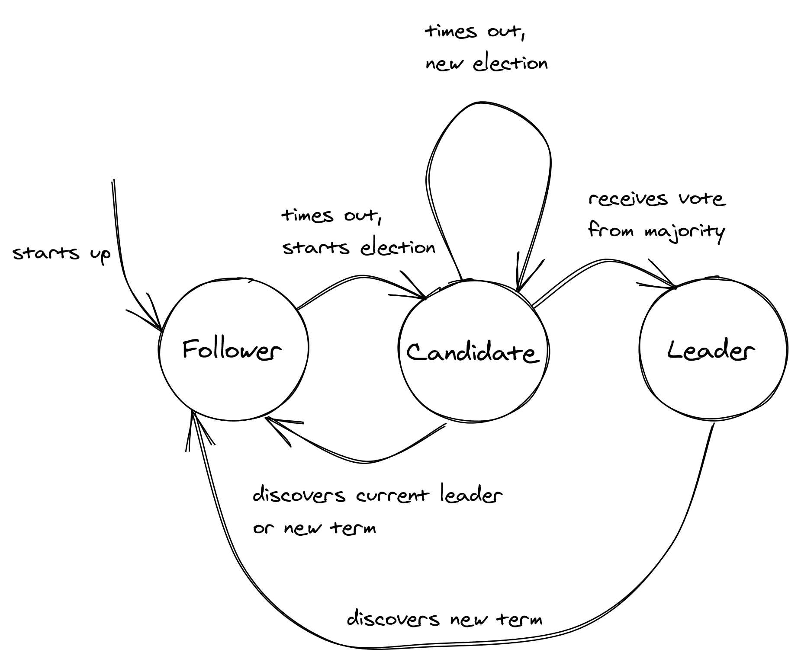

# Chapter 9: Leader Election

In some distributed systems, it is necessary for a single process to have special powers, such as coordinating tasks or accessing a shared resource. This special process is called the **leader**. To select this process, the system runs a **leader election** algorithm among a set of candidate processes. The chosen leader remains in charge until it steps down or becomes unavailable, at which point a new election is held.

A leader election algorithm must provide two fundamental guarantees:

- **Safety**: At most one leader exists at any given time. (Informally, "nothing bad happens.")
- **Liveness**: An election eventually completes, even in the presence of failures. (Informally, "something good eventually does happen.")

## 9.1 Raft Leader Election Algorithm

The Raft leader election algorithm is implemented as a state machine where a process can be in one of three states:

1.  **Follower**: The process recognizes another process as the leader.
2.  **Candidate**: The process has started a new election and is proposing itself as the leader.
3.  **Leader**: The process is the current leader.

In Raft, time is divided into **election terms**, which are numbered with consecutive integers (like logical timestamps). There can be at most one leader per term.

### The Election Process

- Initially, all processes start as **followers**.
- A follower expects to receive periodic heartbeat messages from the current leader. If a follower does not receive a heartbeat within a specific timeout period, it presumes the leader has failed.
- The follower then starts a new election: it increments the current term number, transitions to the **candidate** state, votes for itself, and sends a request to all other processes in the system asking for their vote.

A process remains in the candidate state until one of three things happens:

1.  **The candidate wins the election**:

    - A candidate wins if it receives votes from a **majority** of the processes in the system.
    - Each process can only vote for one candidate per term (on a first-come-first-served basis). This majority rule ensures that at most one candidate can win.
    - Upon winning, the candidate transitions to the **leader** state and begins sending heartbeats to all other processes.

2.  **Another process wins the election**:

    - If the candidate receives a heartbeat from a process claiming to be the new leader with a term greater than or equal to its own, it accepts the new leader and transitions back to the **follower** state.

3.  **A period of time goes by with no winner**:
    - It's possible for multiple followers to become candidates simultaneously, leading to a **split vote** where no candidate obtains a majority.
    - In this case, the candidate will eventually time out and start a new election. To reduce the likelihood of another split vote, the election timeout is chosen randomly from a fixed interval.

::: {.centerfigure}
{width=80%}
:::

## 9.2 Practical Considerations

While Raft is a popular algorithm, you will rarely need to implement leader election from scratch. A more common approach is to use a fault-tolerant key-value store.

### Using Leases with a Key-Value Store

You can implement leader election using any fault-tolerant key-value store that provides a linearizable **compare-and-swap (CAS)** operation with an expiration time (TTL).

- **Compare-and-Swap (CAS)**: An atomic operation that updates the value of a key if and only if its current value matches an expected "old" value.
- **Acquiring a Lease**: Each competing process tries to acquire a "lease" by using CAS to create a key in the store. The first process to succeed becomes the leader.
- **Maintaining Leadership**: The leader must periodically renew the lease to extend its expiration time (TTL). If it fails to do so (e.g., because it crashed), the lease expires, and another process can become the leader.

### The Problem with Leases Alone

A lease by itself does not guarantee that only one process is acting as the leader at a time. A process could acquire a lease, be paused by the operating system for a long time (long enough for the lease to expire), and then resume its work, unaware that another process has already been elected leader. This creates a dangerous race condition.

### Fencing: The Solution to Lease-Based Race Conditions

To solve this problem, we use a technique called **fencing**.

- The shared resource is protected by a **version number** that is incremented every time the resource is updated.
- A process that believes it is the leader reads the resource _and_ its current version number.
- After performing its work, it attempts to write back to the resource **conditionally**, using a compare-and-swap operation. The write succeeds only if the version number has not changed since it was read.
- If the write fails, it means another leader has modified the resource in the meantime, and the current process's action is safely rejected.

### Downsides of a Leader

- **Scalability Bottleneck**: A single leader can become a bottleneck if the number of operations it must perform becomes too large.
- **Single Point of Failure**: If the leader fails or the election process breaks, the entire system can be brought down.
- **Mitigation**: These downsides can be mitigated by introducing **partitions** and assigning a different leader to each partition, a solution common in distributed data stores.

As a rule ofthumb, if you must have a leader, you should minimize the work it performs and design the system to be prepared for moments where there might temporarily be more than one leader.
