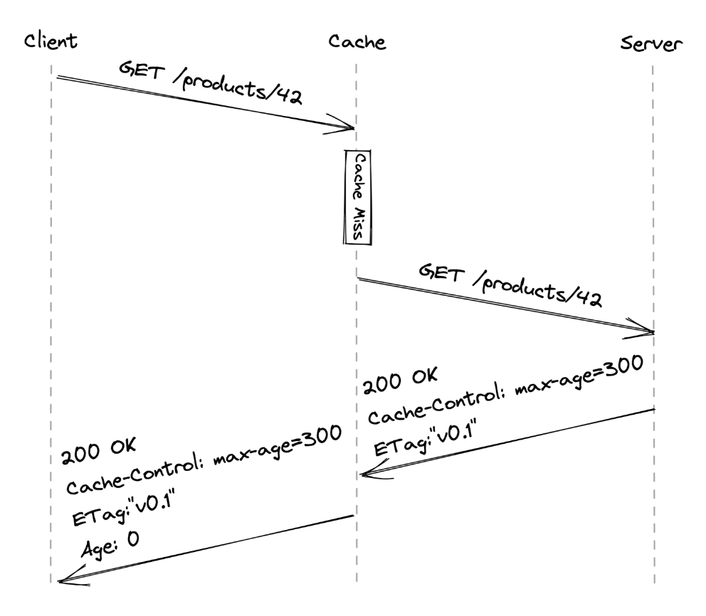
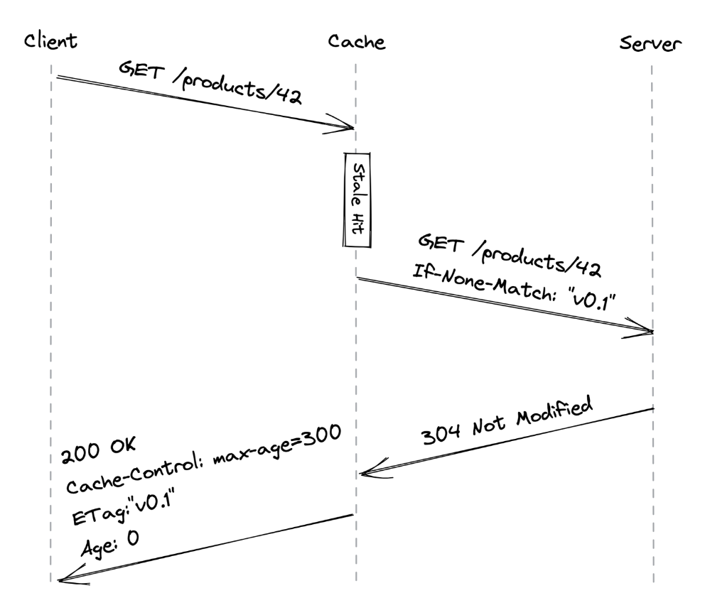

# Chapter 14: HTTP Caching

### I. Core Concepts: Why Cache?

- **Goal:** Improve scalability, reduce server load, and decrease response times.
- **How:** Store copies of resources closer to the client, avoiding repeated requests to the origin server.
- **What to Cache:** Primarily **static resources** -- data that doesn't change frequently (e.g., CSS, JavaScript files, images).
  - **Static Resources:** Data usually doesn't change from one request to another (e.g., JavaScript, CSS files).
  - **Dynamic Resources:** Generated on the fly by the server (e.g., a JSON document with a user's profile).
- **Limitations:** HTTP caching is generally limited to **safe request methods** (those that don't alter server state), like GET or HEAD.

### II. Client-Side HTTP Caching: How It Works

This is the first line of defense in reducing server load. The client (e.g., a browser) maintains a local cache.

**A. First Request for a Resource (Cache Miss)**

1.  **Client Request:** User attempts to access a resource (e.g., `GET /products/42`).

2.  **Cache Check:** The local cache intercepts the request. If the resource isn't found locally (a "cache miss"), the request is forwarded to the origin server.

3.  **Server Response:** The server fetches/generates the resource and sends it back with specific HTTP headers to indicate cachability. Key headers include:

    - `Cache-Control: max-age=300`: Tells the cache how long (in seconds) the resource can be considered "fresh." (TTL - Time To Live).
    - `ETag: "v0.1"`: An entity tag, which is a version identifier for the resource.

4.  **Cache Storage & Client Delivery:** The local cache receives the response, stores the resource (e.g., `products/42` with its headers), and then forwards the resource to the client. The `Age` header indicates how long the object has been in any cache.

    

    _Figure 14.1: A client accessing a resource for the first time (the Age header contains the time in seconds the object was in the cache)_

**B. Subsequent Requests**

1.  **Cache Check (Freshness):** When the client requests the same resource again, the cache first checks if its stored copy is still "fresh" (i.e., `max-age` has not expired).
2.  **Fresh Resource:** If fresh, the cache immediately returns the resource directly to the client without contacting the server. This is fast and saves server load.
    - **System Design Trade-off:** This means reads are not strongly consistent. The server might have updated the resource, but a client with a fresh cache will see the old version until its cache expires. This is often an acceptable trade-off for performance.
3.  **Stale Resource (Validation):** If the resource has expired (is "stale"), the cache must validate it with the server.
    - The cache sends a conditional `GET` request to the server.
    - This request includes an `If-None-Match` header containing the `ETag` of the stale resource (e.g., `If-None-Match: "v0.1"`).
4.  **Server Validation Response:**

    - **No Change:** If the server's version of the resource still has the same `ETag`, it means the resource hasn't changed. The server responds with a `304 Not Modified` status code and an empty body. The client's cache can then mark its stale copy as fresh again (often with updated cache headers) and serve it.

    - **Resource Updated:** If the resource has changed (different `ETag`), the server responds with a `200 OK`, the new version of the resource, and new `Cache-Control` and `ETag` headers. The cache updates its stored copy and returns the new resource to the client.

    

    _Figure 14.2: A client accessing a stale resource_

**C. Immutability and Versioning**

- **Best Practice:** Treat static resources as **immutable**. Cache them "forever" (up to 1 year per HTTP spec).
- **Updating Immutable Resources:** To update an immutable resource, create a _new_ resource with a _different URL_ (e.g., include a version hash in the filename like `style.v2.css` instead of `style.css`).
- **Benefit - Atomic Updates:** If a website update involves changes to HTML, CSS, and JavaScript, by using new URLs for the updated CSS and JS files referenced in the new HTML, clients will either get the complete old version or the complete new version, never a broken mix.

### III. Command Query Responsibility Segregation (CQRS)

- HTTP caching inherently treats the read path (GET requests) differently from the write path (POST, PUT, DELETE requests).
- This aligns with the **Command Query Responsibility Segregation (CQRS)** pattern, which advocates separating operations that read data (Queries) from operations that mutate data (Commands). We expect significantly more reads than writes for many applications.

### IV. Server-Side Caching: Reverse Proxies

While client-side caching helps individual users, server-side caching benefits _all_ users by reducing load on the application servers.

**A. What is a Reverse Proxy?**

- A server-side proxy that intercepts all client communications before they reach the origin server(s).

- **Transparency:** Clients are typically unaware they are communicating through a reverse proxy; it appears as the actual server.

**B. Reverse Proxies for Caching**

- A common use is to cache static resources.
- **Shared Cache:** Since this cache is shared among all clients, it can significantly decrease server load, even more so than client-side caches combined.
  - The same `Cache-Control` and `ETag` mechanisms are typically used.

**C. Other Key Functions of Reverse Proxies**

Beyond caching, reverse proxies are versatile and can handle:

- **Load Balancing:** Distribute incoming requests across multiple backend servers to handle more load and improve availability.
- **SSL Termination:** Handle HTTPS connections, decrypting requests and encrypting responses, offloading this work from application servers.
- **Compression:** Compress responses (e.g., using Gzip) before sending them to clients, reducing bandwidth usage and speeding up transmission.
- **Rate Limiting:** Protect backend servers from being overwhelmed by limiting the number of requests from specific IPs or users.
- **Request Routing:** Direct requests to different backend services based on URL paths or other criteria.
- **Authentication/Authorization:** Perform initial authentication checks before requests hit application servers.
- **Serving Static Content Directly:** Serve static files directly, bypassing application servers entirely for these assets.

**D. Popular Reverse Proxy Software:**

- NGINX.
- HAProxy.
