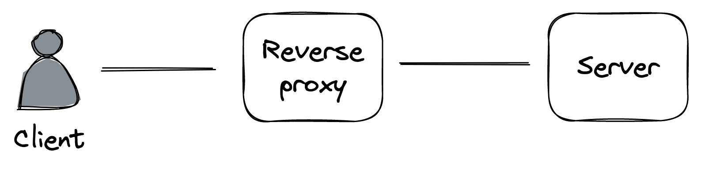

# Chapter 14

# HTTP Caching

## 1. Introduction to HTTP Caching

- **Purpose:** To improve performance and reduce server load by storing copies of resources closer to the client.
- **Static Resources:** Data that doesn't change often from one request to another (e.g., JavaScript, CSS files). These are _ideal candidates_ for caching.
- **Dynamic Resources:** Data generated by the server _on the fly_ (e.g., a JSON document with user profile information).
- **Mechanism:** Clients (e.g., browsers) cache a resource for a specified time (Time To Live - TTL) so subsequent requests for the same resource can be served from the cache, _avoiding a network call_.
- **Scope:** HTTP caching is generally limited to _"safe"_ request methods like `GET` or `HEAD` that _do not alter_ the server's state.

## 2. Client-Side HTTP Caching Workflow

### A. First Request (Cache Miss)

::: {.centerfigure}
{width=60%}
:::

1.  A client issues a `GET` request for a resource it hasn't accessed before.
2.  The local cache intercepts the request. If the resource is not found locally (a _cache miss_), the cache fetches it from the origin server.
3.  The server includes specific HTTP response headers to indicate cachability:
    - `Cache-Control`: Defines _how long_ the resource can be cached (TTL) (e.g., `max-age=300` for 300 seconds).
    - `ETag`: Provides a _version identifier_ for the resource (e.g., `"v0.1"`).
4.  The cache receives the response, stores the resource locally, and returns it to the client.
    - The `Age` header indicates the time in seconds the object has been in the cache (e.g., `Age: 0` for a fresh response from the origin).

### B. Subsequent Request (Resource in Cache)

1.  The client attempts to access the resource again.
2.  The cache checks if the locally stored resource has expired (i.e., if it's _"fresh"_).

    - **Fresh Resource:** If the resource is still within its TTL, the cache _immediately returns it_ to the client.
      - **Consistency Note:** Reads are _not strongly consistent_ with the origin server; the server may have updated the resource even if the client's copy hasn't expired. This is often an acceptable trade-off.
    - **Stale Resource:** If the resource has expired (considered _"stale"_):

      ::: {.centerfigure}
      {width=60%}
      :::

      1. The cache sends a _conditional `GET` request_ to the server.
      2. This request includes an `If-None-Match` header containing the `ETag` (version identifier) of the stale resource.
      3. **Server Response:**
         - If a newer version is available, the server returns the updated resource with a `200 OK` status.
         - If the cached version is still the current one, the server replies with a `304 Not Modified` status code (and no resource body), saving bandwidth. The client then uses its cached version.

### C. Immutable Static Resources

- Ideally, static resources should be treated as _immutable_. This allows clients to cache them "forever" (up to a year per HTTP specification).
- To update an immutable static resource, a new version is created with a _different URL_. This forces clients to fetch the new version.
- **Benefit:** Allows _atomic updates_ of multiple related resources. For example, a new website version with an updated HTML index file will reference new URLs for JS/CSS bundles, preventing a mix of old and new assets.

## 3. Benefits of Client-Side Caching

- Reduces load on the origin server.
- Decreases response time for the client.

## 4. Command Query Responsibility Segregation (CQRS)

- HTTP caching treats the read path (`GET`) differently from write paths (`POST`, `PUT`, `DELETE`).
- This aligns with the **CQRS pattern**, as reads are often expected to be orders of magnitude higher than writes.

## 5. Server-Side Caching: Reverse Proxies

- Caching can be extended by introducing a server-side HTTP cache, often implemented using a _reverse proxy_.

### A. What is a Reverse Proxy?

::: {.centerfigure}
{width=60%}
:::

- A _server-side proxy_ that intercepts all communications with clients.
- It acts as an intermediary between clients and the actual server(s)..
- Clients are typically _unaware_ they are communicating through a reverse proxy as it's indistinguishable from the origin server.

### B. Benefits for Caching

- A common use case is to _cache static resources_ returned by the server.
- Since this cache is _shared among all clients_, it can decrease server load much more significantly than individual client-side caches.

### C. Other Functionalities of Reverse Proxies

Because a reverse proxy is a middleman, it can perform many other functions:

- Authenticate requests on behalf of the server.
- Compress responses before sending them to clients to speed up transmission.
- Rate-limit requests from specific IPs or users to protect the server.
- Load-balance requests across multiple servers to handle more load.

### D. Examples & Evolution

- Widely-used reverse proxies include **NGINX** and **HAProxy**.
- Many reverse proxy use cases, including server-side caching, have been _commoditized by managed services_.
- Instead of building a server-side cache with a reverse proxy, one might leverage a **Content Delivery Network (CDN)**.
