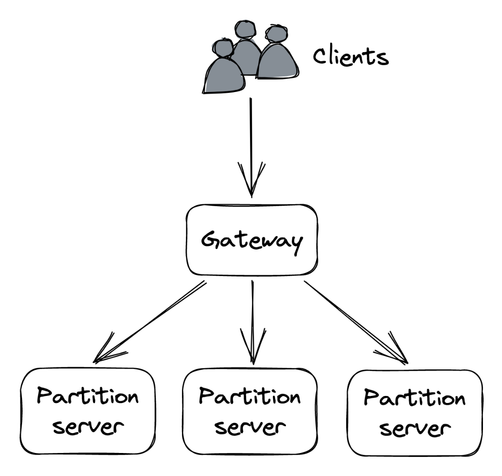
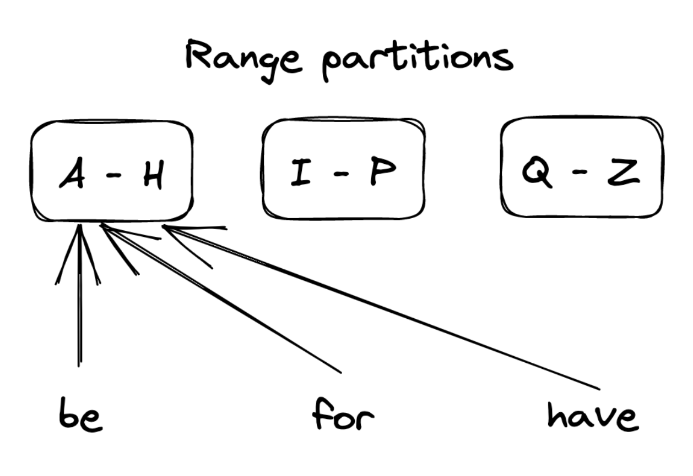
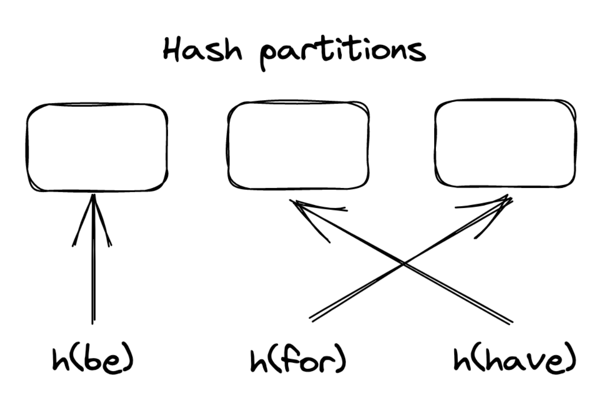
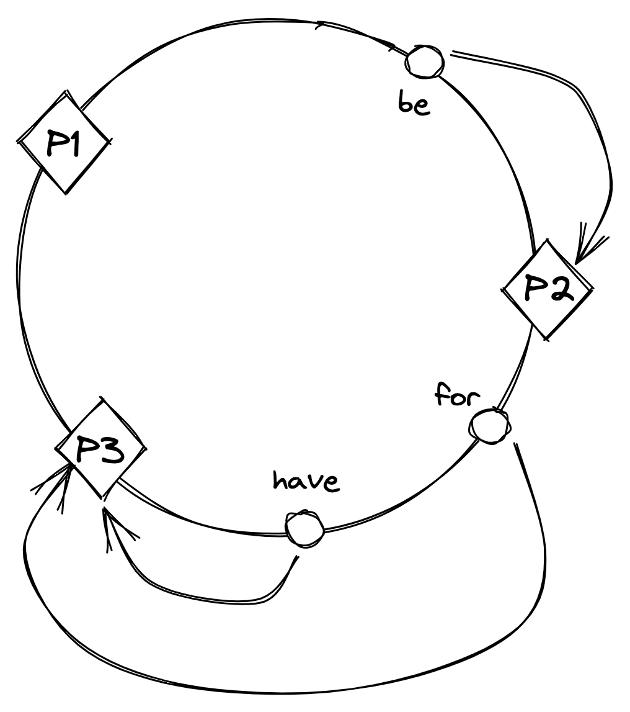
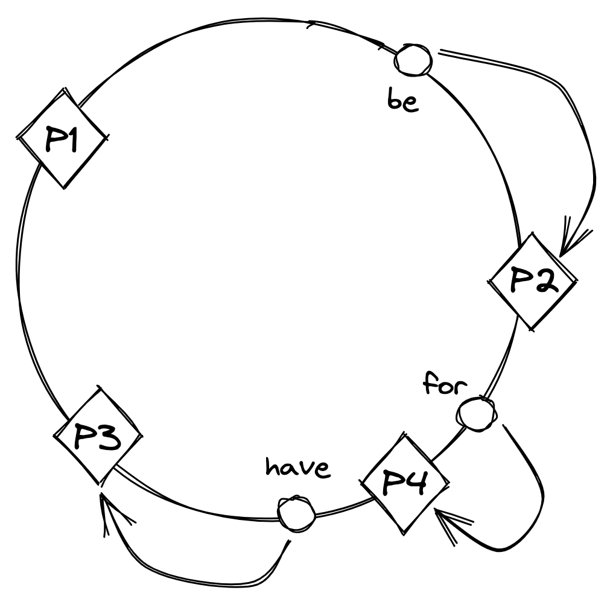

# Chapter 16

# Partitioning

## 1. What is Partitioning and Why is it Needed?

- **Definition:** When an application's data volume grows too large to fit on a single machine, it needs to be split into smaller pieces called **partitions** or **shards**. Each partition is small enough to fit on an individual node.
- **Primary Goal:** To manage _large datasets_ that exceed the capacity of a single machine.
- **Additional Benefit:** Increases the system's capacity for handling requests because the _load of accessing data is spread_ across multiple nodes.

## 2. The Role of a Gateway Service

- When a client sends a request to a partitioned system, it needs to be routed to the _correct node(s)_ responsible for it.
- A **gateway service** (like a reverse proxy) is typically responsible for this routing, knowing how the data is mapped to partitions and nodes (see Figure 16.1).
- This data-to-partition mapping is usually maintained by a _fault-tolerant coordination service_ (e.g., etcd or Zookeeper).

::: {.centerfigure}
{width=45%}
:::

## 3. Complexities and Drawbacks of Partitioning

Partitioning is not without its challenges and introduces significant complexity:

- **Gateway Requirement:** A gateway service is _necessary_ to direct requests to the appropriate nodes.
- **Data Aggregation:** To roll up data across different partitions (e.g., for a "group by" operation), data must be fetched from multiple partitions and then aggregated, which _adds complexity_.
- **Cross-Partition Transactions:** Transactions that need to atomically update data spanning multiple partitions _limit scalability_.
- **Hotspots:** If a partition is accessed much more frequently than others, the system's ability to scale is limited.
- **Dynamic Resizing (Rebalancing):** Adding or removing partitions at runtime is _challenging_ because it requires moving data across nodes.

## 4. Partitioning and Caches

- Caches are _well-suited_ for partitioning because they avoid many of the common complexities. This is mentioned in the context of discussing CDNs just before partitioning.
- For instance, caches generally _don't require atomic updates_ across partitions or complex aggregations spanning multiple partitions.

## 5. Prerequisite for Key Partitioning

- A fundamental requirement for partitioning key-value data is that the number of possible keys must be _very large_.
- Keys with a small set of possible values (e.g., a boolean key with only two values) are _not suitable_ for partitioning as they allow for at most two partitions.

## 6. Methods of Mapping Key-Value Data to Partitions

There are two primary ways to map key-value pairs to partitions: range partitioning and hash partitioning.

### 6.1. Range Partitioning

- **Definition:** Range partitioning splits data by _key range_ into lexicographically sorted partitions (as shown in Figure 16.2).
- **Performance:** To make range scans fast, each partition is generally stored in sorted order on disk.

::: {.centerfigure}
{width=45%}
:::

- **Challenges:**
  - **Picking Boundaries:** The first challenge is picking partition boundaries.
    - Evenly splitting the key range works well if key distribution is _uniform_.
    - If not uniform (like words in the English dictionary), partitions can become _unbalanced_, with some having significantly more entries than others.
  - **Hotspots:** Certain access patterns can lead to hotspots, affecting performance. For example, if data is range-partitioned by date, all requests for the current day might hit a _single node_.
    - Workaround: Adding a random prefix to the partition keys can help, but it increases complexity.
- **Rebalancing (Adding/Removing Nodes):**
  - **Need:** When data size or request volume changes, nodes need to be added or removed to sustain the load and manage costs. This process of adding and removing nodes to balance the system's load is called **rebalancing**.
  - **Goal:** Rebalancing should _minimize system disruption_ and the amount of data transferred, as the system needs to continue serving requests.
  - **Static Partitioning:**
    - One solution is to create _many more partitions_ than initially needed and assign multiple partitions to each node when the system is first initialized. This is also called static partitioning since the number of partitions doesn't change over time.
    - When a new node is added, some partitions are moved from existing nodes to the new one to maintain a balanced state.
    - **Drawbacks:**
      - The number of partitions is _fixed_ and hard to change.
      - Getting the initial number of partitions right is difficult: too many can add overhead and decrease performance; too few can limit scalability.
      - Some partitions might still become hotspots if accessed much more than others.
  - **Dynamic Partitioning:**
    - The alternative is to create partitions _on demand_, also referred to as dynamic partitioning.
    - The system starts with a single partition. When it grows too large or becomes too hot, it's split into two sub-partitions (approximately half of the data each), and one sub-partition is moved to a new node.
    - Conversely, if two adjacent partitions become small or "cold" enough, they can be merged into a single one.

### 6.2. Hash Partitioning

- **Definition:** An alternative way of mapping data to partitions is to use a _hash function_ that deterministically maps a key to a seemingly random number (a hash) within a defined range (e.g., 0 to $2^{64}-1$). This guarantees that the keys' hashes are distributed _uniformly_ across the range. Next, a subset of these hashes is assigned to each partition (as shown in Figure 16.3).
  - Example: `hash(key) mod N`, where N is the number of partitions.

::: {.centerfigure}
{width=45%}
:::

- **Benefit:** Generally ensures partitions contain a _relatively similar number of entries_.
- **Challenges:**
  - **Hotspots:** Does _not eliminate hotspots_ if the access pattern is non-uniform. If a single key is accessed very frequently, the node hosting its partition could become overloaded.
    - Solutions: The partition needs to be split further by increasing the total number of partitions, or the key needs to be split into sub-keys (e.g., by prepending a random prefix).
  - **Rebalancing with Modulo Operator:** Assigning hashes to partitions via the modulo operator can become problematic when a new partition is added, as _most keys have to be moved_ (shuffled) to a different partition because their assignment changes. Shuffling data is extremely expensive as it consumes network bandwidth and other resources.
    - Ideally, if a partition is added, only $K/N$ keys should be shuffled around (where K is the number of keys and N is the number of partitions).
- **Consistent Hashing:**
  - One widely used hashing strategy with that property is **consistent hashing**.
  - **How it works:** With consistent hashing, a hash function randomly maps both partition identifiers and keys onto an _imaginary circle_. Each key is assigned to the _closest partition_ that appears on the circle in a clockwise direction (see Figure 16.4).

::: {.centerfigure}
{width=45%}
:::

- **Adding a new partition:** When a new partition is added, _only the keys that now map to it on the circle_ need to be reassigned (as shown in Figure 16.5).

::: {.centerfigure}
{width=45%}
:::

- **Main Drawback of Hash Partitioning (vs. Range Partitioning):**
  - The _sort order of keys across partitions is lost_, which is required to efficiently scan all the data in order.
  - However, data _within_ an individual partition can still be sorted based on a secondary key.
