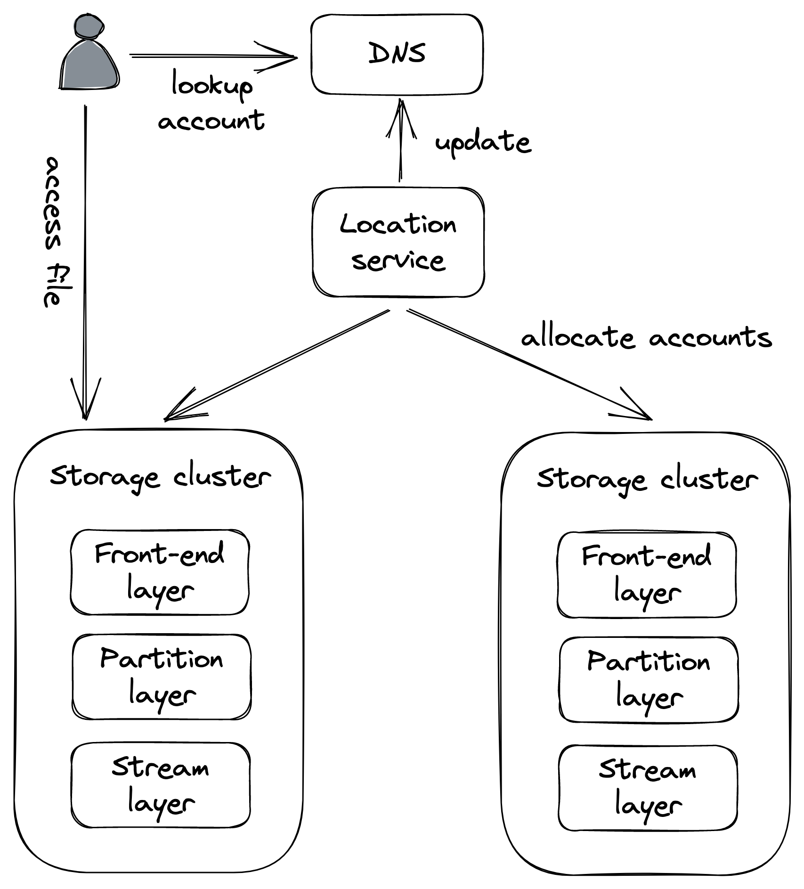
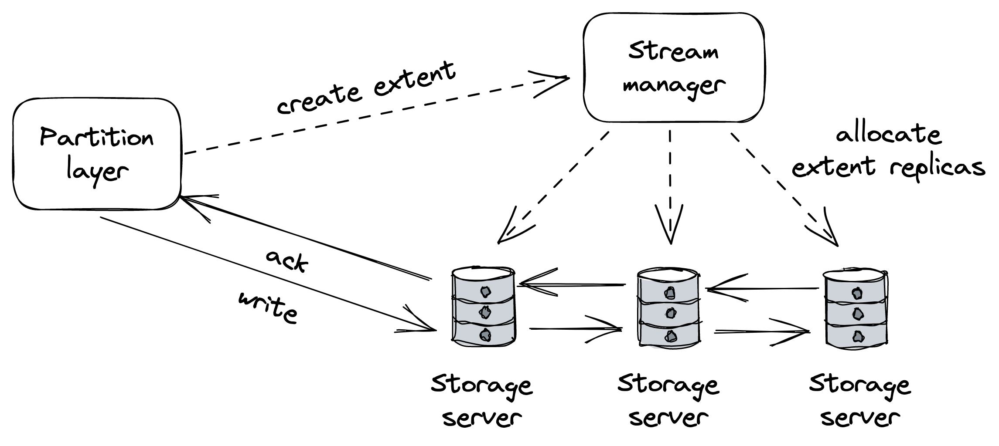
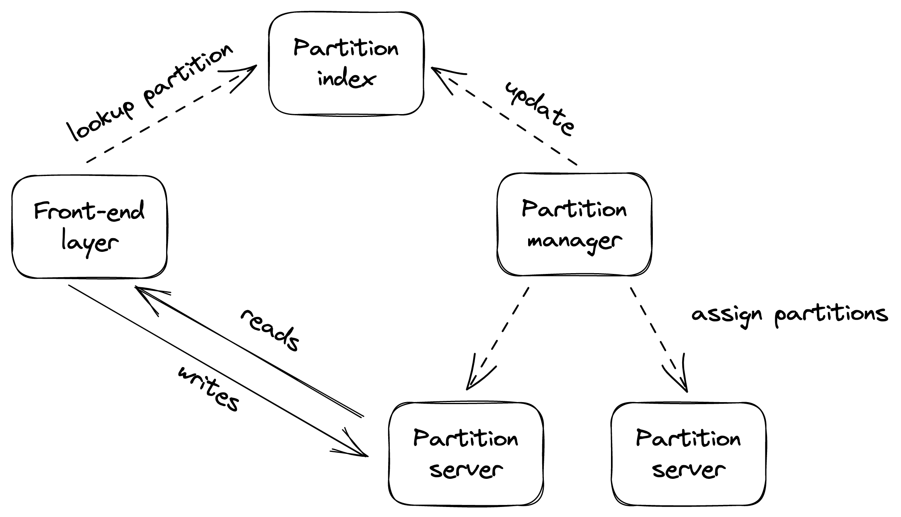

# Chapter 17

# File Storage

## 1. Introduction to Managed File Stores

- **Problem:** Application servers have limited local disk space and can run out when storing many images, videos, and other static files.
- **Solution:** Utilize **managed file stores**, such as _AWS S3_ or _Azure Blob Storage_, to store large static files.
- **Key Benefits:** These services are typically:
  - **Scalable**
  - **Highly available**
  - Offer **strong durability guarantees**
- **CDN Integration:** Files uploaded to a managed store can be configured for public URL access, enabling CDNs to point directly to them.
- **Outcome:** This approach allows for the _complete offloading_ of storage and serving of static resources to managed services, significantly reducing the load on the application server.

## 2. Blob Storage Architecture (Focus on Azure Storage - AS)

Understanding the internal workings of distributed file stores is beneficial due to their crucial role in modern applications. This section focuses on Azure Storage (AS) as an example of a scalable cloud storage system with strong consistency, specifically its file abstraction (blob store).

### A. Global Infrastructure

- AS consists of **storage clusters** distributed across _multiple regions worldwide_.
- Each storage cluster comprises multiple **racks of nodes**. Each rack is a separate unit with _redundant networking and power_.

### B. Namespace and Access

- AS uses a **global namespace** based on domain names, composed of an _account name_ and a _file name_.
- These two parts form a **unique URL** pointing to a specific file (e.g., `https://ACCOUNT_NAME.blob.core.windows.net/FILE_NAME`).
- The _account name_ (customer-configured) is used by AS DNS to identify the specific **storage cluster** where the data resides.
- The _file name_ is used by the identified cluster to locate the **node** responsible for that data.

### C. Location Service (Global Control Plane)

- This central service manages:
  - Creation of new accounts.
  - Allocation of accounts to storage clusters.
  - Moving accounts between clusters for better _load distribution_.
- **New Account Creation Process:**
  1. The location service selects a suitable cluster for the new account (in a specific region requested by the customer) based on current _load information_.
  2. It updates the chosen cluster's configuration to begin accepting requests for this new account.
  3. It creates a new _DNS record_ that maps the account name to the cluster's public IP address.

### D. Storage Cluster Architecture (Three Layers)

::: {.centerfigure}
{width=50%}
:::

A storage cluster in AS is architecturally composed of three distinct layers:

1.  **Stream Layer:**

    - Implements a _distributed append-only file system_. Data is stored in structures called **streams**.
    - Internally, a stream is a sequence of **extents**. The _extent_ is the fundamental unit of replication.
    - Writes to extents are replicated _synchronously_ using **chain replication**.
    - **Stream Manager (Control Plane):**

      ::: {.centerfigure}
      {width=70%}
      :::

      - Responsible for assigning an extent to a specific _chain of storage servers_ within the cluster.
      - When allocating a new extent, it provides the client (partition layer) with the list of storage servers in the chain for that extent.
      - The client caches this information and uses it to send future writes directly to the _primary server_ in the chain.
      - Handles _unavailable or faulty extent replicas_ by creating new ones and reconfiguring their replication chains.

2.  **Partition Layer:**

    - This layer translates _high-level file operations_ (like read, write, delete on a file) into _low-level stream operations_ (on extents).
    - **Partition Manager (Control Plane):**

      ::: {.centerfigure}
      {width=70%}
      :::

      - Manages a _large distributed index_ of all files stored in the cluster.
      - Each index entry contains metadata (e.g., account and file name) and a pointer to the actual data in the stream service (which includes a list of extents, plus offset and length within those extents).
      - It _range-partitions_ this index and maps each index partition to a specific **partition server**.
      - Responsible for _load-balancing_ these index partitions across partition servers, including _splitting_ partitions when they become too "hot" (frequently accessed) and _merging_ "cold" ones.

    - This layer also _asynchronously replicates accounts across different clusters_ in the background. This is used for migrating accounts for load balancing and for disaster recovery purposes.

3.  **Front-End Layer:**
    - A _stateless service_ that acts as a **reverse proxy**.
    - It _authenticates incoming requests_.
    - It routes these requests to the _appropriate partition server_ by consulting the mapping managed by the partition manager.

### E. Architectural Significance & Consistency

- The architecture of AS demonstrates the application of various _scalability patterns_ in a large-scale, concrete system.
- **Historical Note on Consistency:** Azure Storage was designed and built with _strong consistency_ from its inception. In contrast, AWS S3 initially offered eventual consistency for some operations and started providing strong read-after-write consistency in 2021.
