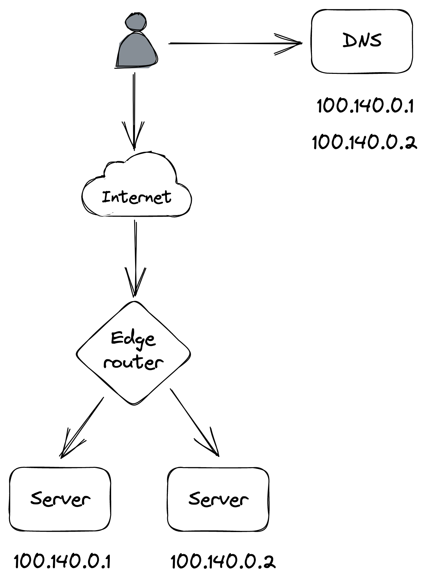
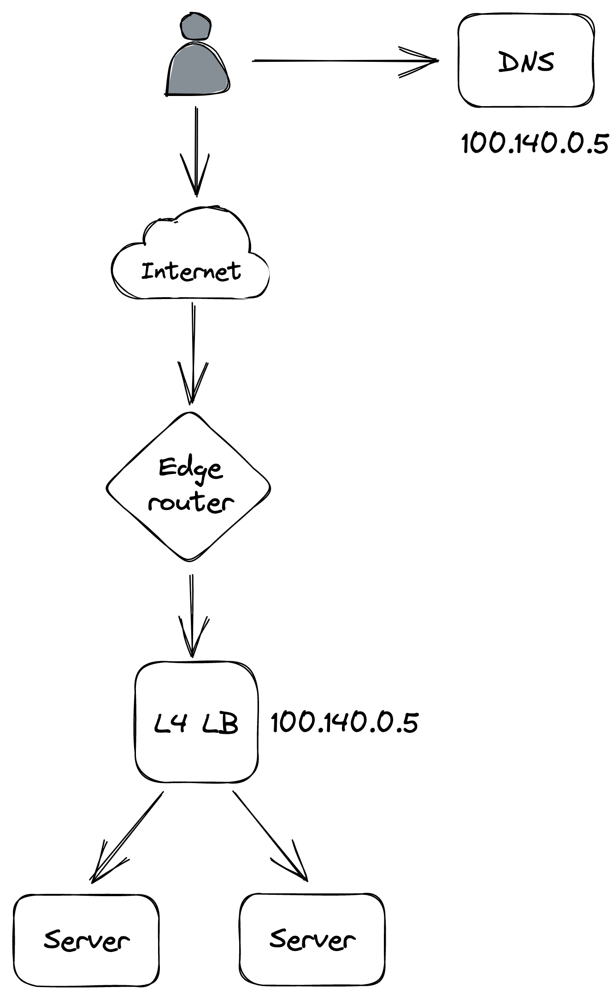

# Chapter 18

# Network Load Balancing

## 1. Introduction to Network Load Balancing

- **Problem:** A single application server, even after offloading to file stores and CDNs, will eventually become a bottleneck as request volume increases.
- **Solution:** Create multiple application servers and use a **load balancer** to distribute requests among them.
  - This is an example of _scaling out_ or _scaling horizontally_.
  - The idea is that if one server has a certain capacity, multiple servers should proportionally increase that capacity.
- **Prerequisite for Horizontal Scaling:** The application should be **stateless**.
  - State should be pushed to dedicated services (e.g., database, managed file store).
  - Scaling out stateless applications is relatively straightforward, assuming dependencies can also scale.
  - Scaling stateful services (like data stores) is much more challenging due to the need for state replication and coordination.
- **General Guideline:** Aim to keep applications stateless by leveraging third-party services designed for state management.

## 2. Benefits of Load Balancing

- **Decoupling:** Clients are decoupled from individual server addresses; they don't need to know them.
- **Transparent Scaling:** The number of servers behind the load balancer can be increased or decreased transparently to clients.
- **Increased Availability:**
  - Load balancers can detect faulty servers and remove them from the pool, allowing other redundant servers to handle requests.
  - **Availability Definition:** The percentage of time a system is capable of servicing requests and doing useful work, or the probability that a request will succeed.
  - With N servers, the application is considered unavailable only if _all_ servers are down. The probability of this is the product of individual server failure rates.
  - Theoretical availability increases significantly (e.g., two servers with 99% availability each yield a theoretical application availability of 99.99%: `1 - (0.01 * 0.01) = 0.9999`). Intuitively, the "nines" of independent servers sum up.
  - **Caveats to Theoretical Availability:**
    - Load balancers don't remove faulty servers instantaneously.
    - Failure rates might not be independent.
    - Removing a server can increase load on remaining servers, potentially degrading them.

## 3. Core Features of a Load Balancer

### A. Load Balancing Algorithms

- **Methods:** Can range from simple _round-robin_ to _consistent hashing_, or algorithms that consider server load.
- **Challenges with Load-Based Balancing:**
  - Measuring server load (e.g., CPU usage via a dedicated endpoint) in a distributed context is complex.
  - Constantly querying servers for load can be costly; caching load metrics can lead to using stale data.
  - Using delayed metrics can cause surprising behaviors: a new server reporting zero load might get hammered, then report overload, then be starved, creating oscillations.
- **Effective Approach: "The Power of Two Random Choices"**
  - Randomly pick two servers from the pool.
  - Route the request to the _least-loaded_ of the two.
  - This approach works remarkably well in practice and often achieves better load distribution than complex schemes using delayed metrics.

### B. Service Discovery

- **Definition:** The mechanism a load balancer uses to discover the pool of servers it can route requests to.
- **Implementations:**
  - **Static Configuration File:** Lists server IP addresses. Painful to manage and keep current.
  - **Dynamic via Coordination Service:** A more flexible solution using a fault-tolerant service like _etcd_ or _Zookeeper_.
    - New servers register themselves with the coordination service, typically with a _Time-To-Live (TTL)_.
    - Servers are removed if they unregister or if their TTL expires (meaning they haven't renewed registration).
- **Enabling Autoscaling:** Dynamically adding/removing servers from the load balancer's pool is key for _autoscaling_ (spinning up/down servers based on load), a common feature from cloud providers.

### C. Health Checks

- **Purpose:** Used by the load balancer to detect when a server can no longer serve requests and needs to be temporarily removed from the routing pool.
- **Types of Health Checks:**
  1.  **Passive Health Checks:**
      - Performed _by the load balancer_ as it routes incoming requests.
      - If a server is unreachable, the request times out, or the server returns a non-retriable status code (e.g., 503 Service Unavailable), the load balancer can decide to remove that server from the pool.
  2.  **Active Health Checks:**
      - Requires support from downstream servers, which must expose a _dedicated health endpoint_ (e.g., `/health`).
      - The load balancer queries this endpoint periodically.
      - Expected responses: `200 OK` if healthy, or a `5xx` status code if overloaded/unable to serve more requests. A timeout is also considered an error.
- **Health Endpoint Implementation Details:**
  - Can be as simple as always returning `200 OK` (relying on timeouts if the server is degraded).
  - Or, can be more complex, comparing local metrics (CPU usage, available memory, concurrent requests) against configurable thresholds.
  - **Risk of Misconfiguration:** If thresholds are misconfigured or the health check logic has a bug, all servers might fail health checks. A "smart" load balancer, in such a scenario where a large fraction of servers become unhealthy simultaneously, might consider the health checks unreliable and _ignore them_ to prevent taking the entire application down by emptying the pool.
- **Benefits of Health Checks for Operations:**
  - **Zero-Downtime Updates:** During a rolling update, servers can report themselves as unavailable via the health check. The load balancer stops sending new requests, allowing in-flight requests to complete (drain) before the server is restarted with the new version.
  - **Handling Degraded Servers (e.g., Memory Leaks):** Allows restarting a server safely without complex recovery logic if it enters an unexpected degraded state (e.g., due to a slow memory leak causing excessive swapping).
    - **Watchdog Pattern:** A separate background thread (watchdog) on a server can monitor its health (e.g., available memory). If a metric breaches a threshold for a period, the watchdog can deliberately crash or restart the server, allowing the system to _self-heal_ and giving operators time to find the root cause. This needs careful testing to avoid continuous restarts.

## 4. Implementations of Load Balancers

### A. DNS Load Balancing

::: {.centerfigure}
{width=40%}
:::

- **Mechanism:** Add multiple public IP addresses of servers to the application's DNS record. Clients pick one IP when resolving the DNS address.
- **Drawbacks:**
  - _Not resilient to failures_: If a server goes down, the DNS server will continue to serve its IP address.
  - _DNS Caching Delays_: Even if the DNS record is updated upon failure, changes take time to propagate to clients due to DNS caching.
- **Practical Use Case:** Commonly used for _global DNS load balancing_ to distribute traffic to different data centers in different regions (e.g., as seen with CDNs).

### B. Transport Layer Load Balancing (L4 LB)

::: {.centerfigure}
{width=40%}
:::

- **Operation Level:** Operates at the TCP level (Layer 4 of the OSI model). All traffic between clients and servers flows through it.
- **Virtual IP (VIP):** An L4 load balancer has network interfaces mapped to one or more VIP addresses. A VIP is associated with a pool of backend servers.
  - Clients only see the VIP; they have no visibility of individual backend servers.
- **Connection Handling:**
  - When a client creates a new TCP connection to a VIP, the load balancer selects a server from the pool.
  - It then shuffles packets back and forth for that connection between the client and the selected server.
  - Because all traffic passes through, it can detect unavailable servers (e.g., via passive health checks) and remove them from the pool, improving reliability.
- **Server Assignment:** A connection is identified by a tuple (source IP/port, destination IP/port). Hashing (like _consistent hashing_) is typically used to assign a connection tuple to a server, minimizing disruption when servers are added/removed.
- **Packet Forwarding (NAT-like):**
  - _Downstream (Client to Server):_ Translates packet's source address to LB's address and destination address to the server's address.
  - _Upstream (Server to Client):_ Translates packet's source address to LB's address and destination address to the client's address.
- **Direct Server Return (DSR):** A mechanism allowing servers to bypass the load balancer when sending responses directly to clients. This can significantly reduce load on the load balancer, especially for outbound-heavy traffic.
- **Scaling L4 Load Balancers:**
  - Can be built using commodity machines.
  - Scaled out using a combination of _Anycast IP_ and _Equal-Cost Multi-Path routing (ECMP)_.
    - Load balancer instances announce the same Anycast VIP to edge routers with identical BGP weights.
    - Anycast IP allows multiple machines to share the same IP; routers send traffic to the one with the lowest BGP weight.
    - If BGP weights are identical, routers use ECMP (often consistent hashing) to ensure packets for a specific connection are generally routed to the same LB instance.
- **Managed Solutions:** Cloud providers offer managed network load balancers (e.g., AWS Network Load Balancer, Azure Load Balancer).
- **Drawback:** Operates only at the TCP level ("shuffling bytes"). It's unaware of higher-level application protocols (e.g., HTTP) and thus generally doesn't support features like terminating TLS connections.

### C. Application Layer Load Balancing (L7 LB)

- **Type:** An HTTP reverse proxy that distributes HTTP/HTTPS requests over a pool of servers (Layer 7 of the OSI model).
- **Connection Handling:**
  - The load balancer receives an HTTP request, inspects it, and sends it to a backend server.
  - _Two TCP connections_ are involved: one between client and L7 LB, another between L7 LB and the backend server.
  - Can _de-multiplex_ individual HTTP requests that share the same TCP connection (crucial for HTTP/2, where multiple concurrent streams are multiplexed on one TCP connection, and some streams/requests can be more resource-intensive).
- **Advanced Features (due to HTTP awareness):**
  - Rate-limit requests based on HTTP headers.
  - Terminate TLS connections (offloading SSL/TLS processing from backend servers).
  - **Sticky Sessions (Session Affinity):** Force HTTP requests belonging to the same logical session to be routed to the same backend server.
    - Example: Use a cookie to identify a session and map it to a server using consistent hashing.
    - Benefit: Allows backend servers to cache session data in memory, avoiding fetches from a data store for each request.
    - Caveat: Can create _hotspots_ if some sessions are much more resource-intensive than others.
- **Deployment with L4 LB:** An L7 load balancer can be used as the backend for an L4 load balancer. The L4 LB handles initial traffic distribution and can protect against certain DDoS attacks (like SYN floods) due to its higher throughput, while the L7 LB provides richer application-level features.
- **Drawback of Dedicated Load Balancers:** If a dedicated load balancer (L4 or L7) goes down, the application behind it also goes down.
- **Sidecar Pattern (Service Mesh):**
  - An alternative for _internal_ traffic (e.g., between microservices).
  - Load balancing is delegated to clients.
  - A _sidecar proxy_ (process co-located on the same machine as the client application) intercepts all the client's outbound network traffic.
  - The sidecar acts as an L7 load balancer, routing requests to the correct backend services.
  - It can also implement other functions like rate-limiting, authentication, and monitoring.
  - This approach is also known as a "service mesh" and has gained popularity with the rise of microservices.
  - **Popular Sidecar Proxies:** NGINX, HAProxy, Envoy.
  - **Advantage:** Removes the need for a separate, dedicated load balancer tier that needs to be scaled and maintained.
  - **Disadvantage:** Increases system complexity, as a _control plane_ is now needed to manage and configure all the sidecar proxies.
