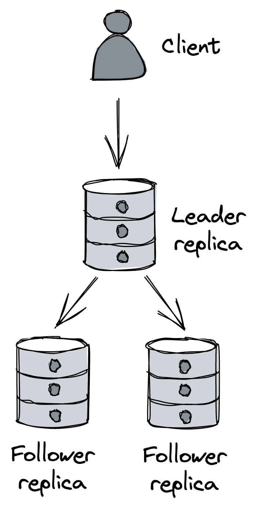

# Chapter 19

# Data Storage

## 1. Introduction: The Database Bottleneck

- Even with stateless application servers scaled out behind a load balancer, the **relational database**, often hosted on a _single machine_, can become the next performance bottleneck as application load and requests to the database increase.

## 2. Database Replication (Scaling Reads & Increasing Availability)

- **Purpose:** To increase the _read capacity_ and _availability_ of the database.
- **Common Topology: Leader-Follower**

  ::: {.centerfigure}
  {width=30%}
  :::

  - **Writes (Updates, Inserts, Deletes):** Clients send writes _exclusively to the leader_ replica.
  - The leader persists these changes to its **write-ahead log (WAL)**.
  - **Followers (Replicas):** Connect to the leader and _stream log entries_ from it, applying (committing) them locally.
  - Log entries have _sequence numbers_, allowing followers to disconnect/reconnect and resume replication from where they left off by communicating the last processed sequence number to the leader.

- **Benefits of Replication:**
  - **Increased Read Capacity:** _Read-only followers_ can be placed behind a load balancer to distribute read queries.
  - **Increased Availability:**
    - A load balancer can automatically remove a _faulty replica_ from the pool if it's unhealthy or unavailable.
    - If the _leader fails_, a replica can be reconfigured (promoted) to take its place.
  - **Workload Isolation:** Individual followers can be used for specific, potentially intensive workloads (e.g., periodic analytics queries) without impacting the performance of the leader or other replicas serving live traffic.
- **Replication Modes:**
  - **Fully Asynchronous Replication:**
    - The leader receives a write, broadcasts it to followers, and _immediately sends a response_ back to the client without waiting for follower acknowledgments.
    - **Pros:** Minimizes client response time.
    - **Cons:** _Not fault-tolerant_; if the leader crashes after acknowledging a write but before broadcasting it, data loss can occur.
  - **Fully Synchronous Replication:**
    - The leader _waits for the write to be acknowledged by all followers_ before returning a response to the client.
    - **Pros:** Stronger data consistency, no data loss on leader failure if followers are up-to-date.
    - **Cons:**
      - _Performance Cost:_ A single slow replica increases the response time for every write request.
      - _Availability Risk:_ If any replica is unreachable, the data store becomes unavailable for writes.
      - _Not Scalable:_ The more followers, the higher the probability of at least one being slow or unavailable.
  - **Combined (Semi-Synchronous) Replication:**
    - Common in practice. Relational databases like _PostgreSQL_ often support configuring individual followers for synchronous replication (default is usually asynchronous).
    - **Example Use Case:** Have a single _synchronous follower_ designated as an up-to-date backup of the leader.
    - **Benefit:** If the primary leader fails, failover can occur to the synchronous follower _without any data loss_.
- **Failover Mechanism (Conceptual Steps):**
  1.  Detect when the leader has failed.
  2.  Promote the synchronous follower to be the new leader.
  3.  Reconfigure other replicas to follow the newly promoted leader.
  4.  Ensure client requests are routed to the new leader.
- **Managed Solutions:** Cloud database services like _AWS RDS_ or _Azure SQL Database_ often provide features like read replicas and automated failover, along with automated patching and backups, out of the box.
- **Limitations of Replication:**
  - Primarily helps scale out _reads_, not writes (writes still go to the single leader).
  - The _entire database must still fit_ on the leader's single machine. While moving some tables to other databases can delay this issue, it's not a fundamental solution for very large datasets.

## 3. Partitioning (Scaling Reads, Writes & Handling Large Datasets)

- **Purpose:** Overcomes the write scaling and single-machine size limitations of simple replication. Allows scaling out a database for _both reads and writes_.
- **Application-Layer Partitioning (for Traditional RDBMS):**
  - Traditional (centralized) relational databases _generally don't support partitioning out of the box_.
  - Implementing it at the application layer is, in principle, possible but _highly challenging_ and adds significant complexity:
    - **Data Distribution:** Deciding _how to partition_ the data among the database instances.
    - **Rebalancing:** Moving data when a partition becomes too hot (frequently accessed) or too large.
    - **Cross-Partition Queries:** Queries spanning multiple partitions (e.g., aggregations, joins) need to be _split into sub-queries_, and their responses must be combined.
    - **Distributed Transactions:** Supporting atomic transactions across partitions requires implementing a distributed transaction protocol (e.g., _Two-Phase Commit (2PC)_).
    - **Combined Complexity:** Adding replication to an application-layer partitioning scheme further increases the difficulty.
- **The Fundamental Problem with Traditional Relational Databases:**
  - They were designed assuming they would fit on a _single, powerful ("beefy") machine_.
  - Consequently, they support features that are _hard to scale_ in a distributed manner, such as ACID transactions and complex joins across the entire dataset.
  - **Historical Context:** Designed when disk space was expensive, prioritizing _data normalization_ to reduce storage footprint, even if it meant costly denormalization via joins at query time.
  - **Modern Context:** Storage is now relatively cheap, while CPU time is not.
- **Benefits of Normalization (Beyond Storage):**
  - **Data Integrity:** If data is duplicated, updates must occur in all places. With normalized data, an update needs to happen in only one place.

## 4. NoSQL Databases

- **Origins:** Emerged in the early 2000s from large tech companies building bespoke data storage solutions designed from the ground up for _high availability and scalability_ (inspired by papers like Google's Bigtable and Amazon's Dynamo).
- **Initial Naming:** Termed "NoSQL" because the first generation often didn't support SQL. This designation is now _misleading_, as many NoSQL stores have evolved to support SQL-like query languages or other rich features.
- **Key Differences from Traditional Relational Databases (RDBMS):**
  - **Consistency Models:** NoSQL stores often embrace _relaxed consistency models_ (e.g., eventual consistency, causal consistency) to achieve high availability, whereas RDBMS typically support stronger models like strict serializability.
  - **Joins:** Generally _do not provide join operations_.
  - **Data Model:** Rely on _unnormalized data_, often represented as:
    - **Key-Value Pairs:** An opaque key maps to an opaque value (sequence of bytes).
    - **Documents (e.g., JSON):** A key maps to a (possibly hierarchical) document, often without a strictly enforced schema. Unlike pure key-value stores, documents are _interpreted and indexed_, allowing queries based on their internal structure.
  - **Transactions:** Due to native support for partitioning for scalability, NoSQL stores have _limited support for transactions_. For example, Azure Cosmos DB currently supports transactions scoped only to _individual partitions_. The need for complex transactions is reduced when data is denormalized.
- **Using NoSQL for Relational Data:**
  - While NoSQL stores can model relational data, trying to use them _as if they were traditional relational databases_ will likely result in the "worst of both worlds."
  - When used correctly, NoSQL can handle many use cases of traditional RDBMS while being _essentially scalable from day one_.
- **Core Requirement for Efficient NoSQL Use:**

  - **Know the access patterns upfront** and model the data accordingly. This is crucial.
  - **Amazon DynamoDB Example:**

    - **Abstraction:** A table containing items. Each item can have different attributes but _must_ have a primary key.
    - **Primary Key:** Can be a single attribute (the _partition key_) or two attributes (the _partition key_ and the _sort key_).
      - **Partition Key:** Dictates how data is partitioned and distributed across nodes.
      - **Sort Key:** Defines how data is sorted _within a partition_, enabling efficient range queries.
    - **Replication:** DynamoDB creates _three replicas_ for each partition and uses state machine replication to keep them synchronized. Writes are acknowledged to the client when _two out of three_ replicas have received the write.
    - **Read Consistency:** Reads can be either _eventually consistent_ (from any replica) or _strongly consistent_ (querying the leader replica).
    - **API Support:**
      - CRUD (Create, Read, Update, Delete) operations on single items.
      - Querying multiple items that share the _same partition key_ (optionally specifying conditions on the sort key).
      - Scanning the entire table (less efficient, for bulk operations).
    - **No Joins by Design:** Joins don't scale well. Data should be modeled to avoid needing them.
    - **Modeling Example (Customers and Orders):**

      - Suppose the most common access pattern is retrieving orders for a customer, sorted by date. The table might have `customer ID` as the partition key and `order creation date` as the sort key.

      | Partition Key | Sort Key   | Attribute     | Attribute       |
      | ------------- | ---------- | ------------- | --------------- |
      | jonsnow       | 2021-07-13 | OrderID: 1452 | Status: Shipped |
      | aryastark     | 2021-07-20 | OrderID: 5252 | Status: Placed  |
      | branstark     | 2021-07-22 | OrderID: 5260 | Status: Placed  |

      - If customer full name is also needed, entities of multiple types (customers, orders) can be stored in the same table:

      | Partition Key | Sort Key   | Attribute            | Attribute       |
      | ------------- | ---------- | -------------------- | --------------- |
      | jonsnow       | 2021-07-13 | OrderID: 1452        | Status: Shipped |
      | jonsnow       | jonsnow    | FullName: Jon Snow   | Address: …      |
      | aryastark     | 2021-07-20 | OrderID: 5252        | Status: Placed  |
      | aryastark     | aryastark  | FullName: Arya Stark | Address: …      |

      - Because a customer and its orders have the same partition key, a single query can retrieve all related entities. This structures the table based on access patterns to avoid joins.

    - **Secondary Indexes:** DynamoDB supports secondary indexes for more complex access patterns:
      - _Local Secondary Indexes (LSIs):_ Allow alternate sort keys on the same table (within the same partition key).
      - _Global Secondary Indexes (GSIs):_ Allow different partition and sort keys, effectively creating a new "view" of the data. Index updates for GSIs are asynchronous and _eventually consistent_.

- **NoSQL Flexibility Misconception:**
  - It's a common misconception that NoSQL data stores are more flexible because they scale seamlessly without upfront data modeling.
  - The reality is that NoSQL _requires significantly more attention_ to how data is modeled based on access patterns.
  - Because they are tightly coupled to access patterns, NoSQL stores can be _less flexible_ than relational databases if those patterns change.
- **Key Takeaway:** Using a NoSQL data store effectively _requires identifying the access patterns upfront to model the data accordingly._

## 5. NewSQL Databases

- **Latest Trend:** Aim to combine the _scalability of NoSQL_ with the _ACID guarantees_ often associated with relational databases.
- **Consistency vs. Availability:** While many NoSQL stores prioritize availability over consistency in the face of network partitions (CAP theorem trade-off), NewSQL stores often _prefer consistency_.
- **Argument for NewSQL:** Proponents argue that for many applications, the reduction in availability caused by enforcing strong consistency is hardly noticeable, especially since perfect 100% availability is practically impossible anyway (availability is defined in "nines").
- **Examples:** Well-known NewSQL data stores include _CockroachDB_ and _Spanner_.
