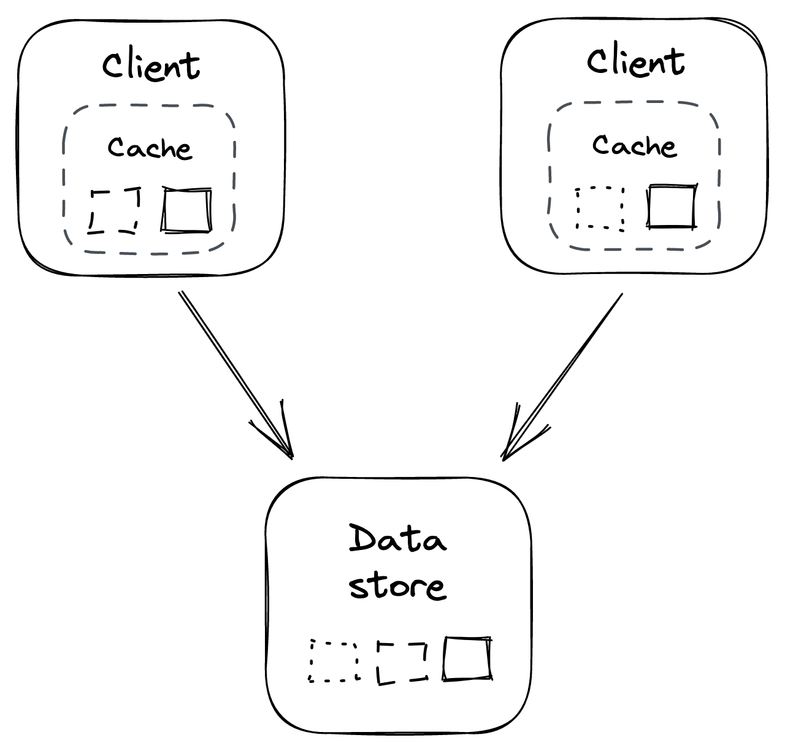
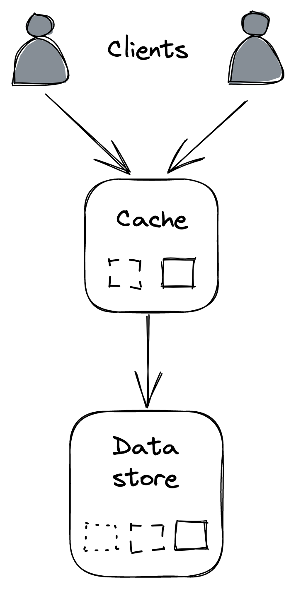

# Chapter 20

# Caching

## 1. Introduction to Caching

- **Context:** If a significant fraction of requests sent to a data store consists of a _small pool of frequently accessed entries_, introducing a cache can improve application performance and reduce load on the data store.
- **Definition:** A cache is a _high-speed storage layer_ that temporarily buffers responses from an origin (like a data store), allowing future requests for the same data to be served directly from the cache.
- **Guarantees:** Caching provides _best-effort guarantees_; its state is disposable and can be rebuilt from the origin if necessary.
- **Prior Examples:** Caching principles have been seen in DNS protocol and Content Delivery Networks (CDNs).
- **Cost-Effectiveness:** For a cache to be cost-effective, the **hit ratio** (proportion of requests served directly from the cache) should be high.
- **Factors Affecting Hit Ratio:**
  - The _universe of cachable objects_ (the fewer, the better).
  - The _likelihood of accessing the same objects repeatedly_ (the higher, the better).
  - The _size of the cache_ (the larger, the better).
- **Placement Principle:** As a general rule, the _higher up in the call stack_ caching is implemented, the more resources can be saved downstream. This is why client-side HTTP caching was discussed early on.
- **Important Caveat:** Caching is an **optimization**. A system does not have a scalable architecture if the origin (e.g., the data store) _cannot withstand the load without the cache_ fronting it. If access patterns change leading to cache misses, or if the cache becomes unavailable, the application should _not fall over_ (though it's acceptable for it to become slower).

## 2. Caching Policies

### A. Cache Miss Handling (How missing objects are fetched)

When a cache miss occurs, the missing object must be requested from the origin. This can happen in two main ways:

- **Side Cache (or Cache-Aside):**
  - The application first requests the object from the cache.
  - If the cache returns an "object-not-found" error (cache miss), the application then requests the object directly from the _origin_ (e.g., database).
  - After retrieving the object from the origin, the application _updates the cache_ with this object.
  - In this pattern, the cache is typically treated as a _key-value store_ by the application.
- **Inline Cache (e.g., Read-Through/Write-Through):**
  - The cache itself communicates _directly with the origin_.
  - When a miss occurs, the cache requests the missing object from the origin _on behalf of the application_.
  - The application _only ever interacts with the cache_, not the origin directly for cached data.
  - HTTP caching is an example of an inline cache mechanism.

### B. Eviction Policy

- **Necessity:** Because a cache has limited capacity, one or more existing entries may need to be _evicted_ to make room for new entries when the cache is full.
- **Determinants:** The choice of which entry to remove depends on the _eviction policy_ used by the cache and the _access patterns_ of the objects.
- **Example Policy:** A commonly used policy is **Least Recently Used (LRU)**, which evicts the entry that hasn't been accessed for the longest time.

### C. Expiration Policy

- **Purpose:** Dictates when an object should be considered stale and potentially evicted from the cache.
- **Mechanism:** Often implemented using a **Time-To-Live (TTL)** for each cached object.
- **Behavior:** When an object has been in the cache for longer than its TTL, it _expires_ and can be safely evicted.
- **Trade-off:**
  - _Longer TTLs_ generally lead to a _higher hit ratio_.
  - However, they also increase the likelihood of serving _stale and inconsistent data_ (data that has changed in the origin but not yet in the cache).
- **Deferred Expiration:** Expiration doesn't need to occur immediately when the TTL is reached. It can be _deferred to the next time the entry is requested_.
  - **Resilience Benefit:** If the origin (e.g., a data store) is temporarily unavailable, it might be more resilient to return an object with an expired TTL to the application rather than an error.

### D. Cache Invalidation

- **Complexity:** True cache invalidation (actively removing or marking entries as invalid when the underlying data changes in the origin) is _very hard to implement correctly_ in practice.
- **TTL as a Workaround:** An expiry policy based on TTL is often used as a simpler workaround for the complexities of direct cache invalidation.
- **Example Challenge:** If you cache the result of a database query, _every time any data touched by that query changes_ (which could span thousands of records or more), the cached result would need to be invalidated.

## 3. Local Cache (In-Process Cache)

::: {.centerfigure}
{width=45%}
:::

- **Implementation:** Simplest way to implement a cache is to _co-locate it with the client_ (i.e., within the application process).
- **Examples:**
  - A simple _in-memory hash table_ within the application.
  - An _embeddable key-value store_, like RocksDB.
- **Drawbacks:**
  - **Resource Waste (Duplication):** Since each client cache is independent, the _same objects are often duplicated_ across many caches. For example, if every client has a local cache of 1GB, then no matter how many clients there are, the total _effective_ size of unique cached data is at most 1GB.
  - **Consistency Issues:** Different clients might see _different versions_ of the same object due to independent caching.
  - **Increased Origin Load with Scale:** As the number of clients grows, the number of requests to the origin (for cache misses or initial population) increases proportionally.
  - **Thundering Herd Effect:**
    - This issue is exacerbated when clients restart, or new ones come online, as their caches need to be _populated from scratch_, potentially overwhelming the origin.
    - Can also occur when a specific object that wasn't accessed before (and thus not cached) _becomes popular all of a sudden_, leading to many clients requesting it from the origin simultaneously.
  - **Mitigating Thundering Herd:** Clients can implement request _coalescing_ for the same object. The idea is that, at any given time, there should be at most _one outstanding request per client_ to fetch a specific missing object from the origin.

## 4. External Cache (Out-of-Process Cache)

::: {.centerfigure}
{width=25%}
:::

- **Definition:** An external cache is a _service dedicated to caching objects_, typically in memory, separate from the application processes.
- **Shared Nature:** It's _shared across multiple clients_, addressing some drawbacks of local caches, but introduces its own complexity and cost.
- **Examples:** Popular caching services include _Redis_ or _Memcached_. These are also available as managed services on cloud platforms like AWS and Azure.
- **Scalability of External Cache:** Unlike a local cache, an external cache service can increase its _throughput and storage capacity_ using techniques like **replication** and **partitioning**.
  - For example, Redis can automatically partition data across multiple nodes and replicate each partition using a leader-follower protocol.
- **Benefits over Local Cache:**
  - **Reduced Consistency Issues:** Since the cache is shared, there is typically only a _single version_ of each object at any given time (assuming the external cache itself is not replicated in a way that introduces inconsistencies, or that it manages consistency across its replicas).
  - **Stable Origin Load:** The number of times an object is requested from the origin _doesn't grow directly_ with the number of clients (as many clients will hit the shared cache).
- **Drawbacks & Considerations:**
  - **Load Shifts to Cache:** The load doesn't disappear; it merely shifts from the origin to the external cache. Therefore, the _cache itself will eventually need to be scaled out_ if the load continues to increase.
  - **Rebalancing Data on Scale-Out:** When scaling out the cache (e.g., adding more cache nodes), as little data as possible should be moved around or dropped to avoid degrading cache performance or significantly dropping the hit ratio. Techniques like _consistent hashing_ can help reduce the amount of data that needs to be shuffled during rebalancing.
  - **Maintenance Cost:** It's _another service_ that needs to be operated, monitored, and maintained.
  - **Higher Latency (vs. Local):** Accessing an external cache requires a _network call_, which has higher latency than accessing an in-process local cache.
  - **Handling External Cache Unavailability:**
    - What should clients do if the external cache is down?
    - Simply bypassing the cache and hitting the origin directly might seem okay temporarily.
    - **Danger:** The origin might _not be prepared to withstand the sudden surge of traffic_ that was previously absorbed by the cache.
    - Consequently, the external cache becoming unavailable could cause a _cascading failure_, resulting in the origin becoming unavailable as well.
  - **Defense Strategies:**
    - Clients could use an _in-process (local) cache as a defense_ or fallback when the external cache is unavailable (a multi-layer caching approach).
    - The origin system also needs to be prepared to handle these sudden "attacks" or surges by, for example, _shedding requests_ (gracefully degrading performance rather than failing completely).
  - **Fundamental Reminder:** Caching is an optimization. The system needs to be able to _survive without the cache_, albeit potentially at the cost of being slower.
