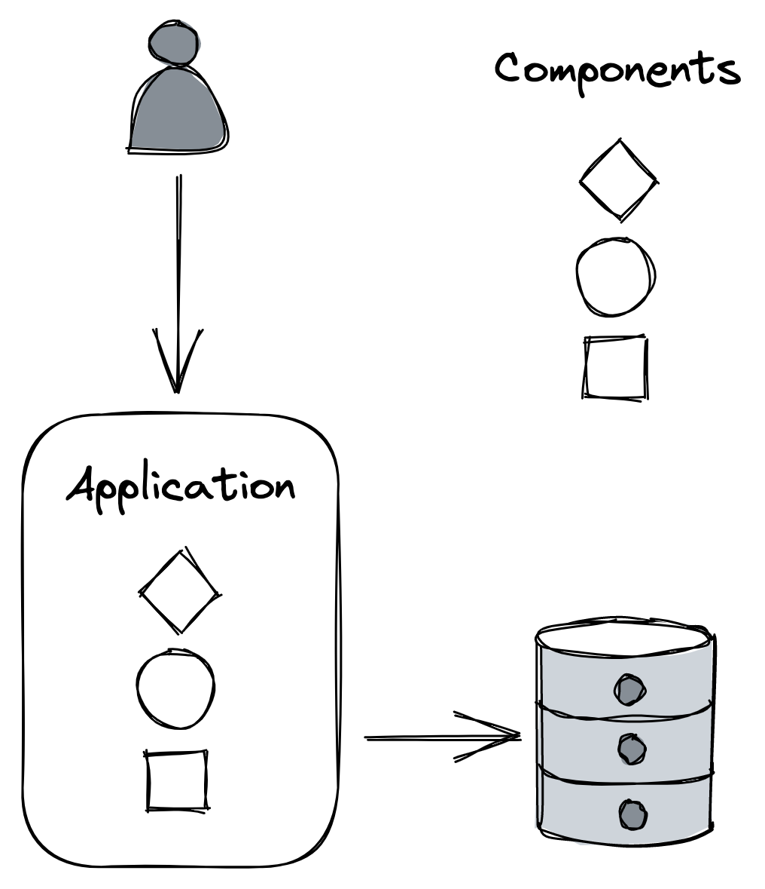
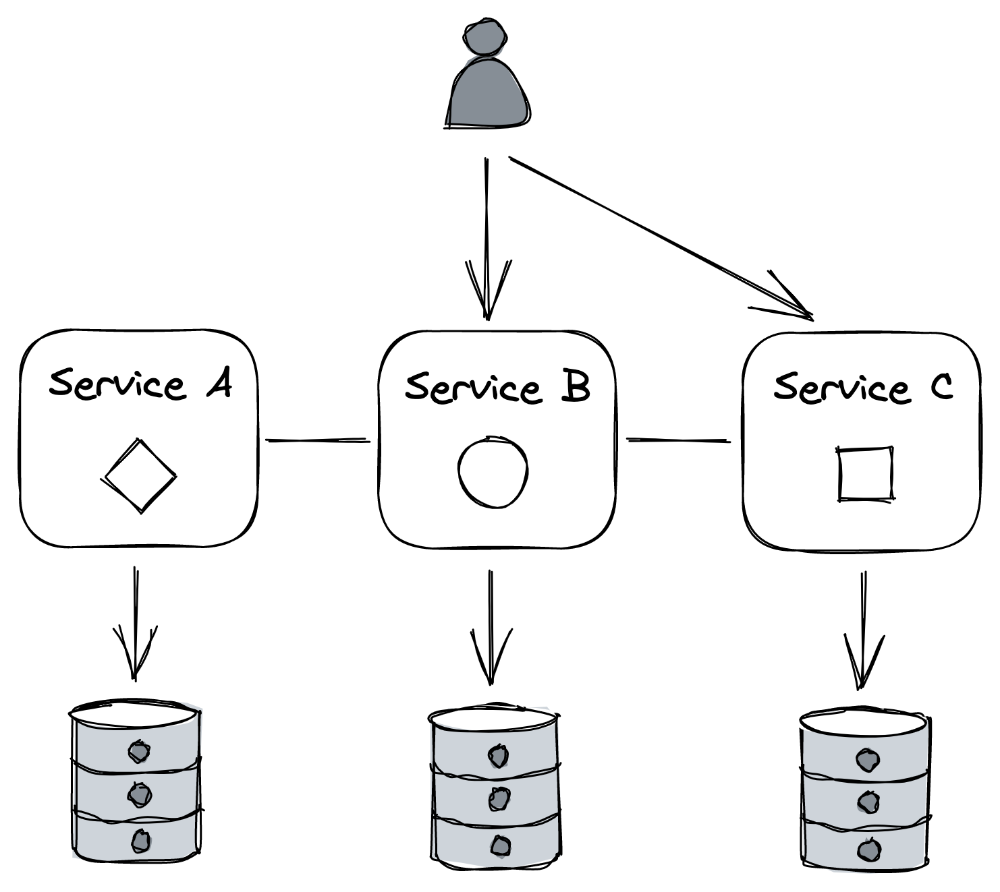
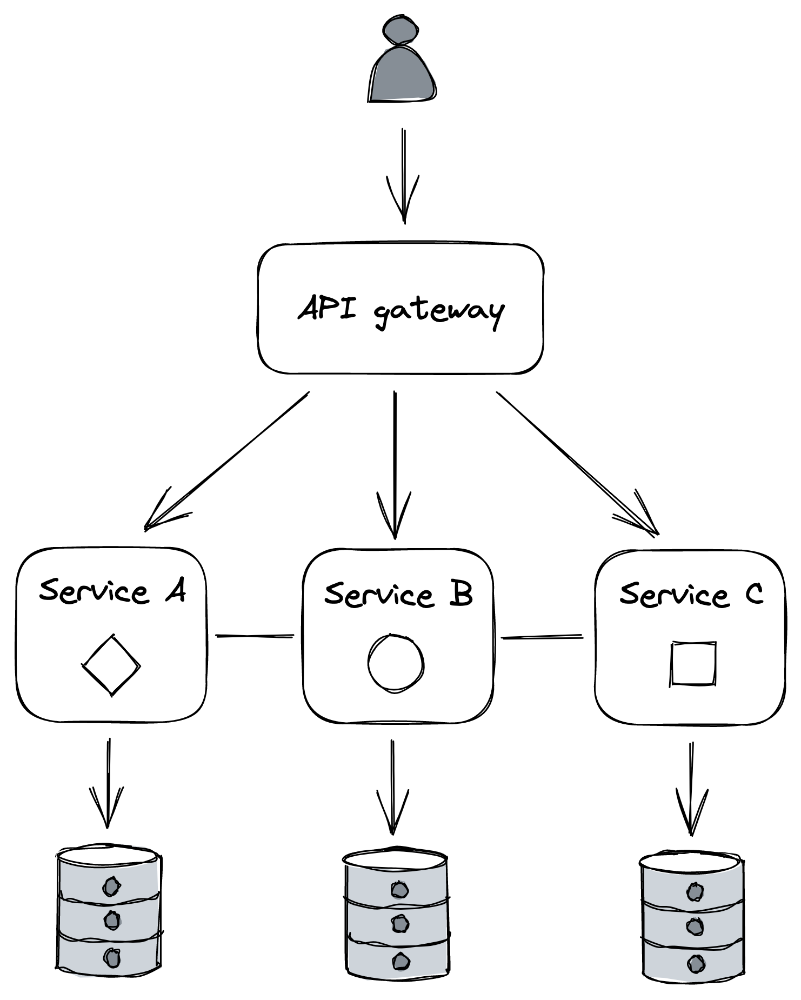

# Chapter 21

# Microservices

## 1. Introduction: From Monolith to Microservices

- As monolithic applications grow to satisfy more business requirements, components are continually added.

::: {.centerfigure}
{width=35%}
:::

- **Problems with Growing Monolithic Applications:**
  - Components often become _increasingly coupled_ over time, leading to developers stepping on each other's toes more frequently.
  - The codebase can become so complex that _nobody fully understands every part_, making new feature implementation and bug fixing very time-consuming.
  - A change to a single component might necessitate the _entire application to be rebuilt and redeployed_.
  - If a new deployment introduces a bug (e.g., a memory or socket leak), _unrelated components can be affected_.
  - Reverting a problematic deployment _impacts the velocity of all developers_, not just the one who introduced the bug.
- **Solution: Microservice Architecture**
  - Functionally decompose the monolithic application into a set of _independently deployable services_ that communicate via APIs.

::: {.centerfigure}
{width=40%}
:::

- **APIs as Boundaries:** APIs decouple services from each other by creating _hard boundaries_ that are more difficult to violate than those between components running in the same process.

- **Organizational & Technical Benefits:**
  - **Team Structure:** Each service can be _owned and operated by a small team_. Smaller teams collaborate more effectively due to reduced communication overhead (which grows quadratically with team size).
  - **Autonomy & Reduced Cross-Team Communication:** Each team controls its own codebase and dictates its own release schedule, requiring less overall cross-team communication.
  - **Manageable Scope:** The surface area of a single service is smaller than the whole application, making it _more digestible_ for developers, especially new hires.
  - **Technological Freedom:** In principle, each team is free to adopt the _tech stack and hardware_ that best fits their service's specific needs, as API consumers don't care about implementation details.
  - **Experimentation:** Makes it easier to experiment with and evaluate _new technologies_ without affecting other parts of the system.
  - **Data Model Independence:** Each service can have its own _independent data model and data store(s)_ tailored to its use cases.
- **Terminology - "Micro" in Microservices:**
  - The term "micro" can be misleading; services _don't have to be tiny_.
  - If a service doesn't do much, it only adds operational overhead and complexity.
  - **Rule of Thumb:** APIs should have a _small surface area_ but encapsulate a _significant amount of functionality_.

## 2. Caveats of Microservices ("Microservice Premium")

- Splitting an application into services adds _a great deal of complexity_ to the overall system. This "premium" is only worth paying if the benefits can be amortized across many development teams.
- **Tech Stack Proliferation vs. Standardization:**
  - While freedom in tech stack choice is a benefit, it can make it _more difficult for developers to move_ between teams.
  - It also leads to a _sheer number of libraries_ (one for each adopted language) that need to be supported for common functionalities like logging.
  - **Solution:** Enforce a certain degree of standardization, often by _loosely encouraging specific technologies_ through providing excellent development experience and support for a recommended portfolio.
- **Communication Overhead & Complexity:**
  - _Remote calls between services are expensive_ and introduce non-determinism (network issues, latency).
  - While a monolith also deals with external communication (client requests, third-party APIs), these issues are _amplified_ in a microservice architecture due to the increased number of internal service-to-service calls.
- **Coupling (Risk of Distributed Monolith):**
  - Microservices _must be loosely coupled_ so that a change in one service doesn't necessitate changes in others.
  - If services are tightly coupled, you can end up with a **distributed monolith**, which has all the downsides of a monolith plus the complexity of a distributed system.
  - **Causes of Tight Coupling:** Fragile APIs requiring clients to update on any change, shared libraries that must be updated in lockstep across services, or using static IP addresses for service references.
- **Resource Provisioning:**
  - Supporting many independent services requires a _simple and efficient way_ to provision new machines, data stores, and other commodity resources.
  - You don't want every team inventing its own provisioning methods.
  - A fair amount of _automation_ is needed for efficient configuration and management.
- **Testing:**
  - Testing _individual_ microservices is not necessarily more challenging than testing components of a monolith.
  - However, _testing the integration of microservices is a lot harder_. Subtle and unexpected behaviors often emerge only when services interact with each other at scale in a production-like environment.
- **Operations:**
  - A _common way of continuously delivering and deploying_ new builds safely to production is needed, so each team doesn't have to reinvent the wheel.
  - _Debugging failures, performance degradations, and bugs is significantly more challenging_ with microservices because you can't just load the whole application onto a local machine and step through it with a debugger.
  - A good **observability platform** (for logging, tracing, metrics) becomes crucial.
- **Eventual Consistency:**
  - Splitting an application into services means the overall data model no longer resides in a single data store; it's spread out.
  - Atomically updating data across different data stores while guaranteeing strong consistency is _slow, expensive, and hard to get right_.
  - Consequently, microservice architectures usually require embracing **eventual consistency** for data spread across services.
- **General Recommendation:**
  - It's often best to _start with a monolith_ and ensure it's well-componentized.
  - Decompose the monolith into microservices _only when there is a good reason to do so_ (e.g., when organizational scaling issues or deployment complexities become significant).
  - This approach allows easier movement of boundaries as the application grows initially. Once the monolith is mature and growing pains arise, you can start to _peel off one microservice at a time_.

## 3. API Gateway

::: {.centerfigure}
{width=40%}
:::

- After decomposing an application into services, how the outside world communicates with it needs rethinking.
- **Problems with Direct Client-to-Internal-Service Communication:**
  - Clients might need to make _multiple requests to different services_ to gather all information for a single operation (inefficient, especially for mobile devices consuming battery life).
  - Clients become _aware of internal implementation details_, such as the DNS names of all internal services.
  - This makes it challenging to _change the application's internal architecture_, as it would require changing clients as well (difficult if you don't control the clients).
  - Public APIs, once released, often need to be _maintained for a very long time_.
- **Solution: API Gateway**
  - Introduce a layer of indirection. The API gateway acts as a _facade or proxy_ for the internal services, exposing a single, public API.
  - It is essentially a specialized _reverse proxy_.

### A. Core Responsibilities of an API Gateway

- **Routing:**
  - The most obvious function: routing inbound requests to the appropriate internal services.
  - Often implemented using a _routing map_ that defines how the public API endpoints map to internal service APIs.
  - This mapping allows internal APIs to _change without breaking external clients_. If an internal endpoint changes, the public endpoint can remain the same, with only the gateway's mapping needing an update.
- **Composition:**
  - In a distributed system, data is spread across multiple services, each with its own data store.
  - Some use cases may require _stitching data together_ from these multiple sources.
  - The API gateway can offer a _higher-level API_ that queries multiple internal services and _composes their responses_ into a single response for the client.
  - **Benefits:** Relieves the client from knowing which services to query and reduces the number of network requests the client needs to make.
  - **Challenges:**
    - The _availability of the composed API decreases_ as the number of internal service calls increases (each call has a non-zero probability of failure).
    - Data might be _inconsistent_ across services if updates haven't propagated everywhere yet. The gateway might need logic to resolve such discrepancies.
- **Translation:**
  - The API gateway can translate from one _Inter-Process Communication (IPC) mechanism to another_ (e.g., translating an external RESTful HTTP request into an internal gRPC call).
  - It can also _expose different APIs tailored to different clients_ or use cases.
    - Example: A desktop application API might return more data than a mobile API due to screen estate. Mobile clients might also need requests batched to reduce battery usage.
  - **Graph-based APIs (e.g., GraphQL):**
    - An increasingly popular solution for providing flexible data fetching.
    - The gateway exposes a _schema_ (composed of types, fields, and relationships) that describes the available data.
    - Clients send _queries declaring precisely what data they need_.
    - The gateway's job is to translate these queries into the necessary internal API calls and compose the response.
    - **Benefits:** Reduces development time as there's less need to introduce many different specific API endpoints for various use cases. Clients are free to specify their exact data requirements.
    - GraphQL is a popular technology in this space.

### B. Cross-Cutting Concerns

- As a reverse proxy, the API gateway is a suitable place to implement cross-cutting functionality that would otherwise need to be part of each individual service.
- **Examples:**
  - Caching frequently accessed resources.
  - Rate-limiting requests to protect internal services from being overwhelmed.
- **Authentication and Authorization:**
  - These are common and critical cross-cutting concerns.
  - **Authentication:** The process of validating that a _principal_ (a human or an application issuing a request) is who it claims to be.
  - **Authorization:** The process of granting an _authenticated principal_ permissions to perform specific operations (e.g., create, read, update, delete) on a particular resource, often implemented by assigning roles with specific permissions.
  - **Monolithic Approach (Sessions):**
    - HTTP is stateless, so applications need a way to store data between requests to associate them.
    - On first request, the application creates a _session object_ with an ID (e.g., a cryptographically strong random number) and stores it (in-memory cache or external data store).
    - The session ID is returned to the client via an _HTTP cookie_, which the client includes in all future requests.
    - The application can retrieve the session object using the cookie.
    - On successful login, the principal's ID and roles are stored in the session object, which is later used for authorization decisions.
  - **Challenges in Microservices:** It's not obvious which service should be responsible for authentication/authorization when request handling spans multiple services.
  - **Common Microservice Approach:**
    - **API Gateway for Authentication:** The API gateway authenticates _external requests_ as they are the point of entry. This centralizes logic for different authentication mechanisms and hides complexity from internal services.
    - **Individual Services for Authorization:** Authorizing requests is best left to _individual services_ to avoid coupling the API gateway with domain-specific logic.
  - **Security Tokens:**
    - After API gateway authentication, a _security token_ is created and passed with requests to internal services and their dependencies.
    - Internal services validate this token to obtain the principal's identity and roles.
    - **Token Types include:**
      - _Opaque Tokens:_ Do not contain information themselves. They require calling an external authentication service to validate and retrieve the principal's information.
      - _Transparent Tokens:_ Embed the principal's information within the token itself, eliminating the need for an external validation call but making the revocation of compromised tokens harder. A popular example is the **JSON Web Token (JWT)**, which is a JSON payload containing an expiration date, the principal's identity/roles, and other metadata, signed with a certificate trusted by internal services so they can validate it without external calls.
  - **API Keys:**
    - Another common authentication mechanism.
    - Custom keys allowing the API gateway to identify the requesting principal and apply limits/permissions.
    - Popular for public APIs (e.g., GitHub, Twitter).

### C. Caveats of API Gateway

- **Development Bottleneck:** Can become a bottleneck as it's tightly coupled with the APIs of the internal services it shields. Whenever an internal API changes, the gateway often needs to be modified as well.
- **Operational Overhead:** It's _one more service_ that needs to be deployed, scaled, and maintained.
- **Scalability Requirement:** Must scale to handle the aggregate request rate for _all services_ behind it.
- **Worthwhile Investment:** Despite caveats, if an application has many services and APIs, the pros of using an API gateway (like providing a unified public interface and handling cross-cutting concerns) generally outweigh the cons.
- **Implementation Options:**
  - _Roll your own:_ Using a reverse proxy like NGINX as a starting point.
  - _Managed Solutions:_ Use cloud provider offerings like Azure API Management or Amazon API Gateway.
