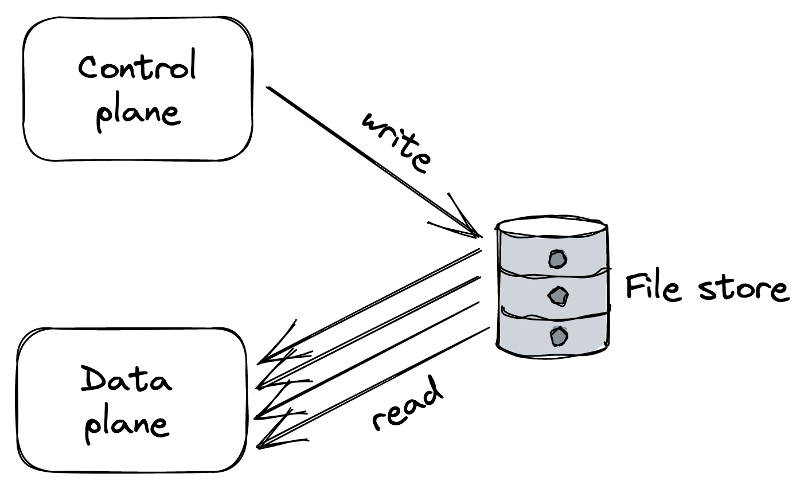
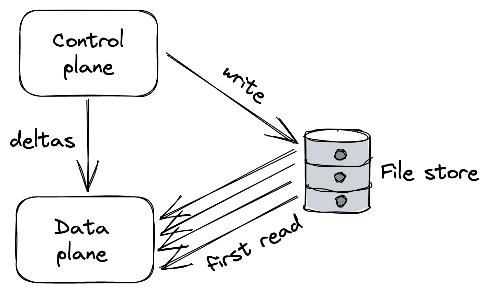

# Chapter 22

# Control Planes and Data Planes

## 1. Introduction: The API Gateway Problem & Solution

- The API gateway, being a critical component, acts as a _single point of failure_. If it goes down, the entire application (e.g., Cruder) it fronts also goes down. Therefore, it must be **highly available**.
- Since every external request passes through it, the API gateway must also be **scalable**.
- This presents challenges regarding external dependencies and internal operations. For example, an API gateway might have:
  - A "configuration" or management endpoint (e.g., to manage API keys for rate-limiting).
  - Main endpoint(s) for routing client requests to internal services.
- **Differing Requirements:**
  - _Configuration Endpoint:_ Typically has a much lower request volume; lower scale requirements suffice. It should prioritize **consistency over availability**.
  - _Main Routing Endpoint(s):_ Need to prioritize **availability and performance over consistency**.
- **Solution:** Due to these competing requirements, a common pattern is to split the component (like an API gateway) into two distinct parts:
  - A **Data Plane** service: Handles external requests directed towards internal services (the high-volume, critical path).
  - A **Control Plane** service: Manages the component's metadata and configuration (the less frequent, consistency-focused tasks).
- This split is a common architectural pattern seen in systems like chain replication (control plane holds chain configurations) and Azure Storage (stream/partition managers act as control planes).

## 2. Defining Control Plane and Data Plane

- **Data Plane:**
  - Encompasses any functionality that lies on the _critical path_ and needs to execute for _each client request_.
  - **Requirements:** Must be _highly available, fast, and able to scale_ according to the number of requests.
- **Control Plane:**
  - Is _not on the critical path_ of client requests.
  - Has _less strict scaling requirements_ compared to the data plane.
  - **Primary Role:** To assist the data plane in its operations by managing metadata or configuration, and by coordinating complex and infrequent operations.
  - Generally needs to offer a _consistent view of its state_ to the data plane, thus it often **favors consistency over availability**.
- **Multiple Planes:** An application can feature _multiple independent control and data planes_. For instance, one control plane might manage scaling a service up or down based on load, while another control plane manages its configuration.

## 3. Complexity and Dependencies of Separation

- Separating the control plane from the data plane inherently _introduces complexity_.
- **Robustness Requirement:** For this separation to be effective, the data plane _must be designed to withstand failures_ in the control plane.
  - **Hard Dependency:** If the data plane stops serving requests when the control plane becomes unavailable, it indicates a hard dependency.
    - In such cases, the _entire system becomes unavailable_ if either the control plane or the data plane fails.
    - The theoretical availability of a system with chained hard dependencies is the _product of the availabilities_ of its components. For example, if a data plane has 99.99% availability and its control plane has 99% availability, the overall system can only achieve `0.9999 * 0.99 = 0.9899` (98.99%) availability.
    - A system can, at best, be only as available as its _least available hard dependency_.
- **Static Stability:**
  - While efforts should be made to make the control plane more reliable, it's crucial to ensure that the _data plane can withstand control plane failures_.
  - If the control plane is temporarily unavailable, the data plane should _continue to operate with its last known (stale) configuration_ rather than stopping altogether. This concept is also referred to as static stability.

## 4. Scale Imbalance Between Planes

- Data planes and control planes generally have _vastly different scale requirements_.
- **Risk:** The data plane can inadvertently _overload the control plane_.
- **Scenario Illustrating Risk:**
  - Suppose the control plane exposes an API that data plane instances periodically query to retrieve the latest configuration.
  - Under normal conditions, these requests to the control plane might be spread out over time.
  - However, under certain circumstances (e.g., if many data plane processes restart simultaneously due to a deployment or a cascading failure), these requests can _cluster within a short time interval_, all hitting the control plane at once to retrieve configuration. This can overload the control plane.
- **Consequences of Control Plane Overload:**
  - If the control plane becomes unavailable (due to overload or other reasons like a network partition), it can _bring down the data plane_ if there's a hard dependency.
  - For example, if a part of the data plane is trying to start but cannot reach an overloaded control plane for its initial configuration, it won't be able to come online.
- **Design Solutions for Scale Imbalance:**

  - **A. Intermediate Scalable File Store as a Buffer:**

    ::: {.centerfigure}
    {width=50%}
    :::

    - The control plane periodically _dumps its entire state_ to a scalable file store (e.g., Azure Storage, AWS S3), irrespective of whether the state has changed.
    - The data plane instances _periodically read the state_ from this file store.
    - **Pros:** This approach tends to be _reliable and robust_ in practice. It _decouples_ the control plane from the data plane, protecting the control plane from being overloaded by the data plane's read requests. It also enables the data plane to continue operating (or to start up) using the last known snapshot from the store, even if the control plane is temporarily unavailable.
    - **Cons:** Results in _higher latencies_ for propagating changes from the control plane to the data plane. It also offers _weaker consistency guarantees_ due to this propagation delay. Depending on the size of the state and frequency of dumps, it might be expensive, but can be cheap if the state is small.
    - _(This is another example of the CQRS pattern in practice)._

  - **B. Control Plane Pushes Configuration (No Intermediary for Deltas):**

    - To decrease propagation latency, an alternative architecture avoids an intermediary for regular updates.
    - The data plane instances connect directly to the control plane (similar to the initial problematic scenario).
    - However, instead of the data plane polling, the _control plane actively pushes configuration updates_ to the data plane whenever the configuration changes.
    - **Pros:** The control plane controls the pace of updates. If it's under duress, it can _slow down the rate of pushes_ rather than falling over due to overwhelming pull requests.
    - **Further Optimization (Pushing Deltas):** To further reduce latency and load, especially when the state is very large, the control plane can _version changes_ and push only _updates/deltas_ to the data plane, rather than the entire configuration each time.
    - **Remaining Challenge for Initial Load:** This approach (even with deltas for ongoing changes) could still lead to the control plane being hammered if many data plane instances start up around the same time (e.g., due to a massive scale-out event or a widespread restart) and all try to read the _entire initial configuration_ from the control plane for the first time.

  - **C. Hybrid Approach: Intermediate Store for Snapshots + Control Plane Pushes Deltas:**

    ::: {.centerfigure}
    {width=50%}
    :::

    - To defend against the initial load problem in the push model, reintroduce an intermediate data store.
    - This store contains a _recent snapshot_ of the control plane's entire state.
    - **Workflow:**
      1. Data plane instances, upon startup, read the initial _snapshot_ from the intermediate store.
      2. Then, they connect to the control plane and request only a _small delta_ (changes that occurred since the snapshot was taken).
      3. Subsequently, the control plane pushes ongoing deltas to the connected data plane instances.
    - **Benefit:** The intermediate store _absorbs the load of bulk reads_ (initial configuration), while the control plane efficiently pushes small, frequent delta updates.
    - **Remaining Caveat:** There's still a potential to overload the control plane if it needs to manage and juggle _too many persistent connections_ for pushing deltas.

## 5. Control Theory Perspective

- Control theory offers another lens through which to view control planes and data planes.
- **Core Concept:** In control theory, the objective is to create a **controller** (our control plane) that:
  1.  Monitors a **dynamic system** (our data plane).
  2.  Compares the system's current state to a **desired state**.
  3.  Applies a **corrective action** to drive the system closer to the desired state, while minimizing any instabilities during this process.
- **Feedback Loop:** The control plane and the data plane are integral parts of a **feedback loop**.
- **Essential Ingredients for a Closed Loop:**
  1.  **Monitor:** Observe the state of the data plane.
  2.  **Compare:** Evaluate the monitored state against the desired state.
  3.  **Action:** Execute corrective measures if a discrepancy exists.
- Without all three ingredients, you don't have a _closed loop_, and the data plane cannot reliably or autonomously reach the desired state. The **monitoring** part is often the most commonly missing ingredient to achieve a truly closed-loop system.
- **Example (Chain Replication):**
  - The control plane's responsibility shouldn't just be to push the configuration of replication chains to the data plane.
  - It should also _monitor_ whether the data plane has actually applied that configuration within a reasonable timeframe.
  - If the configuration hasn't been applied, the control plane should perform some _corrective action_. This could be as naive as rebooting nodes with stale configurations or excluding them from being part of any chain.
- **Example (CI/CD Pipeline for Service Deployment):**
  - A CI/CD pipeline acts as a control plane for releasing new versions of a service.
  - _Blindly deploying_ a new build without monitoring the running service is risky. The build might, for instance, throw an exception at startup that prevents the service from starting, leading to a catastrophic failure.
  - A _closed-loop approach_ would involve the pipeline releasing the new build _incrementally_ while continuously _monitoring_ key health metrics of the service. If there's clear evidence that something is wrong, the pipeline should _stop the roll-out_ and potentially _automatically roll it back_.
- **Key Takeaway Question:** When designing or evaluating a system with a control plane, always ask: "What's missing to close the loop?"
