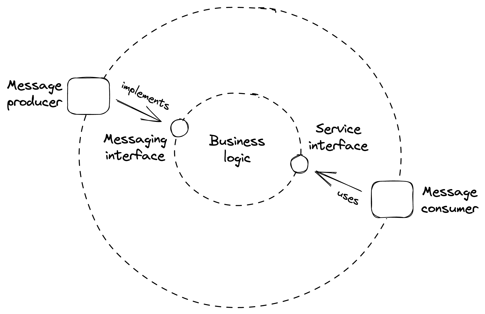
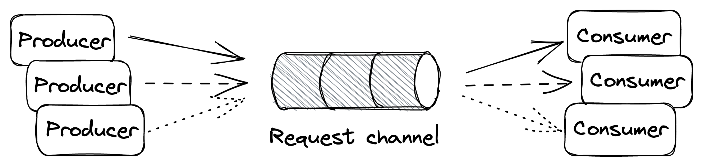
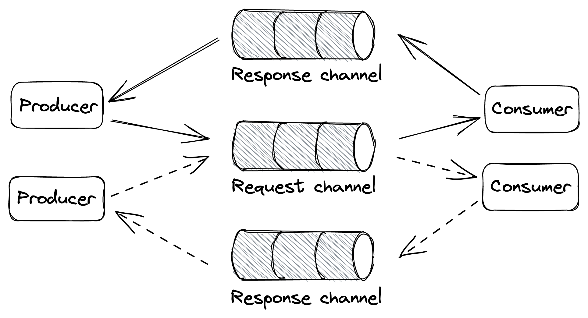
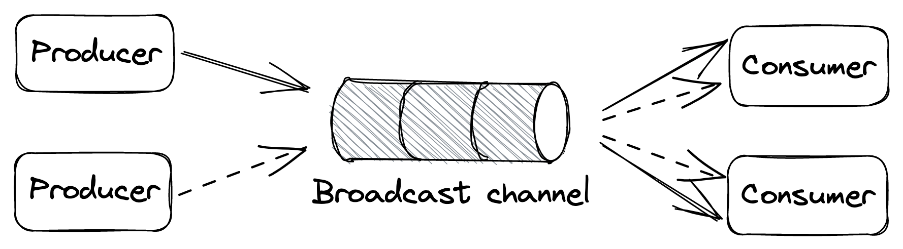

# Chapter 23

# Messaging

## 1. Introduction to Messaging

- **Scenario:** Consider an endpoint for users to upload videos, which then need to be encoded into different formats/resolutions (a potentially long-running task).
- **Problem:** If the API gateway directly calls an encoding service and waits, it can be slow. A naive "fire-and-forget" approach risks losing the request if the encoding service instance crashes.
- **Solution:** Introduce a **message channel** (or message broker) between the API gateway (producer) and the encoding service (consumer).
- **Definition:** Messaging is a form of _indirect communication_.
  - A **producer** writes a message to a channel/message broker.
  - The broker delivers the message to a **consumer** on the other end.
  - The message channel acts as a _temporary buffer_ for the receiver.
- **Asynchronous Nature:** Unlike direct request-response, messaging is _inherently asynchronous_, as sending a message doesn't require the receiving service to be online at that exact moment.
- **Message Structure:**
  - **Header:** Contains metadata, such as a unique message ID.
  - **Body:** Contains the actual content of the message.
- **Message Types:**
  - **Command:** Specifies an operation to be invoked by the receiver.
  - **Event:** Signals to the receiver that something of interest has happened to the sender.
- **Service Adapters:** Services use adapters to interact with message channels.
  - _Inbound Adapters:_ Receive messages from channels.
  - _Outbound Adapters:_ Send messages to channels.
    _(As illustrated in Figure 23.1)_

::: {.centerfigure}
{width=60%}
:::

- **Example Workflow (Video Encoding):**
  1.  The API gateway uploads the video to a file store (e.g., S3).
  2.  It then writes a message to the channel, including a link to the uploaded file.
  3.  The API gateway responds to the client with a `202 Accepted` status, signaling that the request has been accepted for processing but hasn't completed yet.
  4.  Eventually, an instance of the encoding service will read the message from the channel and process the video.
  5.  Crucially, the request (message) is _deleted from the channel only when it's successfully processed_. This ensures that if the encoding service fails mid-process, the message will eventually be picked up again and retried by another instance or the same instance after recovery.

## 2. Benefits of Decoupling with a Message Channel

- **Availability:** The producer can send requests to the consumer even if the consumer is _temporarily unavailable_ or offline.
- **Scalability:** Requests can be _load-balanced_ across a pool of consumer instances, making it easy to scale out the consuming side.
- **Load Smoothing:** Because the consumer can read from the channel _at its own pace_, the channel helps to smooth out load spikes, preventing the consumer from getting overloaded.
- **Batch Processing:** Enables processing multiple messages within a single batch or unit of work.
  - Most messaging brokers support this by allowing clients to fetch _up to N messages_ with a single read request.
  - **Trade-off:** Batching degrades the processing latency of _individual_ messages.
  - **Benefit:** It _dramatically improves the application's overall throughput_. When the application can afford the extra latency for individual messages, batching is highly beneficial.

## 3. Channel Types (Based on Message Delivery)

- A message channel generally allows any number of producer and consumer instances to write to and read from it.
- Channels are classified based on how they deliver messages:
  - **Point-to-Point Channel:** The message is delivered to _exactly one_ consumer instance from the pool of available consumers.
  - **Publish-Subscribe (Pub/Sub) Channel:** _Each consumer instance_ subscribed to the channel receives a _copy_ of every message.

## 4. Complexities Introduced by Messaging

- **Operational Overhead:** The message broker is _yet another service_ that needs to be maintained, monitored, and operated.
- **Increased Latency:** There is an _additional hop_ between the producer and consumer, which necessarily increases communication latency. This latency can be further exacerbated if the channel has a _large backlog_ of messages waiting to be processed.
- **Trade-offs:** As always in system design, introducing messaging involves trade-offs.

## 5. Common Messaging Communication Styles

- **One-Way Messaging:**
  _(As illustrated in Figure 23.2)_
  - The producer writes a message to a _point-to-point channel_ with the expectation that a consumer will eventually read and process it.
  - This is the style used in the initial video encoding example.

::: {.centerfigure}
{width=60%}
:::

- **Request-Response Messaging:**
  _(As illustrated in Figure 23.3)_
  - Similar to the direct request-response style but with messages flowing through channels.
  - The consumer has a _point-to-point request channel_ from which it reads messages.
  - _Every producer has its own dedicated response channel_.
  - **Flow:**
    1. A producer writes a message to the request channel, decorating it with a _request ID_ and a _reference to its own response channel_.
    2. After a consumer reads and processes the message, it writes a reply to the _producer's specified response channel_, tagging the reply with the original request's ID. This allows the producer to identify which request the reply belongs to.

::: {.centerfigure}
{width=55%}
:::

- **Broadcast Messaging:**
  _(As illustrated in Figure 23.4)_
  - The producer writes a message to a _publish-subscribe channel_ to broadcast it to _all consumer instances_ subscribed to that channel.
  - This style is generally used to notify a group of processes that a specific _event has occurred_ (e.g., as seen in the outbox pattern).

::: {.centerfigure}
{width=55%}
:::

## 6. Message Broker Guarantees

- A message channel is implemented by a messaging service or **broker** (e.g., AWS SQS, Kafka), which buffers messages and decouples producers from consumers.
- Different message brokers offer _different guarantees_ depending on their implementation trade-offs.
- **Ordering:**
  - You might expect a channel to respect the insertion order of messages, but some implementations (e.g., SQS standard queues) _do not offer strong ordering guarantees_.
  - **Reason:** Brokers are necessarily distributed to scale horizontally. Guaranteeing order across multiple nodes is challenging as it requires coordination.
  - **Partitioned Channels (e.g., Kafka):**
    - Some brokers partition a channel into multiple _sub-channels_ (partitions).
    - Messages are routed to sub-channels based on their _partition key_.
    - Since each partition is small enough to be handled by a single broker process, it's trivial to _enforce ordering of messages routed to it_.
    - However, to guarantee end-to-end message order, typically _only a single consumer process_ is allowed to read from a given sub-channel.
  - **Caveats of Partitioned Channels:** (Similar to those discussed in Chapter 16 on Partitioning)
    - A partition could become "hot" (high volume of messages), causing the consumer reading from it to be unable to keep up.
    - Rebalancing might be needed (adding more partitions), which could degrade broker performance while messages are shuffled.
  - It should be clear why _not guaranteeing the order_ of messages makes the implementation of a broker much simpler.
- **Other Guarantees and Trade-offs a Broker Makes:**
  - _Delivery guarantees_ (e.g., at-most-once, at-least-once).
  - _Message durability_ guarantees.
  - _Latency_ characteristics.
  - _Messaging standards_ supported (e.g., AMQP).
  - Support for _competing consumer_ instances.
  - _Broker limits_ (e.g., maximum supported size of messages).
- **Assumptions for Simplicity (in this chapter, similar to SQS/Azure Queue Storage):**
  - Channels are _point-to-point_ and support many producer and consumer instances.
  - Messages are delivered to the consumer _at least once_.
  - While a consumer instance is processing a message, the message remains in the channel but is _hidden from other instances_ for the duration of a **visibility timeout**.
    - This timeout guarantees that if the consumer instance crashes while processing, the message will _become visible again_ to other instances when the timeout triggers.
  - When the consumer instance finishes processing the message successfully, it _deletes the message_ from the channel, preventing it from being received by any other consumer instance.

## 7. Exactly-Once Processing

- **The Challenge:** True "exactly-once message delivery" is practically impossible due to the risk of crashes at various stages.
  - If a consumer instance _deletes the message before processing it_: there's a risk it could crash after deleting but before processing, causing the message to be _lost for good_.
  - If a consumer instance _deletes the message only after processing it_: there's a risk it could crash after processing but before deleting, causing the _same message to be read again_ later by another instance (or the same one after restart).
- **Achievable Goal: Simulate Exactly-Once Message Processing**
  - The best a consumer can do is aim for _at-least-once delivery_ and then handle potential duplicates.
  - This is achieved by:
    1. Requiring messages/operations to be **idempotent** (processing a message multiple times has the same effect as processing it once).
    2. Deleting messages from the channel _only after they have been successfully processed_.

## 8. Handling Failures

- When a consumer instance fails to process a message, the visibility timeout eventually triggers, and the message is _delivered to another instance_ (or retried by the same after recovery).
- **Problem of "Poison Pill" Messages:** What if processing a specific message _consistently fails_ with an error?
  - To guard against such a message being picked up and retried repeatedly in perpetuity, we need to _limit the maximum number of times_ the same message can be read/delivered from the channel.
  - **Retry Counting:**
    - The broker can stamp messages with a counter tracking delivery attempts.
    - If the broker doesn't offer this, the consumer application can implement it.
- **Dead Letter Channel (DLC) / Dead Letter Queue (DLQ):**
  - Once the maximum retry count for a message is reached, we still need to decide what to do.
  - A consumer _shouldn't just delete a message without processing it_, as that would cause data loss.
  - Instead, the consumer can _remove the message from the main channel after writing it to a DLC_.
  - A DLC is a separate channel that buffers messages that have been retried too many times.
  - **Benefits:**
    - Messages that consistently fail are _not lost forever_.
    - They are put aside so they don't _pollute the main channel_ and waste consumer resources by being retried endlessly.
    - A human operator can later _inspect these messages_ to debug the failure. Once the root cause is identified and fixed, messages can potentially be _moved back to the main channel_ to be reprocessed.

## 9. Handling Backlogs

- **Benefit of Broker:** One of the main advantages of using a message broker is that it makes the system more _robust to outages_. The producer can continue writing messages to a channel even if the consumer is temporarily degraded or unavailable.
- **Backlog Formation:** A backlog builds up when the _arrival rate of messages is consistently higher than their deletion rate_ (i.e., the consumer can't keep up with the producer).
- **Bimodal System Behavior:** A messaging channel can introduce a bimodal behavior:
  - **Mode 1 (Healthy):** There is no backlog, and everything works as expected.
  - **Mode 2 (Degraded):** A backlog builds up, and the system enters a degraded state regarding message processing timeliness.
- **Issue with Backlogs:** The _longer a backlog builds up, the more resources and/or time it will take to drain it_.
- **Common Reasons for Backlogs:**
  - More producer instances come online, and/or their throughput increases, and the consumer _can't keep up_ with the increased arrival rate.
  - The consumer's _performance has degraded_ (e.g., due to a bug, resource contention, or slow downstream dependency), and messages take longer to be processed, decreasing the effective deletion rate.
  - The consumer _fails to process a fraction of the messages_ (e.g., due to transient errors or "poisonous" messages). These messages are picked up again until they eventually end up in the dead letter channel. This _wastes consumer resources_ and delays the processing of healthy messages.
- **Detecting and Monitoring Backlogs:**
  - Measure the _average time a message waits_ in the channel to be read for the first time (often called "age of oldest message" or similar metrics).
  - Brokers typically attach a _timestamp_ when a message was first written to it.
  - The consumer can use that timestamp to compute how long the message has been waiting by comparing it to the timestamp taken when the message was read.
  - Although the two timestamps are generated by physical clocks that aren't perfectly synchronized, this measure generally provides a _good warning sign_ of developing backlogs.

## 10. Fault Isolation

- A single producer instance emitting "poisonous" messages (that repeatedly fail to be processed) can _degrade the consumer_ and potentially create a backlog. These messages are processed multiple times before they (hopefully) end up in the dead-letter channel.
- **Importance:** It's important to find ways to deal with such poisonous messages _before_ they cause widespread degradation.
- **Strategy for Isolation:**
  - If messages are decorated with an _identifier of the source_ that generated them (e.g., user ID, tenant ID), the consumer can treat them differently based on this source.
  - **Example:** Suppose messages from a specific user (or tenant) start failing consistently.
    - The consumer could decide to _write these problematic messages to an alternate, low-priority channel_ and remove them from the main channel without extensive processing attempts.
    - The consumer would still read from this "slow" or "error" channel, but perhaps _less frequently_ than the main channel.
    - This helps to _isolate the damage_ a single misbehaving user or data source can inflict on others using the system.
