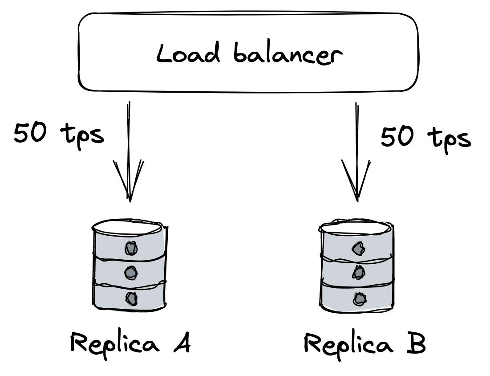
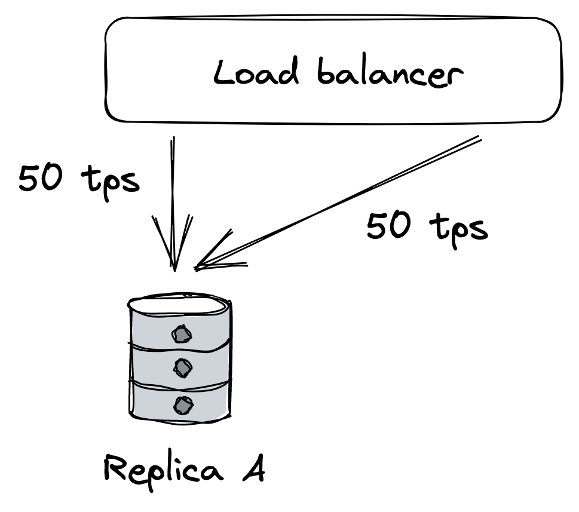
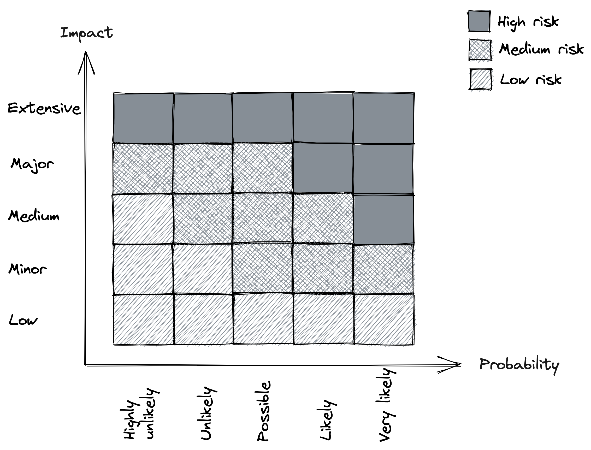

# Chapter 24: Common Failure Causes

A **failure** occurs when a system no longer provides the specified service to its users. A failure is caused by a **fault**, which is a problem with an internal component or an external dependency. While some faults can be tolerated without user-visible impact, others lead to system failures.

### 24.1 Hardware Faults

Hardware components are physical and can fail.

- **Components Prone to Failure**: HDDs, SSDs, memory modules, power supplies, motherboards, NICs, and CPUs can all cease to function.
- **Data Corruption**: Hardware faults can sometimes lead to data corruption.
- **Data Center Outages**: Entire data centers can fail due to power cuts or natural disasters.
- **Mitigation**: Redundancy is a common strategy to address these infrastructure-level faults.

### 24.2 Incorrect Error Handling

This is a surprisingly common reason for major failures in distributed systems.

- A 2014 study found that the **majority of catastrophic failures** in five popular distributed data stores were due to incorrect handling of non-fatal errors.
- **_Bugs in error handling could often have been found with simple tests._**
- **Common Mistakes**:
  - Completely ignoring errors.
  - Catching overly generic exceptions (like `Exception` in Java) and unnecessarily aborting the process.
  - Partially implemented handlers containing "FIXME" or "TODO" comments.

### 24.3 Configuration Changes

Changes to configuration are one of the **leading root causes of catastrophic failures**.

- **Delayed Effects**: The danger lies in their potentially delayed impact. An application might only read a configuration value when a specific feature is used, causing an invalid value to take effect hours or days after the change, thus escaping initial detection.
- **Causes of Problems**:
  - Simple misconfigurations.
  - Valid changes that enable rarely-used features which may be broken.
- **Best Practices**:
  - Configuration changes should be treated like code changes: _version-controlled, tested, and released carefully_.
  - Validation should occur preventively when the change is made.

### 24.4 Single Points of Failure (SPOF)

A **SPOF** is a component whose failure results in the failure of the entire system.

- **Detection**: To find SPOFs, one should examine every system component and ask, "what would happen if this failed?"
- **Common Examples of SPOFs**:
  - **Humans**: Manual processes requiring a sequence of steps without mistakes are prone to human error. _Automation should be used wherever possible_.
  - **DNS**: If clients cannot resolve a domain name, they cannot connect to the application. This can happen for many reasons, from expired domains to root-level domain outages.
  - **TLS Certificates**: An expired certificate will prevent clients from establishing a secure connection to an application's endpoints.
- **Mitigation**:
  - Some SPOFs can be removed through architecture, for example, by adding redundancy.
  - If a SPOF cannot be removed, the goal is to reduce its **blast radius**—the amount of damage it causes when it fails.

### 24.5 Network Faults

Network interactions are inherently unreliable. When a client sends a request, it may not get a prompt response for many reasons.

- **Causes of Delays or No Response**:
  - The server could be slow or may have crashed.
  - The network might be losing packets, causing retransmissions and delays.
- **_Gray Failures_**: This term refers to faults that are so subtle they cannot be detected quickly or accurately. Slow network calls are described as the "silent killers" of distributed systems.
- **Client-Side Issues**: A client waiting for a response doesn't know if it will ever arrive. It can wait for a long time before timing out, leading to performance degradation that is difficult to debug.

### 24.6 Resource Leaks

A very slow process is often as useless as one that has completely crashed. Resource leaks are a frequent cause of slow processes.

- **_Memory Leaks_**:
  - Even in garbage-collected languages, leaks can occur if a reference to an unneeded object is maintained, preventing the garbage collector from reclaiming its memory.
  - As memory is consumed, the OS swaps pages to disk, and the garbage collector runs more often, consuming CPU and slowing the process.
  - Eventually, the process can't allocate any more memory, and operations will fail.
- **_Other Leaked Resources_**:
  - **Thread Pools**: If a thread from a pool makes a synchronous, blocking call without a timeout that never returns, the thread is never returned to the pool. The pool will eventually be exhausted.
  - **Socket Pools**: Similarly, modern HTTP clients use socket pools. A request without a timeout can hold a connection indefinitely, preventing it from being returned to the pool, eventually exhausting the available connections.
- **Dependency Issues**: The libraries your application uses can also suffer from these same resource leak issues.

### 24.7 Load Pressure

Every system has a finite capacity. While a gradual, organic increase in load can be managed by scaling, a sudden flood of requests can cause failure.

- **Reasons for Sudden Load Changes**:
  - **Seasonality**: Usage patterns can change based on the time of day as users from different regions access the application.
  - **Expensive Requests**: Some operations are much more resource-intensive than others. Scrapers, for instance, can abuse the system by consuming data at very high rates.
  - **Malicious Traffic**: DDoS (Distributed Denial of Service) attacks aim to saturate an application's bandwidth to block legitimate users.
- **Handling Load Surges**: While autoscaling can handle some increases, other situations require the system to actively **reject requests (load shedding)** to protect itself from being overloaded.

### 24.8 Cascading Failures

Faults in a distributed system can spread virally from one component to another, causing a system-wide collapse. This happens when components are interdependent.

- **Example Scenario**:
  1.  Two database replicas (A and B) are behind a load balancer, each handling 50 transactions per second (tps).
  2.  Replica B fails due to a network fault. The load balancer redirects all traffic to Replica A.
  3.  Replica A now has to handle 100 tps. If this is beyond its capacity, it struggles, and clients experience timeouts.
  4.  Clients begin to retry their requests, adding even more load on Replica A.
  5.  Eventually, Replica A becomes so overloaded that it also fails, and the load balancer removes it. The entire service is now down.
- **_Metastable Failures_**: This is a type of failure characterized by a feedback loop. Even if the original fault is fixed (e.g., Replica B comes back online), the system continues to struggle. The restored replica is immediately flooded with the pent-up demand, overloads, and fails again.
- **Prevention**: The best way to deal with these failures is to prevent faults from spreading in the first place, often by breaking the feedback loop (e.g., temporarily blocking all traffic).

::: {.centerfigure}
{width=40%}
:::

::: {.centerfigure}
{width=50%}
:::

### 24.9 Managing Risk

It's impossible to prevent every possible fault. Instead, risk should be managed by prioritizing which faults to address.

- **Risk Score**: Risk can be calculated by considering two factors:
  1.  The **probability** that the fault will occur.
  2.  The **impact** it will have on users if it does occur.
- **Prioritization**:
  - A fault that is **highly likely** and has a **major impact** should be addressed immediately.
  - A fault with **low likelihood** and **low impact** can be deferred.
- **Addressing Faults**: Once a fault is prioritized, you can work to either **reduce its probability** of happening or **reduce its impact** if it does happen.

::: {.centerfigure}
{width=60%}
:::
