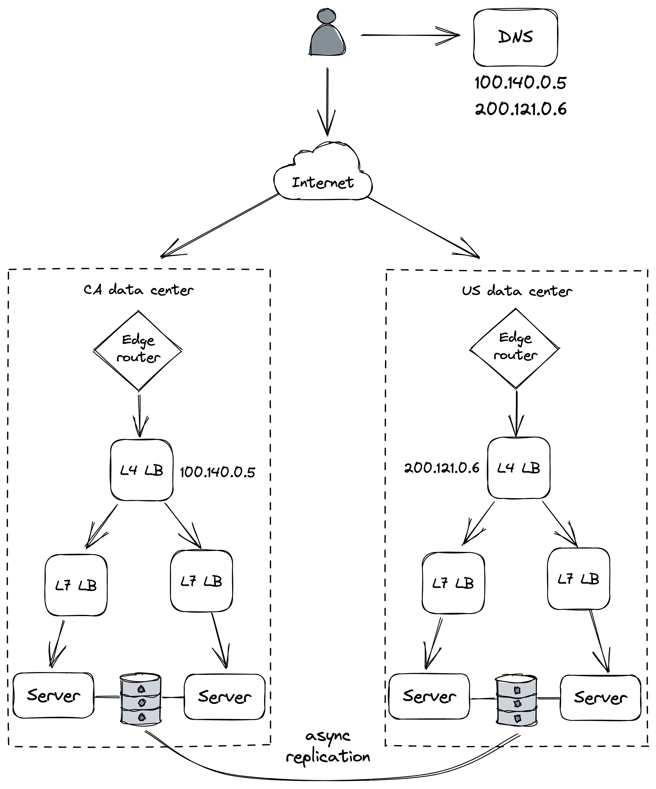

# Chapter 25: Redundancy

**Redundancy**, defined as the replication of functionality or state, serves as the primary defense against system failures. It is the core reason that distributed applications can achieve higher availability than single-node applications. When one replicated node fails, others can take over its responsibilities. Beyond availability, replication is also a fundamental pattern for enabling horizontal scaling.

However, not all forms of redundancy improve availability. For redundancy to be effective, it must meet four prerequisites:

1.  The **complexity** introduced by redundancy should not reduce availability more than the redundancy itself adds.
2.  The system must have a reliable way to **detect** which components are healthy and which are not.
3.  The system must be capable of operating in a **degraded mode** (i.e., with fewer components).
4.  The system must be able to **recover** back to a fully redundant mode.

### Redundancy in Stateless vs. Stateful Services

- **Stateless Services**:

  - In a stateless service, a load balancer can mask node failures (e.g., due to hardware issues) by directing traffic to a pool of healthy, redundant nodes.
  - **Detection**: The load balancer uses health checks to identify unresponsive servers. This is critical; if a faulty server remains in the pool, a percentage of client requests will fail, lowering availability. The faster the detection, the shorter the client-side impact.
  - **Degraded Mode**: When a server is removed, the system runs in a degraded mode, assuming the remaining servers have enough capacity to handle the increased load.
  - **Recovery**: It's not enough to simply run with fewer servers. New servers must be added to the pool to replace the failed ones, otherwise the system may eventually lack the capacity to handle the load.

- **Stateful Services**:
  - Masking node failures is significantly more complex because it requires the **replication of state**. Meeting the four prerequisites is far more challenging for stateful services than for stateless ones.

### 25.1 Correlation

The effectiveness of redundancy hinges on one critical assumption: the redundant nodes cannot fail for the same reason at the same time. In other words, **failures must not be correlated**.

- **Uncorrelated Failure**: A faulty memory module crashing one server is an example of an uncorrelated failure. It is unlikely that other servers will fail simultaneously for the same reason.
- **Correlated Failure**: If all servers are in the same data center, a single event like a power outage or a fiber cut can cause a data-center-wide failure. In this case, all servers fail together, rendering redundancy useless. _The availability of the application is limited by this correlated failure risk._

### Reducing Correlation with Multi-AZ and Multi-Region Architectures

To increase availability, you must reduce the correlation between failures. This is typically achieved by distributing components geographically.

- **Availability Zones (AZs)**:

  - Cloud providers like AWS and Azure use regions, which are each composed of multiple data centers called Availability Zones (AZs).
  - AZs are physically separate to minimize the risk of correlated failures (e.g., power cuts) but are connected by high-speed networks.
  - The network latency between AZs is low enough to support synchronous or partially synchronous replication protocols (like Raft or chain replication) without a major performance penalty.
  - By deploying instances across multiple AZs, an application can remain available even if one entire data center goes down.

- **Multi-Region Deployment**:
  - To tolerate a catastrophic event that could destroy an entire region (including all its AZs), an application stack can be duplicated in multiple regions.
  - **Global DNS load balancing** is used to distribute traffic to different regions.
  - Due to the high network latency between geographically distant regions, state must be replicated **asynchronously**.
  - **Justification**: Deploying a multi-region architecture is a massive effort. The chance of an entire region failing is extremely low. A more common driver for multi-region presence is legal and regulatory compliance, such as data residency laws that mandate customer data be stored and processed within a specific geographic area (e.g., Europe).

::: {.centerfigure}
{width=80%}
:::
