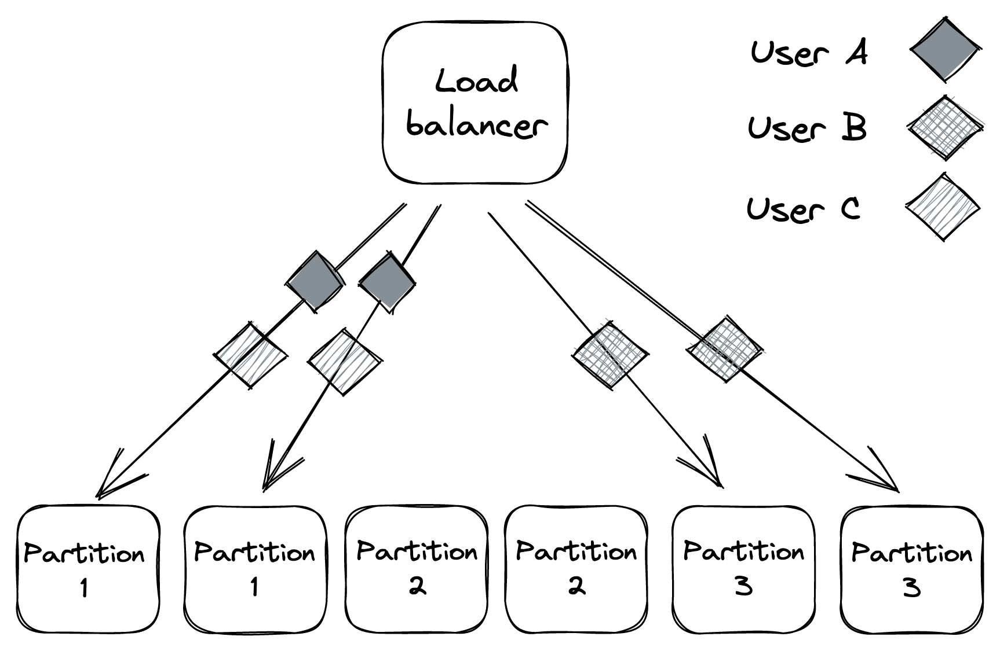
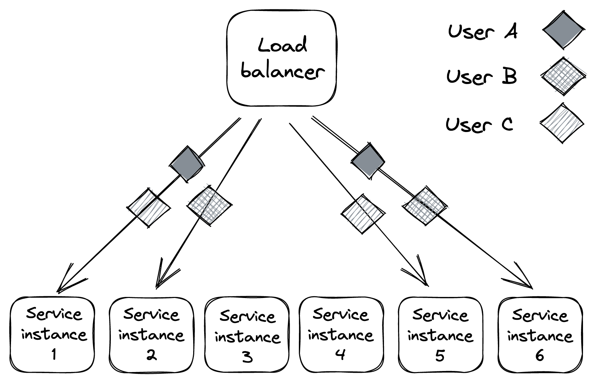
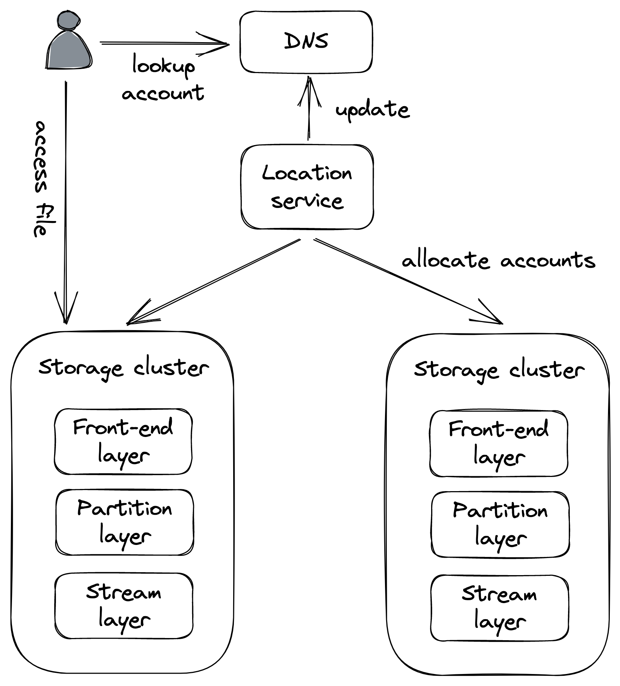

# Chapter 26: Fault Isolation

Redundancy alone cannot handle all types of failures, especially those with a high degree of correlation, such as bugs in code. If a bug exists, it is present on every redundant instance, making replication ineffective against it.

Two common examples of such failures are:

- **_Poison Pills_**: These are malformed requests, sent deliberately or accidentally, that exploit a bug and cause the server handling them to crash. Since the bug is in the code, these requests can affect any server in any data center or region.
- **_Noisy Neighbor Effect_**: This occurs when requests from one user consume an excessive amount of resources, degrading performance for all other users of the system.

The fundamental problem in both scenarios is that the **blast radius** (the scope of the impact) is the entire application. The solution is to use **fault isolation** by partitioning the application stack. By assigning users to specific partitions, the impact of a poison pill or a noisy neighbor is contained within that user's partition, protecting the rest of the system.

This technique is also known as the **bulkhead pattern**, named after the sealed compartments in a ship's hull that prevent a leak in one section from flooding the entire ship.

::: {.centerfigure}
{width=60%}
:::

### 26.1 Shuffle Sharding

A downside of standard partitioning is that all users assigned to a degraded partition are negatively impacted. For stateless services, a powerful variation called **shuffle sharding** offers a better solution.

The core idea is to create _virtual partitions_ composed of random, but permanent, subsets of the available service instances. This dramatically reduces the probability that any two users will be assigned to the exact same set of instances.

- **Example**: With 6 service instances, instead of creating 3 physical partitions of 2 instances each, we can create virtual partitions. The number of unique 2-instance virtual partitions we can create from 6 instances is 15. This means there are 15 possible partitions a user can be assigned to, making it much less likely for two "noisy" users to land on the same one.
  $$
      \frac{n!}{r!(n-r)!}=\frac{6!}{2!4!}=15
  $$
- **Caveat**: These virtual partitions will partially overlap.
- **Benefit**: When shuffle sharding is combined with a load balancer that removes faulty instances and clients that retry failed requests, the system achieves significantly better fault isolation than with physical partitions alone.

::: {.centerfigure}
{width=70%}
:::

### 26.2 Cellular Architecture

The concept of partitioning can be extended to the entire application stack, a design known as a **cellular architecture**.

In this model, the whole stack—including load balancers, compute services, storage, etc.—is partitioned into completely independent **cells**. A gateway service sits in front and is responsible for routing user requests to the appropriate cell. Partitioning can be done along various dimensions, such as by user, physical location, or workload type.

A prime example of this is Azure Storage, where each storage cluster acts as a self-contained cell.

An unexpected benefit of this architecture is related to scaling and reliability:

- Cells are designed with a **maximum capacity**.
- When more capacity is needed, a **new cell is added** rather than scaling out existing ones.
- Because each cell has a fixed maximum size, it can be **thoroughly tested and benchmarked** at that scale. This provides confidence that the system will not hit unexpected performance walls in the future.

::: {.centerfigure}
{width=70%}
:::
