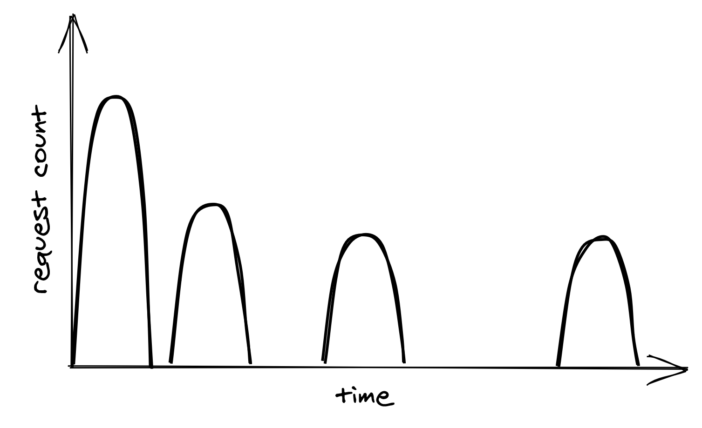
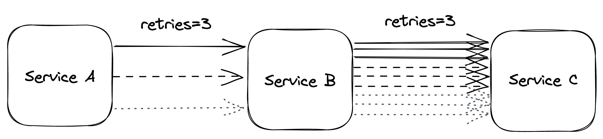
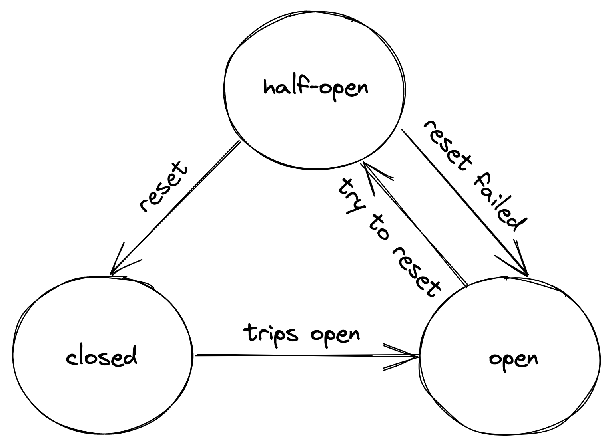

# Chapter 27: Downstream Resiliency

This chapter focuses on tactical resiliency patterns designed to protect a service from the failures of its downstream dependencies, preventing faults from propagating between components.

### 27.1 Timeout

Setting a timeout on network calls is a best practice to ensure that the call fails if a response is not received within a specified period.

- **Importance**: Without a timeout, a network call might never return, leading to resource leaks (e.g., hanging threads or connections) that can cascade and cause failures in other components. Timeouts are essential for any operation that could potentially never return, like acquiring a mutex.
- **Poor Defaults**: Many common libraries and APIs have poor default timeout settings.
  - JavaScript's `XMLHttpRequest` and Go's `net/http` package have no default timeout.
  - Python's popular `requests` library has a default timeout of infinity.
  - While modern clients in .NET and Java often have defaults, they can be overly permissive (e.g., .NET HttpClient's default is 100 seconds).
- **Best Practices**:
  - **Always set timeouts** when making network calls, and be cautious of third-party libraries that don't expose timeout settings.
  - To determine a duration, one can base it on a desired false timeout rate. For example, to achieve a 0.1% false timeout rate, the timeout can be set to the **99.9th percentile** of the downstream service's response time.
  - It is critical to have **good monitoring** in place to track the entire lifecycle of network calls, including duration, status codes, and whether a timeout was triggered.
  - This logic can be encapsulated in a shared library function or handled by a **sidecar proxy** in a service mesh, which can enforce timeouts and monitor calls on behalf of the application process.

### 27.2 Retry

When a network request fails or times out, the client can either fail fast or retry the request. Retrying is effective for short-lived, transient connectivity issues.

#### Exponential Backoff and Jitter

If a downstream service is overloaded, immediate retries will only worsen the situation. The retry mechanism should be slowed down.

- **Exponential Backoff**: This strategy involves increasing the delay between retries exponentially. A common formula is:
  $$delay = min(cap, initial{-}backoff * 2^{attempt} )$$
- **The "Retry Storm" Problem**: A problem with simple exponential backoff is that when a service degrades, multiple clients may see failures at the same time and begin their retry cycles in sync. This creates coordinated load spikes that can further degrade or crash the downstream service.

::: {.centerfigure}
{width=50%}
:::

- **Solution: Add Jitter**: To prevent this "herding" behavior, random jitter should be introduced into the backoff calculation. This spreads the retries out over time, smoothing the load on the downstream service. The formula becomes:
  $$delay = random(0, min(cap, initial{-}backoff * 2^{attempt}))$$

#### Other Retry Considerations

- **Non-Transient Failures**: It makes no sense to retry an error that is not short-lived, such as an authorization failure. In these cases, the client should **fail fast**.
- **Idempotency**: Be aware of the consequences of retrying network calls that are not idempotent, as this can affect the application's correctness.
- **Retry Amplification**: In a long chain of service calls (e.g., A -> B -> C), having retries at every level can dramatically amplify the load on services deep in the chain. If A retries its call to B three times, and B retries its call to C three times for each of A's attempts, C could receive a huge number of amplified requests.
  - **Best Practice**: In long dependency chains, **retry at a single level** of the chain and fail fast in all the others.

::: {.centerfigure}
{width=60%}
:::

### 27.3 Circuit Breaker

When a downstream dependency suffers from a non-transient failure, continuously retrying requests will only slow down the calling service and risk spreading the slowness throughout the system. The circuit breaker pattern addresses this.

- **Purpose**: A circuit breaker detects long-term degradation in a dependency and temporarily blocks new requests from being sent to it. Its goal is to allow a subsystem to fail without slowing down the caller. The fastest network call is the one that is never made.
- **Retries vs. Circuit Breakers**: Retries are useful when the next call is expected to _succeed_. Circuit breakers are useful when the next call is expected to _fail_.

A circuit breaker is implemented as a state machine with three states:

::: {.centerfigure}
{width=50%}
:::

1.  **Closed**:
    - This is the normal state. Network calls are allowed to pass through.
    - The circuit breaker tracks the number of failures (errors, timeouts). If the failure count exceeds a threshold within a time interval, the circuit "trips" and moves to the `Open` state.
2.  **Open**:
    - In this state, network calls are not attempted and fail immediately.
    - This prevents the application from waiting on a known-to-be-unresponsive dependency. The service should be designed to **gracefully degrade**. For example, Amazon's homepage might render without personalized recommendations if the recommendation service is down, which is better than failing the entire page.
    - After a configured timeout period, the circuit breaker moves to the `Half-Open` state.
3.  **Half-Open**:
    - The circuit breaker allows a single "probe" request to pass through to the downstream service.
    - If this call succeeds, it's assumed the dependency has recovered, and the circuit breaker transitions back to `Closed`.
    - If the call fails, it transitions back to the `Open` state to continue protecting the application.

The specific configuration values (failure thresholds, open-state duration) are context-dependent and should be determined using data from past failures.
