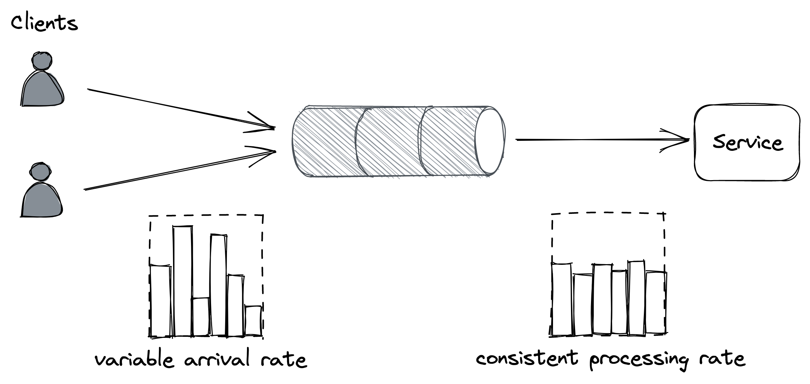
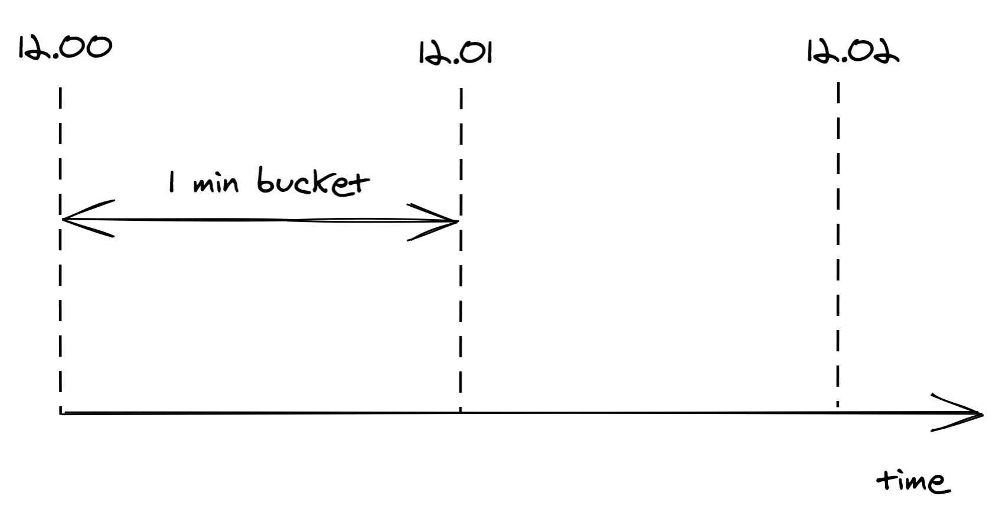
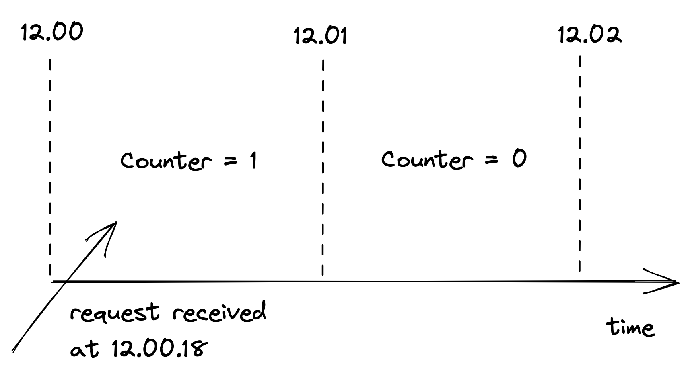
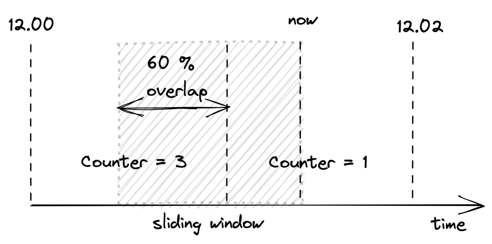
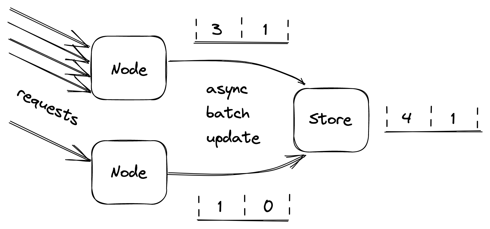

# Chapter 28: Upstream Resiliency

This chapter discusses mechanisms to protect a service against upstream pressure, such as being overwhelmed by too many requests.

### 28.1 Load Shedding

When a server is operating at capacity, it should proactively reject excess requests to dedicate its resources to the requests it is already processing. This technique is called **load shedding**.

- **Problem**: Under extreme load, a server often runs out of resources like memory or threads and crawls to a halt, becoming unavailable _before_ its operating system's connection queue limit is reached.
- **Implementation**: A server can track the number of concurrent requests it's processing. If this number exceeds a predefined threshold that approximates the server's capacity, it can start rejecting new requests by returning a `503 Service Unavailable` response.
- **Prioritized Rejection**: The server doesn't have to reject requests arbitrarily. It can implement strategies such as:
  - Rejecting only low-priority requests.
  - Rejecting the oldest requests first, as they are the most likely to time out soon anyway.
- **Limitations**: Rejecting a request is not free. The server still incurs some cost, such as for the TLS handshake and reading the request headers. If the load continues to increase, the cost of rejecting requests can eventually degrade the server's performance.

### 28.2 Load Leveling

When clients do not require an immediate response, **load leveling** can be used as an alternative to load shedding.

- **Concept**: This pattern introduces a messaging channel (like a queue) between the clients and the service. The service pulls requests from the channel at its own pace, which decouples the rate of incoming requests from the service's processing capacity.
- **Benefit**: It is well-suited for smoothing out short-lived traffic spikes.
- **Caveat**: If the service does not catch up with the arrival rate, a large backlog of requests can build up in the queue.
- **Combined with Auto-scaling**: Both load shedding and load leveling are typically combined with auto-scaling, which can add more capacity to the service to handle a sustained increase in load.

::: {.centerfigure}
{width=70%}
:::

### 28.3 Rate-limiting

**Rate-limiting** (or throttling) is a mechanism that rejects requests when a specific quota is exceeded over a time interval.

- **Concept**: Quotas are typically applied to specific users, API keys, or IP addresses. For example, a user might be limited to 10 requests per second.
- **Response**: When rate-limiting a request, a service should return a `429 Too Many Requests` status code. The response can also include a `Retry-After` header to tell the client how long to wait before trying again.
- **Use Cases**:
  - Preventing non-malicious users or buggy clients from monopolizing the service.
  - Enforcing pricing tiers, where users pay more for higher quotas.
- **DDoS Protection**: It offers only partial protection. Attackers can ignore the 429 responses and continue to send requests, and the service still incurs a cost to process and reject them. True protection against large-scale DDoS attacks requires economies of scale, such as a large gateway service.
- **Load Shedding vs. Rate-limiting**:
  - **Load shedding** makes decisions based on the _local state_ of a single process (e.g., "Am I overloaded right now?").
  - **Rate-limiting** makes decisions based on the _global state_ of the system (e.g., "How many requests has this API key made across all instances in the last minute?") and requires coordination.

#### Distributed Implementation

Implementing a rate limiter in a distributed system requires a shared data store to track request counts for each key.

- **Sliding Window with Buckets**: To avoid storing every request timestamp (which is memory-intensive), the sliding window algorithm is used. Time is divided into buckets of a fixed duration (e.g., one-minute intervals), and only a counter for each bucket is stored.

::: {.centerfigure}
{width=60%}
:::

When a request arrives, the counter for the current time bucket is incremented.

::: {.centerfigure}
{width=70%}
:::

The total count within the current time window is a weighted sum of the counters in the buckets the window overlaps.

::: {.centerfigure}
{width=60%}
:::

- **Challenges**:
  - **Race Conditions**: Simply reading, updating, and writing the count back to the store can lead to lost updates. Atomic operations (like get-and-increment) should be used instead of transactions for better performance.
  - **Data Store Load**: To avoid overwhelming the data store, each service instance can batch updates in memory and flush them asynchronously.
  - **Data Store Unavailability**: If the data store is down, it's often better to fail open (i.e., stop rate-limiting) and continue serving requests based on the last known state, prioritizing availability over consistency.

::: {.centerfigure}
{width=70%}
:::

### 28.4 Constant Work

Systems that behave differently under different conditions (e.g., overload) are said to have multi-modal behavior, which can trigger rare bugs and make operations difficult. The **constant work** pattern aims to minimize this.

- **Concept**: The system is designed to perform the same amount of work per unit of time, regardless of the load. Ideally, the system's worst-case and average-case performance should not differ.
- **Antifragility**: A system that actually performs _better_ under stress is called **antifragile**.
- **Example: Configuration Propagation**:
  - **Variable Work**: Broadcasting individual configuration changes to data plane instances means the work is proportional to the number of changes. A large number of changes at once could create a massive update storm.
  - **Constant Work Solution**: Instead, the control plane can periodically dump the _entire_ configuration for _all_ users to a single file in a store like AWS S3. Data plane instances then periodically read this one large file. The amount of work is now constant and predictable, no matter how many settings have changed.
- **Benefits**:
  - **Reliable and Predictable**: The system's behavior is stable under all circumstances.
  - **Simple and Self-Healing**: This approach is simpler to implement correctly than a complex delta-propagation mechanism. If a dump is corrupted, the next periodic update will automatically fix it.
  - **Reduced Complexity**: While potentially more expensive in terms of raw computation, this pattern increases reliability and reduces operational complexity, which is often a worthwhile trade-off.
