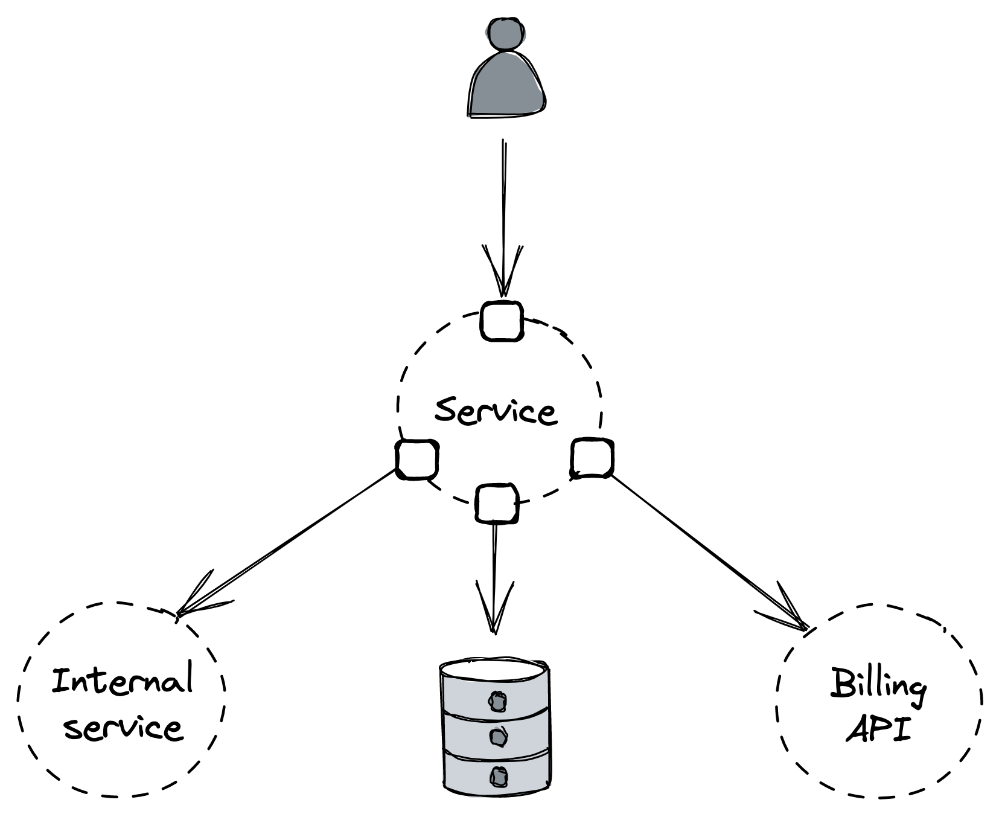

## Chapter 29: Testing

### 1. Introduction to Testing

- The longer it takes to detect a bug, the more _expensive_ it becomes to fix.
- Software tests verify that some part of the application works as intended, _catching bugs early_ in the process.
- The real benefit of testing emerges when developers want to make changes (bug fixes, refactorings, new features) _without breaking expected behaviors_.
- Tests also serve as _always up-to-date documentation_ and improve the quality of public interfaces by requiring developers to think from the user's perspective.
- **Limitations of Testing:**
  - Testing is not a "silver bullet" because it's impossible to predict all states a complex distributed application can enter.
  - It provides only _best-effort guarantees_ that the code is correct and fault-tolerant.
  - Tests can only cover failures developers can imagine, not complex emergent behavior that manifests in production.
- Despite limitations, tests do a good job validating expected behaviors.
- **Rule of Thumb:** If you want confidence that your implementation behaves in a certain way, you must add a test for it.

### 2. Scope of Tests

- Tests vary in scope, defining the _system under test (SUT)_ from the code being run.
- The SUT determines whether a test is categorized as a **unit test**, an **integration test**, or an **end-to-end test**.

#### 2.1 Unit Tests

- Validate the behavior of a _small part_ of the codebase, such as an individual class.
- A good unit test should be relatively _static_ and change only when the SUT's behavior changes (not for refactoring, bug fixes, or new features).
- To achieve this, a unit test should:
  - Use only the _public interfaces_ of the SUT.
  - Test for _state changes_ in the SUT (not predetermined sequences of actions).
  - Test for _behaviors_, i.e., how the SUT handles a given input in a specific state.

#### 2.2 Integration Tests

- Have a _larger scope_ than unit tests; they verify that a service can interact with an external dependency as expected.
- The term "integration testing" can have different meanings.
- Martin Fowler distinguishes between:
  - **Narrow integration test:** Exercises only the code paths of a service that communicate with a _specific external dependency_ (e.g., an adapter and its supporting classes).
  - **Broad integration test:** Exercises code paths across _multiple live services_. (These are referred to as end-to-end tests in this chapter).

#### 2.3 End-to-End Tests

- Validate behavior that _spans multiple services_ in the system, like a user-facing scenario.
- These tests usually run in _shared environments_ (e.g., staging or production) and should not impact other tests or users.
- **Drawbacks:**
  - Due to their scope, they are _slow_ and _more prone to intermittent failures_.
  - They can be _painful and expensive to maintain_.
  - When an end-to-end test fails, it's generally _not obvious which service caused the failure_, requiring deeper investigation.
- **Necessity:** Despite drawbacks, these tests are a necessary evil to ensure that user-facing scenarios work as expected across the entire application.
- They can uncover issues that tests with smaller scope can't, like unanticipated side effects and emergent behaviors.
- **Minimizing End-to-End Tests:** One way to minimize their number is to frame them as _user journey tests_.
  - A user journey test simulates a multi-step interaction of a user with the system (e.g., for an e-commerce service: create an order, modify it, and finally cancel it).
  - Such a test usually requires less time to run than individual journey parts split into separate end-to-end tests.
- **Test Scope vs. Reliability:** As the scope of a test increases, it becomes _more brittle, slow, and costly_.
- Intermittently failing tests are nearly as bad as no tests at all, as developers stop trusting and eventually ignore their failures.
- When possible, it's preferable to have tests with _smaller scope_ as they tend to be _more reliable, faster, and cheaper_.
- **Good Trade-off (Test Pyramid):** A large number of unit tests, a smaller fraction of integration tests, and even fewer end-to-end tests.

::: {.centerfigure}
{width=50%}
:::

### 3. Size of Tests

- The _size_ of a test reflects how much computing resources it needs to run (e.g., number of nodes).
- Generally, this depends on how realistic the environment is where the test runs.
- Although the scope and size of a test tend to be correlated, they are _distinct concepts_.

#### 3.1 Test Size Categories:

- **Small test:** Runs in a single process and doesn't perform any blocking calls or I/O.
  - _Result:_ Very fast, deterministic, and has a very small probability of failing intermittently.
- **Intermediate test:** Runs on a single node and performs local I/O, like reads from disk or network calls to localhost.
  - _Result:_ Introduces more room for delays and non-determinism, increasing the likelihood of intermittent failures.
- **Large test:** Requires multiple nodes to run, introducing even more non-determinism and longer delays.
- Unsurprisingly, the larger a test is, the _longer it takes to run_ and the _flakier_ it becomes.
- **Recommendation:** Write the _smallest possible test_ for a given behavior.

#### 3.2 Test Doubles

- We can use a **test double** in place of a real dependency (such as a fake, a stub, or a mock) to reduce the test's size, making it faster and less prone to intermittent failures:
  - **Fake:** A lightweight implementation of an interface that behaves similarly to a real one. Example: An in-memory version of a database.
  - **Stub:** A function that always returns the same value no matter which arguments are passed to it.
  - **Mock:** Has expectations on how it should be called, and it's used to test the interactions between objects.
- **Problem with Test Doubles:** They don't resemble how the real implementation behaves with all its nuances.
- The weaker the resemblance, the less confidence we should have that the test using the double is actually useful.
- Therefore, when the real implementation is fast, deterministic, and has few dependencies, we should use that rather than a double.
- When using the real implementation is not an option, we can use a fake maintained by the same developers of the dependency if one is available.
- Stubbing or mocking are _last-resort options_ as they offer the least resemblance to the actual implementation, which makes tests that use them brittle.
- **Integration Tests Compromise:** For integration tests, a good compromise is to combine mocking with _contract tests_.
  - A **contract test** defines a request for an external dependency with the corresponding expected response.
  - The test then uses this contract to mock the dependency.
  - Example: A contract for a REST API consists of an HTTP request and response.
  - To ensure the contract is valid and doesn't break in the future, the test suite of the external dependency uses the same contract definition to simulate the client request and ensure the expected response is returned.

### 4. Practical Considerations

- As with everything else, testing requires making trade-offs.
- Consider an API endpoint exposed by a service that talks to:
  - A data store
  - An internal service owned by another team
  - A third-party API used for billing

::: {.centerfigure}
{width=50%}
:::

- The general approach is to write the smallest possible test for the desired scope while minimizing the use of test doubles that don't resemble how the real implementation behaves.
- **Example Scenario:**
  - If the endpoint under test doesn't communicate with the internal service, a mock can be safely used.
  - If the data store has an in-memory implementation (a fake), that can be used to avoid network calls.
  - Calling a third-party billing API directly might require real transactions, so if a fake isn't available, a testing endpoint from the billing service that issues fake transactions could be used.
- **High-Risk Scenario:** For functionality like purging user data across the entire application stack (e.g., GDPR compliance), where the risk of silent failure is high and consequences severe (e.g., fines up to 20 million euros or 4% annual turnover), an _end-to-end test_ that runs in production periodically and uses _live services_ rather than test doubles is warranted.

### 5. Formal Verification

- Software tests are not the only way to catch bugs early.
- Writing a high-level description of how a system behaves (a **specification**) allows subtle bugs and architecture shortcomings to be detected _before writing code_.
- A specification can range from an informal one-pager to a formal mathematical description that a computer can check.
- Since it's hard to specify what we don't fully understand, a specification can help us _reason about system behaviors_.
- It also acts as _documentation_ and a _guide for implementation_.
- By writing the specification in a formal language, we gain the ability to _algorithmically verify_ whether the specification is flawed (**model checking**).
- The goal of a specification is to catch errors when they are still cheap to fix. Therefore, only parts most likely to contain errors and hard to detect by traditional tests should be specified.
- Once decided what to specify, the level of abstraction (which details to omit) must be chosen.
- **TLA+** (Temporal Logic of Actions) is a well-known and widely used formal specification language.
  - Companies like Amazon and Microsoft use it to describe complex distributed systems (e.g., S3, Cosmos DB).
  - In TLA+, a system's behavior is a sequence of states, where a state is an assignment of values to global variables.
  - The specification of a system is the set of all possible behaviors.
- **Verifying Properties:** One goal of writing a specification is to verify that it satisfies desired system properties, like _safety_ and _liveness_.
  - A **safety property** asserts that something is true for all states of a behavior (an invariant).
  - A **liveness property** asserts that something eventually happens.
- TLA+ allows describing and verifying properties that should be satisfied by all possible states and behaviors of a specification. This is powerful because systems at scale eventually run into all possible states and behaviors, and humans are bad at imagining concurrent rare events.
- **Example: Data Store Migration**
  - Suppose migrating a service from key-value store X to Y without downtime:
    1. Service writes to both X and Y (dual write) while reading only from X.
    2. A one-off batch process backfills Y with data from X created before dual writing.
    3. Application switches to read and write exclusively from Y.
  - **Problem Identification with TLA+:** If modeled with TLA+, a model checker could identify problems, such as a _liveness violation_ where the system enters an inconsistent state if a service instance crashes after writing to A but before writing to B.
  - The beauty of automated model checking is it returns an _error trace_ (sequence of states) that violates the properties when it fails.
  - Even if writes are modeled as atomic (both succeed or both fail), the model might still be incorrect. For example, if two service instances write to A and B simultaneously, the two data stores can end up in different states due to differing write orders.

::: {.centerfigure}
{width=60%}
:::

- This problem can be solved by introducing a message channel between the service and data stores that serializes all writes and guarantees a single global order.
- Regardless of the solution, a formal model enables testing architectural decisions that would be hard to verify otherwise.
