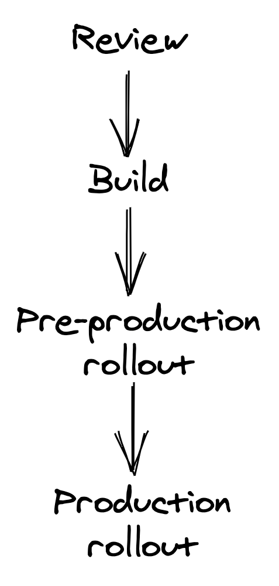

## Chapter 30: Continuous Delivery and Deployment

### 1. Introduction to Continuous Delivery and Deployment (CD)

- Once a code change and its tests are merged, it needs to be released to production.
- **Manual release processes** are problematic:
  - They don't happen frequently, leading to batched changes over days or weeks.
  - This _increases the likelihood of release failure_.
  - When a release fails, it's _harder to pinpoint the breaking change_, slowing down the team.
  - Developers must constantly monitor dashboards and alerts.
- Manual deployments are a _terrible use of engineering time_, especially with many services.
- The only way to release changes safely and efficiently is to _automate the entire process_.
- A change merged to a repository should _automatically be rolled out to production safely_.
- The **Continuous Delivery and Deployment (CD) pipeline** automates the entire release process, including rollbacks.
- Releasing changes is a main source of failures, so CD requires significant investment in _safeguards, monitoring, and automation_.
- If a regression is detected, the deployable component (artifact) is either _rolled back_ to the previous version or _rolled forward_ to a version with a hotfix.
- There's a balance between rollout safety and release time; a good CD pipeline strives for a good trade-off.

### 2. CD Pipeline Stages: Review and Build

- A code change goes through a pipeline of four stages to be released to production: **review, build, pre-production rollout, and production rollout**.

::: {.centerfigure}
{width=30%}
:::

#### 2.1 Review Stage

- It begins with a _pull request (PR)_ submitted for review by a developer.
- When the PR is submitted, it needs to be _compiled, statically analyzed, and validated with a battery of tests_. This should take no longer than a few minutes.
- To increase test speed and minimize intermittent failures, tests at this stage should be _small enough to run on a single process or node_, while larger tests run later.
- The PR must be _reviewed and approved by a team member_ before merging.
- The reviewer validates whether the change is correct and safe for automatic release by the CD pipeline.
- A checklist can assist reviewers:
  - Does the change include unit, integration, and end-to-end tests as needed?
  - Does the change include metrics, logs, and traces?
  - Can this change break production (e.g., backward-incompatible change, hitting service limits)?
  - Can the change be rolled back safely if needed?
- Not just code changes, but also _static assets, end-to-end tests, and configuration files_ should go through this review process and be version-controlled.
- A service can have _multiple CD pipelines_, one for each repository, potentially running in parallel.
- It's critical to review and release _configuration changes_ with a CD pipeline, as they are a common cause of production failures when applied globally without prior review or testing.
- Applications running in the cloud should declare their infrastructure dependencies (VMs, data stores, load balancers) with code (**Infrastructure as Code - IaC**) using tools like Terraform. This automates infrastructure provisioning and treats infrastructure changes like software changes.

#### 2.2 Build Stage

- Once a change is merged into the main branch, the CD pipeline moves to the build stage.
- Here, the repository's content is _built and packaged into a deployable release artifact_.

### 3. Pre-production Rollout

- During this stage, the artifact is deployed to a _synthetic pre-production environment_.
- Although it lacks production realism, it's useful to verify:
  - No hard failures are triggered (e.g., null pointer exception at startup due to missing configuration).
  - End-to-end tests succeed.
- Releasing to pre-production is _significantly faster_ than to production, allowing early bug detection.
- There can be _multiple pre-production environments_: from those created from scratch for each artifact for smoke tests, to persistent ones mirroring production and receiving a small fraction of mirrored requests.
- Ideally, the CD pipeline should assess artifact health in pre-production using the _same health signals used in production_ (metrics, alerts, tests) to ensure consistent health coverage.

### 4. Production Rollout

- After successful pre-production rollout, the CD pipeline proceeds to release the artifact to production.
- **Initial Release:** It should start by releasing to a _small number of production instances first_.
  - The goal is to surface problems not yet detected as quickly as possible before widespread damage.
- **Incremental Release:** If the initial release is healthy, the artifact is _incrementally released to the rest of the fleet_.
- **Capacity Management:** During rollout, a fraction of the fleet can't serve traffic, so remaining instances must pick up the slack. _Enough capacity_ must be available to sustain the incremental release without performance degradation.
- **Multi-Region Deployment:** If the service is in multiple regions, the CD pipeline should:
  - Start with a _low-traffic region_ to reduce the impact of a faulty release.
  - Divide releasing to remaining regions into _sequential stages_ to minimize risks.
  - The more stages, the longer the pipeline takes. This can be mitigated by _increasing release speed_ in later stages once confidence is built.
  - Example: Stage 1 to a single region, Stage 2 to a larger region, Stage 3 to N regions simultaneously.

### 5. Rollbacks

- After each step, the CD pipeline must _assess the deployed artifact's health_ and, if unhealthy, _stop the release and roll it back_.
- **Health Signals for Decision Making:**
  - Results of end-to-end tests.
  - Health metrics (e.g., latencies, errors).
  - Alerts.
- **Monitoring Scope:** Monitoring only the health signals of the service being rolled out is _not enough_. The CD pipeline should also monitor the health of _upstream and downstream services_ to detect indirect impacts.
- **Bake Time:** Allow enough _bake time_ between steps to ensure success, as some issues (e.g., performance degradation) appear only after time or at peak load.
  - Bake time can be reduced after early successes.
  - It can also be gated on the number of requests for specific API endpoints to ensure proper exercise of the API surface.
- **Degradation Response:** When a health signal reports degradation, the CD pipeline stops.
  - It can _automatically roll back_ the artifact.
  - Or, it can _trigger an alert_ to engage the on-call engineer to decide if a rollback is warranted.
  - Based on engineer input, the pipeline might retry the failed stage or roll back entirely.
- **Rolling Forward vs. Rolling Back:** An operator can stop the pipeline and wait for a new artifact with a hotfix to be rolled forward. This is necessary if the release can't be rolled back due to a _backward-incompatible change_.
- **Rule of Thumb:** Since rolling forward is riskier than rolling back, _any change should always be backward compatible_.
- **Common Cause of Backward Incompatibility:** Changing the serialization format used for persistence or IPC.
- **Safely Introducing Backward-Incompatible Changes:** Break them down into multiple backward-compatible changes.
  - Example: Changing a messaging schema between a producer and consumer:
    1.  **Prepare change:** Consumer is modified to support _both new and old_ messaging formats.
    2.  **Activate change:** Producer is modified to _write messages in the new format_.
    3.  **Cleanup change:** Consumer _stops supporting the old format altogether_. This is released only when there's enough confidence the activated change won't need rollback.
- An automated _upgrade-downgrade test_ as part of the CD pipeline in pre-production can validate if a change is truly safe to roll back.
