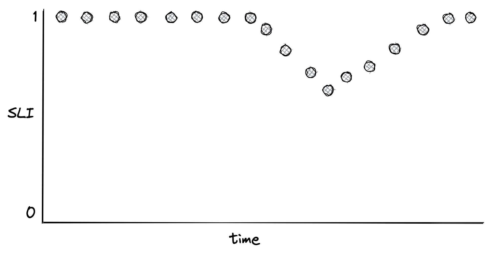
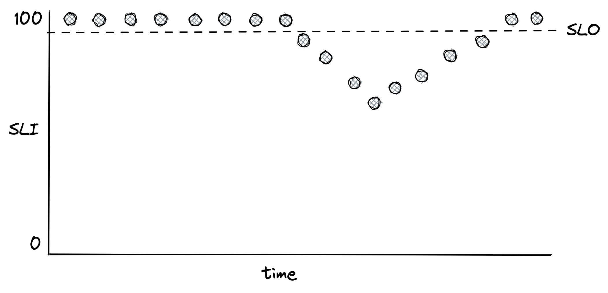
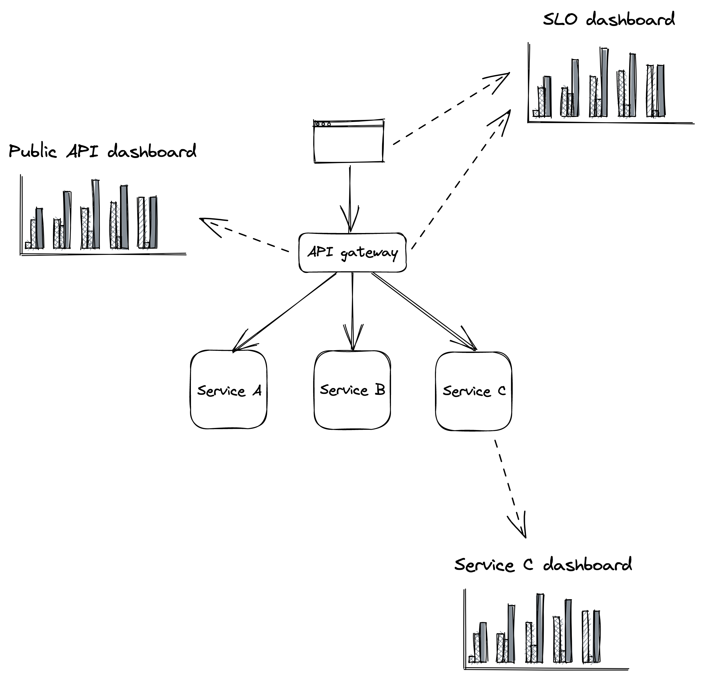

# Chapter 31: Monitoring

## Introduction to Monitoring

Monitoring is essential for two main purposes:

- **_Failure Detection_**: It is primarily used to detect failures affecting users in a production environment and to notify the human operators responsible for the system.
- **_System Health Overview_**: It provides a high-level view of the system's health through dashboards.

### Types of Monitoring

1.  **Black-box Monitoring**:

    - This was the initial form of monitoring, focusing on whether a service was simply "up" or "down" without providing internal visibility.
    - It is useful for monitoring external dependencies like third-party APIs and understanding how users perceive the service from the outside.
    - A common method involves using **synthetics**: scripts that periodically send test requests to external endpoints to measure response time and success.
    - Synthetics can detect issues not visible from within the application, such as DNS or connectivity problems.

2.  **White-box Monitoring**:
    - Developers instrument their applications to report if specific features are working as expected. This helps in identifying the root cause of a failure.
    - Its popularity grew with tools like _statsd_ from Etsy, which standardized the collection of application-level measurements.
    - While black-box monitoring identifies symptoms, white-box monitoring helps pinpoint the cause.

## 31.1 Metrics

A **metric** is a time series of raw measurements (samples) concerning resource usage or system behavior. Each sample consists of a floating-point number and a timestamp.

- **Labels**: Metrics can be tagged with key-value pairs called labels (e.g., region, data center).

  - _Benefit_: Labels allow for easy slicing and dicing of data without needing to create a separate metric for each combination.
  - _Challenge_: A high number of unique label combinations can generate a large volume of metrics, making them difficult to store and process.

- **Essential Metrics**: A service should, at a minimum, emit metrics about:
  - Its load (e.g., request throughput).
  - Its internal state (e.g., in-memory cache size).
  - The availability and performance of its dependencies (e.g., data store response time).

### Metric Aggregation

Metrics can be expensive to process, especially at query time. Pre-aggregation is a technique used to manage this cost.

- **Event-Based Approach**: Each time an event occurs (e.g., a request fails), a failure count of 1 is reported in an event. This is expensive as the telemetry service load increases with the number of events.
- **Pre-aggregation**:
  - Time-series samples can be pre-aggregated over fixed time periods (e.g., 1 minute, 1 hour).
  - **Server-side**: The telemetry service can pre-aggregate data as it is ingested.
  - **Client-side**: Local telemetry agents can pre-aggregate metrics before sending them, reducing ingestion costs (bandwidth, compute, storage).
  - _Trade-off_: Pre-aggregation results in the loss of original raw events. This means you cannot re-aggregate metrics into smaller time periods later.

## 31.2 Service-Level Indicators (SLIs)

An **SLI** is a specific metric that measures an aspect of the service level provided to users, such as response time, error rate, or throughput.

- **Defining an SLI**: SLIs are best defined as a _ratio of "good events" to the total number of events_. This yields a value between 0 (completely broken) and 1 (working perfectly).

::: {.centerfigure}
{width="40%"}
:::

- **Common SLIs**:

  - **Response time**: The fraction of requests completed faster than a certain threshold.
  - **Availability**: The proportion of usable time, defined as successful requests over total requests.

- **Measurement Best Practices**:
  - Measure from the location that best represents the user's experience (e.g., the client side).
  - Represent response times with **percentiles** rather than averages. An average can be skewed by a single large outlier.
  - **Long-tail latencies** (e.g., 99th and 99.9th percentiles) are critical as they often affect the most active users and can significantly impact system resources and revenue.

## 31.3 Service-Level Objectives (SLOs)

An **SLO** defines an acceptable range of values for an SLI, indicating the service's healthy state. It sets user expectations for how a service should behave when functioning correctly.

- **Error Budget**: An SLO implies an **error budget**, which is the amount of failure that can be tolerated. For example, an SLO of 99% of API calls completing under 200ms over a week means an error budget of 1% of requests can be slower.

::: {.centerfigure}
{width="40%"}
:::

- **Purpose of SLOs**:

  - Help prioritize repair tasks over new features when the error budget is exhausted.
  - Measure the importance of an incident by how much of the error budget it consumes.
  - Can be used to define a **Service-Level Agreement (SLA)**, which is a contractual agreement with financial consequences if the SLO is not met.

- **Setting SLOs**:
  - Choosing the right target is difficult. If too lenient, user-facing issues are missed; if too strict, engineering time is wasted.
  - Work backward from what users care about.
  - Start with comfortable ranges and tighten them as confidence grows.
  - Keep SLOs simple and review them periodically.
  - Ensure SLOs are agreed upon by all stakeholders (engineering, product).

## 31.4 Alerts

**Alerting** is the part of a monitoring system that triggers an action when a specific condition happens, like a metric crossing a threshold.

- **Actionable Alerts**: For an alert to be useful, it must be _actionable_. An alert on high CPU usage is not useful because its impact is unclear, whereas an SLO-based alert is actionable because it quantifies user impact.

- **Precision vs. Recall**:

  - **Precision**: The fraction of significant events (actual issues) over the total number of alerts. Low precision leads to "alert fatigue".
  - **Recall**: The ratio of significant events that triggered an alert. Low recall means outages are missed.
  - There is a trade-off; improving one often lowers the other.

- **Alerting on Burn Rate**:
  - A naive alert (e.g., availability drops below a threshold for a short time window) has low precision.
  - A better approach is to alert based on the **burn rate**, which is the rate at which the error budget is being consumed.
  - The burn rate is the percentage of the error budget consumed over the percentage of the SLO time window that has elapsed.
  - A burn rate of 1 means the budget will be exhausted precisely at the end of the SLO window; a rate of 2 means it will be exhausted in half the time.
  - This allows for faster detection of significant issues.
  - Multiple alerts can be set for different burn rates to indicate severity.

## 31.5 Dashboards

Dashboards are the other primary use case for metrics, providing a real-time overview of system health.

- **Audience First**: When creating a dashboard, first decide on the audience and what they need to see. Then, work backward to select the appropriate charts and metrics.

### Types of Dashboards

1.  **SLO Dashboard**: For stakeholders across the organization to see the system's health as represented by its SLOs. During an incident, it quantifies the impact on users.
2.  **Public API Dashboard**: For operators to identify issues with public API endpoints during an incident. It displays metrics related to requests, handling, and responses.
3.  **Service Dashboard**: For the team that owns the service, containing service-specific implementation details and metrics from upstream and downstream dependencies.

::: {.centerfigure}
{width="60%"}
:::

### Dashboard Best Practices

- **Dashboards as Code**: Define dashboards using a domain-specific language and version-control them.
- **Layout**: Place the most important charts at the top.
- **Timezone**: Use a standard timezone like UTC to facilitate communication.
- **Consistency**: Use the same time resolution and range across all charts on a dashboard to correlate anomalies easily.
- **Simplicity**: Keep the number of metrics on a single chart to a minimum to avoid clutter and slow rendering.
- **Ranges**: Only include metrics with similar value ranges on the same chart. Split statistics (e.g., average vs. p99) into separate charts if their ranges differ significantly.
- **Annotations**: Include useful annotations like descriptions, links to runbooks, alert thresholds, and deployment markers.
- **Zero Values**: For metrics that only appear on error, emit a zero value in the absence of an error to avoid confusing gaps in charts.

## 31.6 Being On Call

A healthy on-call rotation is built on a foundation of reliability and operability.

- **Developer Ownership**: Developers should be responsible for operating what they build ("build it, run it"). This incentivizes them to minimize operational toil. They are also in the best position to be on call due to their familiarity with the system.
- **On-Call Experience**:
  - Being on call is stressful and should be compensated.
  - On-call engineers should not be expected to do feature work and should be empowered to improve the on-call experience (e.g., improve dashboards, fix resiliency issues).
- **Incident Response**:
  - **Mitigate First**: The first step is to mitigate the issue (e.g., roll back a deployment, scale out a service), not find the root cause.
  - **Root Cause Analysis**: After mitigation, understand the root cause and create repair items to prevent it from happening again. For significant incidents, conduct a formal **postmortem**.
  - **Prioritize Reliability**: The team should agree to halt feature work and focus on reliability if an SLO's error budget is burned or the alert volume becomes unmanageable.
- **Actionable Alerts and Communication**:
  - Alerts must be actionable and link to relevant dashboards and runbooks.
  - All actions taken by an operator should be communicated in a shared, visible channel.
