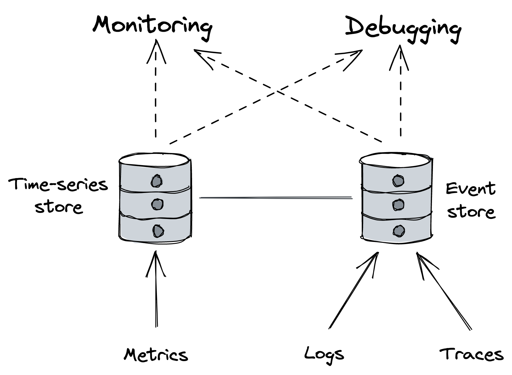
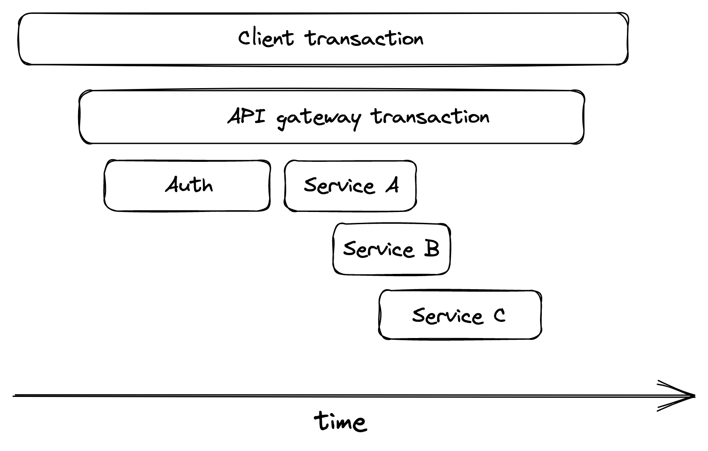

# Chapter 32: Observability

**Observability** is a set of tools that provide granular insights into a system in production, allowing operators to understand its emergent behaviors. In a complex distributed system, where many behaviors are impossible to predict, human operators need to debug failures by forming and validating hypotheses. A good observability platform minimizes the time it takes to validate these hypotheses.

At its core, observability uses three main telemetry sources:

- **Metrics**: Stored in time-series databases, used mainly for _monitoring_. They handle high throughput but struggle with high-dimensional data.
- **Event Logs**: Stored in event stores that handle high-dimensional data but struggle with high throughput. Used mainly for _debugging_.
- **Traces**: Also stored in event stores and used for _debugging_.

Observability is considered a superset of monitoring. While monitoring tracks a system's health and detects symptoms of failure, observability also provides the tools to understand and debug the root cause of those symptoms.

::: {.centerfigure}
{width=60%}
:::

## 32.1 Logs

A **log** is an immutable, time-stamped list of events that occurred over time. An event can be simple free-form text or structured using formats like JSON or Protobuf. Structured events are typically a collection of key-value pairs.

### Usefulness of Logs

- They provide a wealth of information about everything happening in a service.
- They are especially helpful for debugging, allowing engineers to trace a symptom back to its root cause.
- They help investigate long-tail behaviors (e.g., why a specific user request is failing) that are invisible to aggregated metrics like averages and percentiles.

### Challenges with Logs

- **Performance Overhead**: Logging libraries can add overhead, especially if they are synchronous and block while writing to disk.
- **Storage Risk**: Excessive logging can fill up disk space, leading to lost logs or service failure.
- **Cost**: Ingesting, processing, and storing massive amounts of log data is expensive.
- **Low Signal-to-Noise Ratio**: Logs are fine-grained and service-specific, which can make it hard to extract useful information.

### Best Practices for Logging

- **Single Event per Work Unit**: All data related to a single work unit (e.g., a request or a message from a queue) should be stored in a single event. This is often achieved by passing a context object through the relevant code paths.
- **Rich Context**: An event should contain useful information, such as:
  - Who created the work unit and what it was for.
  - Whether it succeeded or failed.
  - Measurements, like the duration of specific operations.
  - Details of any network calls, including response times and status codes.
- **Data Sanitization**: All logged data should be sanitized to remove sensitive information like users' personal data.
- **Request ID for Correlation**: To correlate logs across different services (e.g., a caller and a callee), every event should include a unique identifier for the request.

### Controlling Logging Costs

- **Logging Levels**: Use different logging levels (e.g., debug, info, warning, error) that can be dynamically controlled. This allows operators to increase verbosity for investigations and reduce it to save costs during normal operation.
- **Sampling**: Reduce verbosity by only logging a fraction of events.
  - For example, a service could log only every nth event.
  - Sampling can be prioritized based on the event's importance; for instance, failed requests should have a higher sampling frequency than successful ones.
- **Rate Limiting**: Log collectors should be able to rate-limit requests to prevent cost overruns or service overloads from excessive logging.
- **In-Memory Aggregates**: Instead of emitting raw logs, create in-memory aggregates (metrics) from event measurements. The trade-off is losing the ability to drill down into the raw data if needed.

## 32.2 Traces

**Tracing** captures the entire lifespan of a request as it propagates through the services of a distributed system.

- A **trace** is a list of causally-related spans that represent the execution flow of a single request.
- A **span** represents a time interval for a logical operation or work unit and contains a bag of key-value pairs.

When a request begins, it receives a unique **trace ID**. This ID is propagated through every stage of the request's journey—from thread to thread and from service to service (e.g., in HTTP headers). Each stage is recorded as a span, and a collector service later assembles all spans with the same trace ID into a single trace.

::: {.centerfigure}
{width=60%}
:::

### Benefits of Tracing

Traces allow developers to:

- Debug issues affecting specific requests (e.g., from customer support tickets).
- Investigate rare issues that affect a very small fraction of requests.
- Debug issues affecting a large group of requests that share a common characteristic.
- Identify performance bottlenecks in the end-to-end request path.
- Perform resource attribution to see which users are hitting which downstream services.

### Challenges of Tracing

- Tracing is difficult to retrofit into an existing system.
- It requires every component in the request path—including third-party frameworks, libraries, and services—to be modified to propagate the trace context.

## 32.3 Putting It All Together

Metrics and traces can be thought of as abstractions, or derived views, built from raw event logs and optimized for specific use cases.

- A **metric** is a time series of summary statistics created by aggregating counters or observations from multiple events.
- A **trace** is an ordered list created by aggregating all events belonging to the lifecycle of a single user request.

This approach allows systems to emit individual events (or span events) and have a backend system roll them up into metrics and traces as they are ingested.
